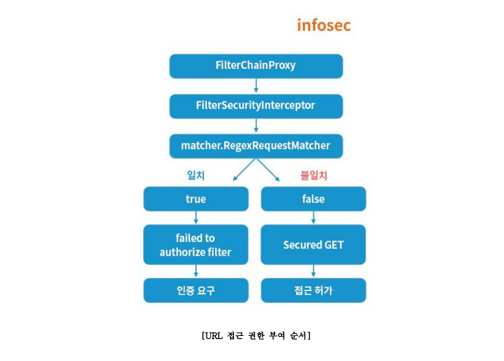
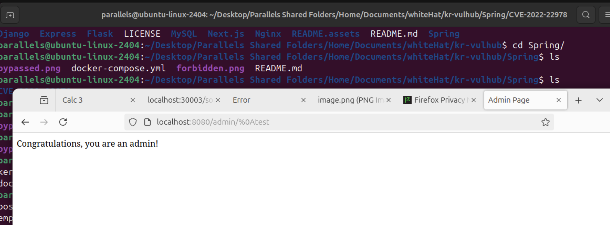

# Spring Security Authorization Bypass in RegexRequestMatcher (CVE-2022-22978)

> 화이트햇 스쿨 3기-[조상연(Korea version)](README.kr.md)

 

### 요약:

- Spring Security framework 는 Spring framework 에서 보안 인증 기능을 제공하는 데 사용
- Spring Security 5.5.6 , 5.6.3 이전 버전에서 정규 표현식에 ','를 포함하는 RegexRequestMatcher 클래스 를 사용하는 애플리케이션은 권한 부여 우회에 취약함

 

### 참조:

- <https://www.skshieldus.com/download/files/download.do?o_fname=EQST%20insight_Research%20Technique_202208.pdf&r_fname=20220818113152277.pdf>
- <https://tanzu.vmware.com/security/cve-2022-22978>
- <https://github.com/DeEpinGh0st/CVE-2022-22978>

 

### 취약점 동작 과정

## step 1
- Spring Security는 여러 개의 Filter 를 통해 인증 및 인가를 진행한다
- 정규 표현식을 처리하는 RegexRequestMatcher클래스의 DEFAULT 모드가 정규표현식 처리 시, 개행 문자를 포함하지 않는다.
- 따라서 URL에 개행 문자를 입력 시 패턴에서 제외된다.

## step 2
- 정규표현식으로 지정한 경로인 '/admin/.*' 접근 시 인증을 요구한다.
- /admin/ 경로 아래에 정상 문자열과 개행 문자를 포함한 문자열을 비교하면 결과는 항상 false를 반환한다.

## step3
- Spring Security 에서 정규표현식을 통해 URL 접근 권한을 부여하는 순서는 다음과 같다.

- 이때 인증을 요구하는 /admin/ 이하의 경로를 우회하여 인증 없이 접근이 가능하다. 

  % 첫번째 참조 자료의 요약이니 자세한 정보는 첫번째 참조자료를 봐주세요

 

### 환경 구성 및 실행

- `docker compose up -d` 를 실행하여 테스트 환경을 실행(Spring Security 5.6.3 이하 버전)
- <http://your-ip:8080/admin> 으로 접속하면 403Error인 Forbidden이 나오면서 막힘

 

## 결과
- <http://your-ip:8080/admin/index%0d>
- <http://your-ip:8080/admin/%0atest>
- <http://your-ip:8080/admin/%0dtest>

 

### 정리
- RegexRequestMatcher클래스의 의 DEFAULT 모드의 개행 문자 필터링 누락으로 인한 권한 우회가능
- DEFAULT -> Pattern.DOTALL 모드로 변경
