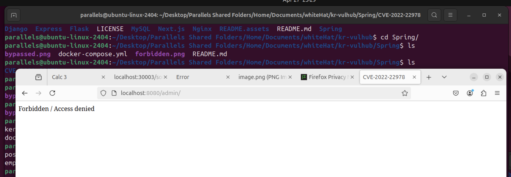

# Spring Security Authorization Bypass in RegexRequestMatcher (CVE-2022-22978)
==============


## 참고 자료
- [vulhub PoC 환경 – CVE-2022-22978](https://github.com/vulhub/vulhub/tree/master/spring/CVE-2022-22978)  
  CVE-2022-22978 취약점을 재현할 수 있는 Docker 기반 실습 환경
- [SK쉴더스 EQST Insight – Research Technique 2022.08 (PDF)](https://www.skshieldus.com/download/files/download.do?o_fname=EQST%20insight_Research%20Technique_202208.pdf&r_fname=20220818113152277.pdf)  
  Spring Security를 포함한 다양한 보안 취약점 분석과 대응 기법이 정리된 기술 보고서

## 1. 요약
- Spring Security에서 정규표현식 기반의 URL 필터링(`RegexRequestMatcher`)을 사용할 때, 필터에 사용된 `. (dot)` 표현이 URL 인코딩된 특수문자 `%0a`(Line Feed), `%0d`(Carriage Return)를 무시하고 매칭되면서 인증이 필요한 경로에 대해 인증 우회가 발생할 수 있는 취약점이다.
- Spring은 해당 인코딩된 문자를 디코딩하지 않기 때문에 필터는 이를 통과시키지만, 실제 컨트롤러는 정상적으로 경로를 처리하여 결과적으로 인증 없이 보호된 URL에 접근할 수 있게 된다.

## 2. 취약한 환경 구성 및 실행
### 2.1 필요 환경
- Spring Security 5.6.3 (또는 5.5.6 이하 취약 버전)
### 2.2 실행 방법
```bash
docker-compose up -d
```

## 3. 취약점 재현
- http://localhost:8080/admin → 403 Forbidden (인증 필요)

### 3.1 실행 결과 (직접 접근)
- http://localhost:8080/admin/%0atest → 200 OK (인증 우회 성공)
- http://localhost:8080/admin/%0dtest → 200 OK (인증 우회 성공)

### 3.2 실행 결과 (코드)
- poc.py 코드를 통해 한 눈에 확인할 수 있도록 해보았다.
- 필요하다면, target과 path를 변경시켜, 다른 취약한 페이지에 대해서도 검증이 가능하다.


## 4. 마무리 (대응 방안)
- 해당 취약점은 Spring Security에서 정규표현식 기반 필터(RegexRequestMatcher)가 URL 인코딩된 특수문자(%0a, %0d)를 제대로 처리하지 않아 발생한 인증 우회 취약점이다.
- 이를 안전하게 방지하려면 Spring Security를 보안 패치가 적용된 버전으로 업그레이드해야 하며, 
    5.5.x 버전 사용 시 → 5.5.7 이상
    5.6.x 버전 사용 시 → 5.6.4 이상으로
업데이트가 필요하다.
- 경로 필터링 시에는 특수문자 및 URL 인코딩 처리에 대한 검증 로직을 추가해 우회 가능성을 차단해야한다.

