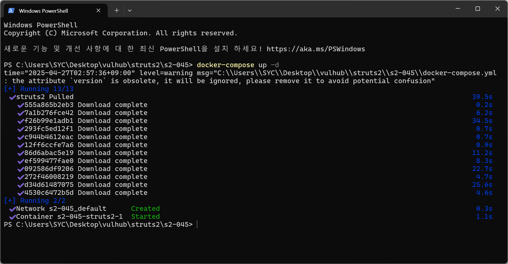
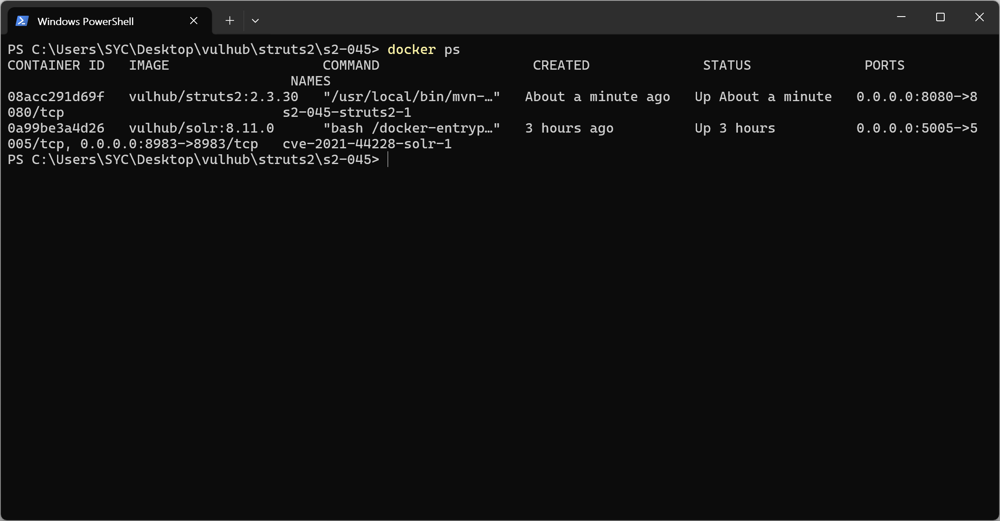
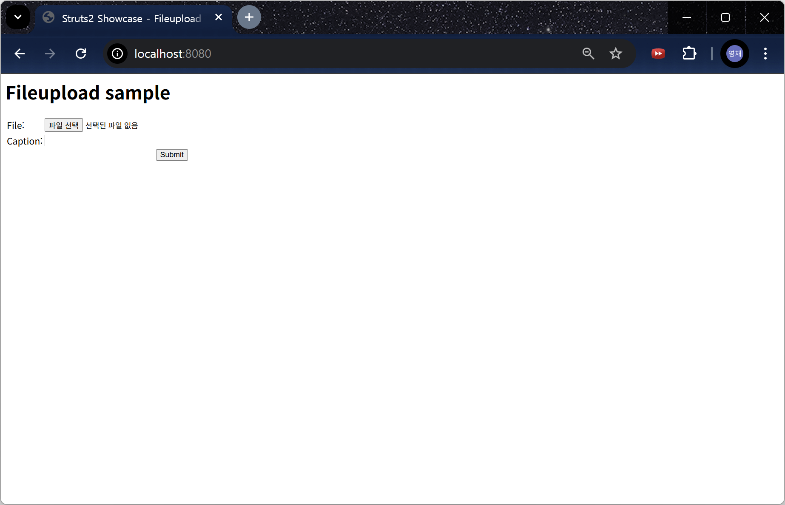
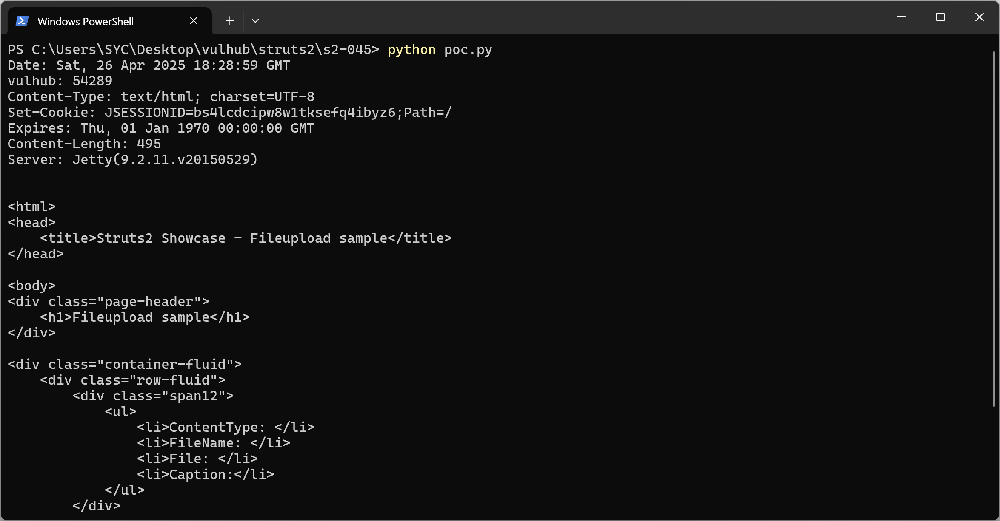

# Apache Struts2 S2-045 (CVE-2017-5638)
> 화이트햇 스쿨 3기 - [서영채(@ycseo-git)](https://github.com/ycseo-git)

<br/>

## 도움 (Help)

- Struts2는 Java 기반 웹 애플리케이션 프레임워크로, 폼 데이터 처리, 요청-응답 흐름 관리 같은 웹 개발을 쉽게 해주는 도구다. 한때 대규모 기업, 공공기관 시스템에 널리 사용됐다.

- OGNL이란 Object-Graph Navigation Language의 약자로, Java 객체 안의 값 조회, 수정, 메소드 호출을 표현식(Expression)으로 간단하게 할 수 있게 해주는 언어다. 원래는 개발 편의를 위해 쓰였지만, 검증 없이 사용하면 코드 실행 취약점으로 이어질 수 있다.

- 요즘 Java 웹 개발은 대부분 Spring Boot/Spring MVC로 진행된다. 그러나 과거 대규모 시스템에 많이 쓰였기 때문에, 여전히 레거시 시스템(공공기관, 금융권 등)에서 Struts2 기반 서버가 운영 중일 수 있다. 따라서 Struts2의 취약점을 알아두는 것은 충분히 당신에게 도움이 될 것이다.

<br/>

## 요약 (Summary)

- CVE-2017-5638은 Apache Struts2에서 발생한 원격 코드 실행(RCE) 취약점으로, OGNL(Object-Graph Navigation Language)을 처리하는 방식에서 발생한다.

- 사용자가 제공한 Content-Type 헤더에 포함된 OGNL 표현식을 제대로 검증하지 않아, 악의적인 사용자가 서버에서 임의의 코드를 실행할 수 있다.

- 영향을 받는 버전 (Affected Versions)은 `Struts 2.3.5` - `Struts 2.3.31`, `Struts 2.5` - `Struts 2.5.10`이다.

- 이 취약점은 `Struts2 2.3.32` 및 `2.5.10.1` 버전에서 수정되었다. 따라서 이 이상의 버전으로 업데이트해 취약점을 제거할 수 있다.

<br/>

## 환경 구성 및 실행 (Setup and Execute)

1. `docker compose up -d`를 실행하여 Struts2 2.3.30 환경을 실행한다.





2. `http://your-ip:8080`에 접속하여 페이지를 확인한다.



3. `python poc.py`를 실행하여 공격을 수행한다.

<br/>

## PoC

```
# Put a malicious OGNL expression into the Content-Type Header
payload = "%{(#context['com.opensymphony.xwork2.dispatcher.HttpServletResponse'].addHeader('vulhub',233*233))}.multipart/form-data"
```

%{(#context['com.opensymphony.xwork2.dispatcherHttpServletResponse'].addHeader('vulhub',233*233))} 부분이 OGNL 표현식으로, 서버가 해당 값을 처리하여 응답 헤더에 값을 추가한다.

<br/>

## 결과 (Result)

서버의 응답에 `vulhub` 헤더가 포함되어 있고, 233*233의 결과(54289)가 전달된 것을 확인할 수 있다.



<br/>

## 정리 (Conclusion)

- CVE-2017-5638은 사용자가 서버에 전달한 Content-Type 헤더 값에 삽입한 OGNL 표현식이 서버 측에서 검증 없이 실행되기 때문에 발생한다. 이로 인해 공격자가 서버에서 임의의 코드를 실행하는 것이 허용되며, 서버 장악, 데이터 탈취, 시스템 파괴 등의 피해로 이어질 수 있다.

- 안전한 웹 서비스 운영을 위해서는 서버 개발자가 또는 라이브러리, 프레임워크 설계자가 사용자의 입력을 그대로 코드로 해석하지 않도록 주의해야 한다. 불필요한 코드 실행 경로를 없애거나 입력값을 무해화(Sanitization)하여 처리해야 한다.