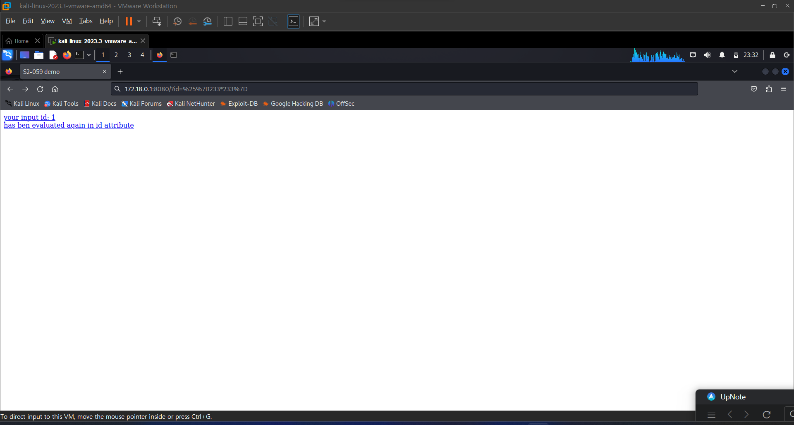
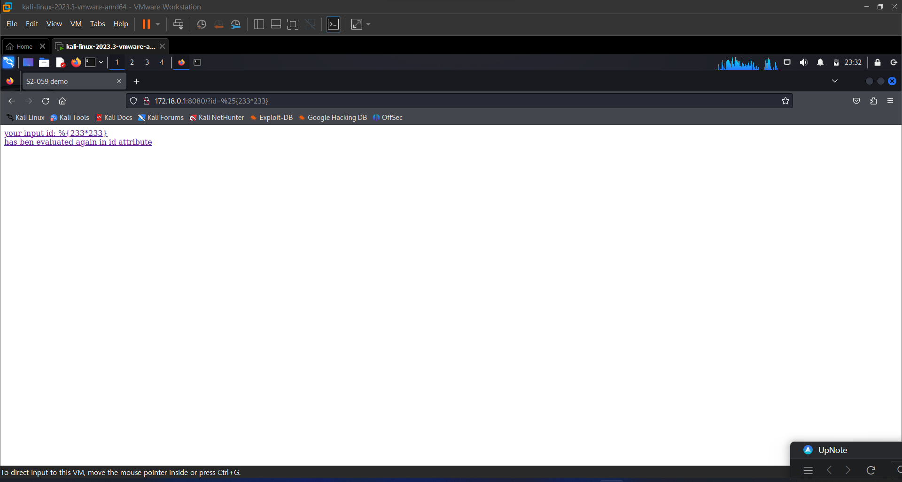
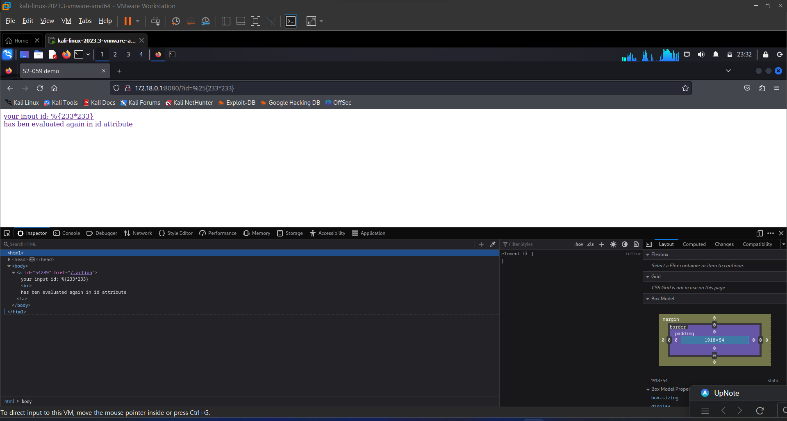
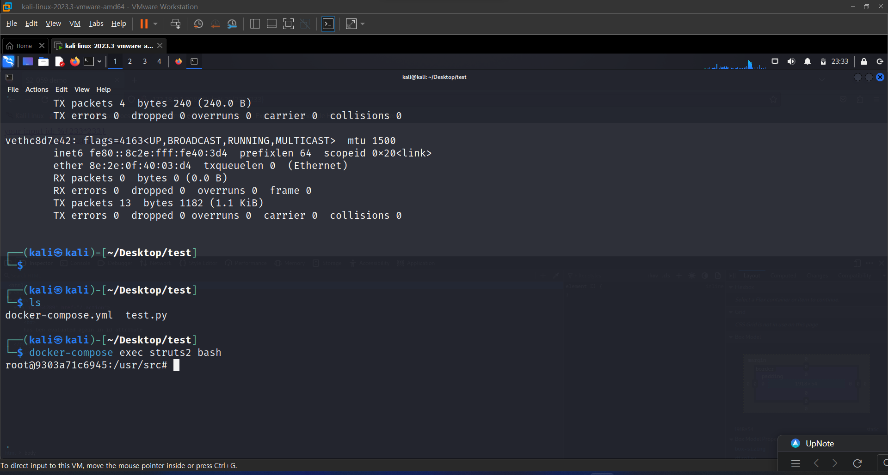
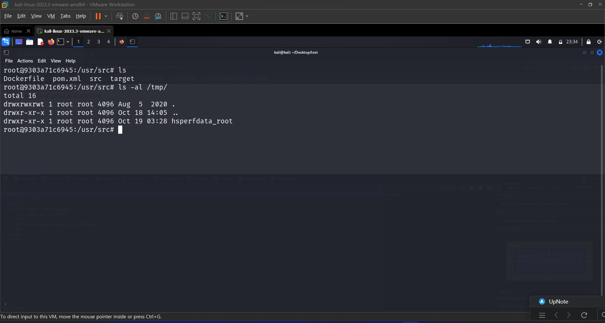
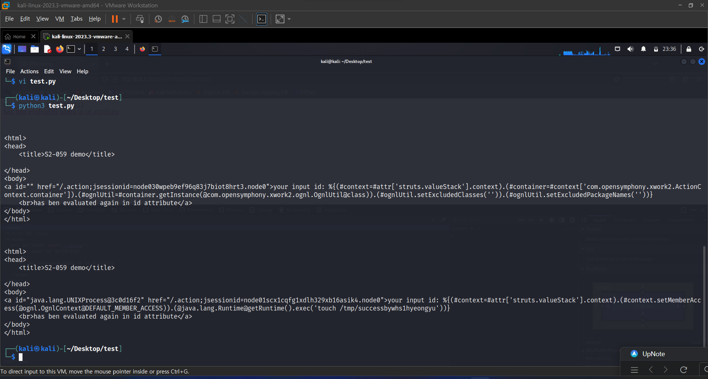
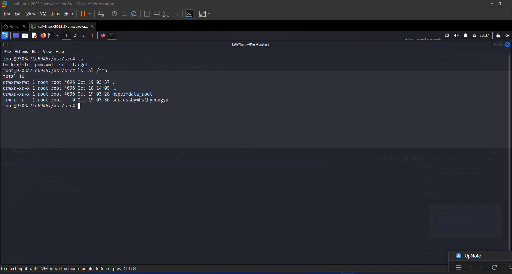

# CVE-2019-0230

**Contributors**

-   [이현규(@hy30nq)](https://github.com/hy30nq)

<br/>

# Struts2 S2-059 원격 코드 실행 취약점 (CVE-2019-0230)

Apache Struts2 프레임워크는 ID 속성과 같은 특정 태그의 속성 값을 2차적으로 분석하므로 공격자가 태그 속성을 나타낼 때 다시 분석될 OGNL 표현을 전달하여 OGNL 표현을 주입할 수 있습니다. 이로 인해 코드가 원격으로 실행될 수 있습니다.

영향을 받는 버전: Struts 2.0.0 - Struts 2.5.20

참고자료:

- https://cwiki.apache.org/confluence/display/WW/S2-059
- https://securitylab.github.com/research/ognl-apache-struts-exploit-CVE-2018-11776

## 환경 설정

Struts 2.5.16 환경을 시작하기 위해 다음 명령을 실행한다:

```
docker compose up -d
```

환경 설정 후, `http://your-ip:8080/?id=1`에 접속하면 Struts2 test page를 볼 수 있다.


## 취약점 재현

`http://your-ip:8080/?id=%25%7B233*233%7D`에 방문하면 id 속성에서 `233*233`의 결과인 `54289`가 반환된 것을 확인할 수 있다. Struts2가 사용자 제공 입력을 OGNL 표현식으로 해석하고 실행하는지 여부를 확인하는 단계이다.





[OGNL Apache Struts exploit: Weaponizing a sandbox bypass (CVE-2018-11776)](https://securitylab.github.com/research/ognl-apache-struts-exploit-CVE-2018-11776)를 통해 Struts 2.5.16의 OGNL sandbox bypass 세부사항을 확인할 수 있다.

## POC

```
python3 POC.py
```

POC를 실행하면 `touch /tmp/successbywhs1hyeongyu`가 실행된다:






## 환경 종료

```
docker compose down
```
