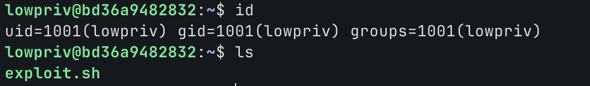
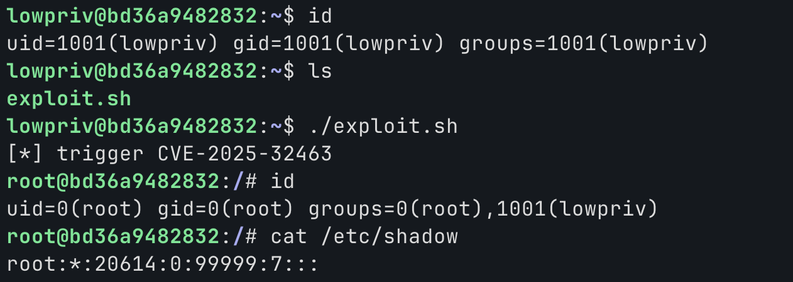

# CVE-2025-32463

**Contributors**
- [김민준(@f-pwny0)](https://github.com/f-pwny0)

<br/>

### 요약

- sudo는 Unix/Linux 계열 시스템에서 일반 사용자가 특정 명령을 다른 사용자, 주로 root 권한으로 실행할 수 있도록 하는 권한 관리 도구.
- CVE-2025-32463은 sudo의 `chroot` 옵션 처리 과정에서 발생하는 Local Privilege Escalation 취약점.
- 공격자는 sudo의 `-R` 옵션을 이용해 공격자가 제어하는 chroot 환경을 지정하고, 그 내부의 `nsswitch.conf` 설정을 악용하여 악성 NSS 라이브러리를 root 권한으로 로드.
- 이 취약점을 성공적으로 악용하면 일반 사용자가 컨테이너 내부에서 root 권한을 획득 가능.
<br/>

### 환경

- 영향 버전: sudo 1.9.14 ~ 1.9.17
- 패치 버전: sudo 1.9.17p1 이상
- gcc 사용가능한 일반 사용자 계정 보유
<br/>

### 환경 구성 및 실행

아래 명령어를 실행하여 테스트 환경을 실행한다.

```bash
docker compose up -d
```
이후 다른 터미널에서 해당 명령을 입력해 ssh 접속한다.
<br/>
```bash
ssh -p 2222 lowpriv@127.0.0.1 #password : lowpriv
```
<br />

정상적으로 테스트 환경이 구축되었다면, 아래와 같은 사용자와 exploit.sh 파일이 존재해야 한다.



exploit.sh를 실행하면, root권한을 획득한다.



### 취약점 설명
- sudo는 동작할떄 NSS(Name Service Switch)를 조회한다.

- chroot로 루트 디렉토리를 변경하면 해당 환경의 etc/nsswitch.conf를 제어할수 있다.

- NSS가 참조하는 nsswitch.conf에서 NSS모듈을 직접 만든 공유 라이브러리로 지정할수 있다.

- sudo가 root권한으로 NSS 라이브러리를 로드하면 constructor 함수가 자동으로 실행된다.


### 대응 방안
- sudo 1.9.17p1 이상 버전으로 업데이트해야한다.
