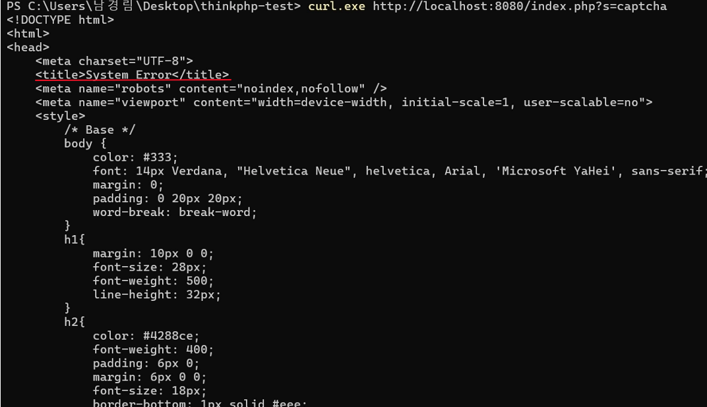
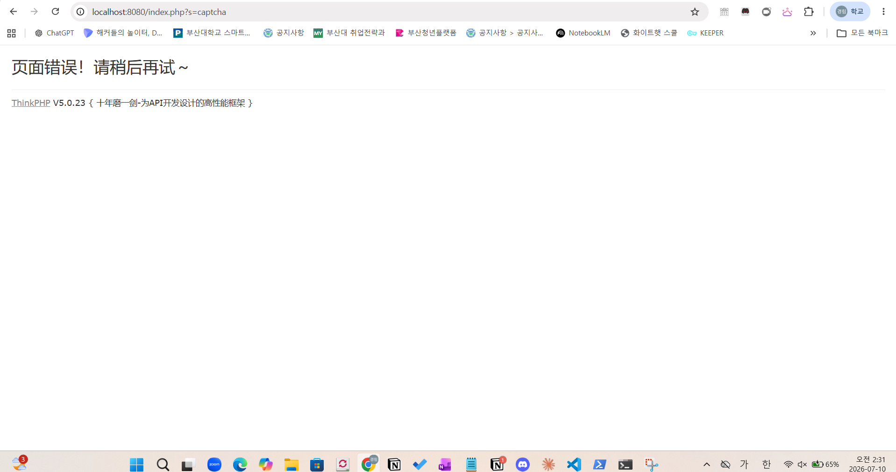
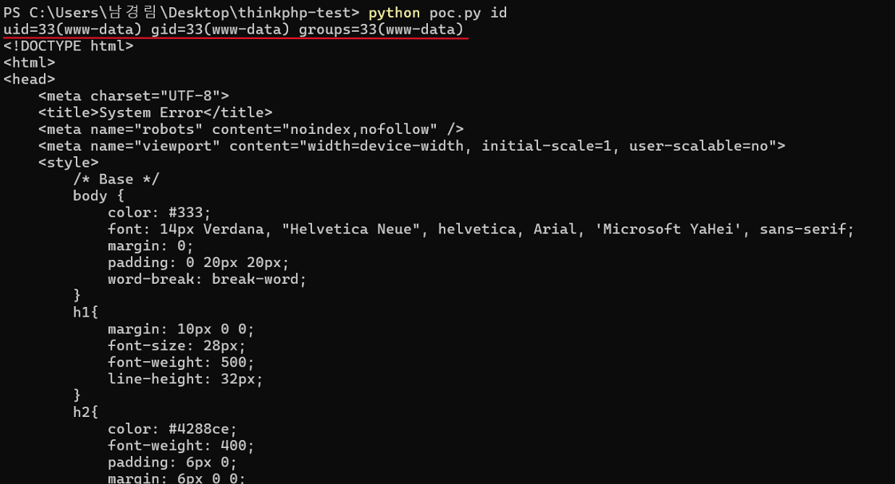

1. 취약한 환경 구현 → docker compose up -d
2. PoC 작성/실행 → curl 명령어로 실제 공격 시도 (증명)
3. 결과 확인/캡쳐 → 진짜 인증 우회가 됐는지 확인
4. README 작성 → 위 과정 전부를 문서화

# ThinkPHP5 5.0.23 원격 코드 실행 취약점

---

## 요약

ThinkPHP는 중국에서 매우 널리 사용되는 PHP 개발 프레임워크이다.

ThinkPHP **5.0 버전 중 5.0.24 미만 버전**에서는 요청 메서드를 가져오는 과정에서 프레임워크가 이를 잘못 처리한다.

이 문제로 인해 공격자는 `Request` 클래스의 임의 메서드를 호출할 수 있으며, 특정 exploit chain을 통해 **RCE(Remote Code Execution, 원격 코드 실행) 취약점**이 발생한다.

## References

- https://github.com/vulhub/vulhub/tree/master/thinkphp/5.0.23-rce#thinkphp5-5023-remote-code-execution-vulnerability
- https://github.com/top-think/framework/commit/4a4b5e64fa4c46f851b4004005bff5f3196de003

## 환경 구성 및 실행

- 이미지: vulhub/thinkphp:5.0.23
- 포트: 8080

다음 명령을 실행하여 취약한 환경을 구축한다.

```c
docker compose up -d
```

POC.py 실행 전 의존성을 설치한다.

```c
pip install requests
```

## 취약점 재현 (Vulnerability Reproduction)

이후 다음 명령어를 사용하여 ThinkPHP 서버에 정상 요청을 전송하였다.

```c
curl.exe http://localhost:8080/index.php?s=captcha
```





서버는 HTML 형식의 응답을 반환하였고, 응답에서 ThinkPHP의 `System Error` 페이지와 `ThinkPHP V5.0.23` 정보를 확인할 수 있었다.

이는 Docker 컨테이너의 웹 서버와 ThinkPHP 애플리케이션이 정상적으로 동작하고 있으며, `localhost:8080`을 통해 요청이 컨테이너 내부로 전달되고 있음을 의미한다.

이 요청에는 `_method`, `filter[]`, `server[REQUEST_METHOD]`와 같은 조작된 POST 파라미터가 포함되지 않았으므로 명령어 실행은 발생하지 않는다.

## POC 실행

```c
python poc.py id
```

`python poc.py id`를 실행하면 `id`라는 문자열이 `server[REQUEST_METHOD]` 값으로 전달된다.

취약한 ThinkPHP 5.0.23 환경에서는 이 값이 `system` 함수의 인자로 처리될 수 있으며, 결과적으로 서버 측에서 다음과 같은 형태의 명령어 실행이 발생한다.



이 결과는 리눅스 `id` 명령어의 실행 결과이다.

`www-data`는 웹 서버 프로세스가 사용하는 제한된 권한의 사용자 계정이다. 따라서 위 결과는 명령어가 로컬 Windows 환경에서 실행된 것이 아니라, Docker 컨테이너 내부의 ThinkPHP 웹 서버 권한으로 실행되었음을 의미한다.

PoC 실행 후 응답에는 ThinkPHP의 `System Error` HTML 페이지가 함께 출력될 수 있다. 그러나 응답 첫 줄에 `uid=33(www-data)`와 같은 명령어 실행 결과가 포함되어 있으므로, 서버 측 명령어 실행이 성공했음을 확인할 수 있다.

따라서 해당 실습을 통해 ThinkPHP 5.0.23의 요청 처리 로직이 조작된 POST 파라미터를 잘못 처리할 경우, 공격자가 HTTP 요청만으로 서버에서 OS 명령어를 실행할 수 있음을 확인하였다.

```c
python poc.py whoami
```

[](images/img4.png)

`www-data`는 리눅스 웹 서버 프로세스가 사용하는 계정이다. 따라서 해당 결과는 `whoami` 명령어가 로컬 PC가 아니라 Docker 컨테이너 내부의 ThinkPHP 웹 서버 권한으로 실행되었음을 의미한다. 이를 통해 HTTP 요청만으로 서버 측 OS 명령어 실행이 가능함을 확인할 수 있다.
