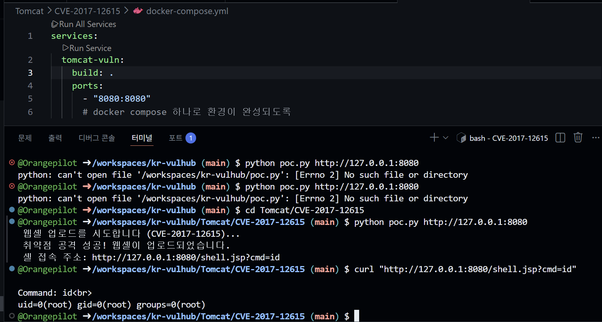

# CVE-2017-12615

### (Apache Tomcat PUT 취약점을 통한 원격 코드 실행) 분석 보고서

**contributors**
- [이윤담@Orangepilot] (https://github.com/Orangepilot)

### 파일 구성
- **docker-compose.yml** : 세팅한 서버를 8080 포트로 띄우는 실행 버튼 파
- **Dockerfile** : 공식 톰켓 서버를 가져와서 취약점이 발생하도록 설정 파일 한 줄만 바꾸는 환경세팅 파일
- **poc.py** : 8080포트를 향해 공격을 던지는 코드(파이썬 라이브러리 requests가 필요하다)
- **README.md** : 분석 및 정리 보고서 

### 1. 취약점 요약

- **CVE 번호:** CVE-2017-12615
- **위험도 (Risk Score):** 9.8
- **요약:** Apache Tomcat의 `readonly` 파라미터가 `false`로 설정된 경우, HTTP PUT 메서드를 사용하여 임의의 파일(JSP 웹셸 등)을 서버에 업로드하고 원격으로 코드를 실행(RCE)할 수 있는 고위험 취약점입니다.
- https://github.com/vulhub/vulhub/blob/master/tomcat/CVE-2017-12615/README.md

## 2. 환경 구성 및 취약 조건

- **환경 구성:** `docker-compose up -d` 명령어를 통해 공식 Tomcat 베이스 이미지(`tomcat:8.5.19-jre8`)를 빌드하여 로컬 8080 포트에 구동합니다.
- **취약 조건:** `conf/web.xml` 내 `DefaultServlet`의 `readonly` 속성이 `false`로 설정되어 있어야 하며, 리눅스 환경에서는 업로드 요청 시 파일명 끝에 슬래시(`/`)를 붙여 확장자 검증 로직을 우회합니다.


## 3. 재현 절차
1. 클린 환경에서 아래 명령어를 통해 취약한 도커 컨테이너를 실행합니다.
```bash
    docker-compose up -d --build
```
2. poc.py를 사용하여 8080 포트에 구동된 Tomcat 서버로 공격을 수행합니다.
```bash
    python poc.py [http://127.0.0.1:8080](http://127.0.0.1:8080)
```

## 4. 실행 결과



- 명령어 결과로 나온 uid=0(root)는 공격자가 서버 내부 최고 관리자의 권환을 획득했다는 의미입니다. 공격자는 정상적인 접근을 우회하여 악성 웹쉘을 업로드 한 것이며, 웹쉘을 통해 던진 명령어를 톰캣 서버가 최고 관리자 권한으로 실행시켜줄 수 있습니다.

## 5. 대응방안
- `conf/web.xml` 내 `DefaultServlet`의 `readonly` 속성을 `true`로 변경하여 'PUT'메소드를 통한 임의의 파일 업로드를 막을 수 있다.
- 취약점이 패치된 최신 버전의 'Apache Tomcat' 으로 업데이트 한다.


