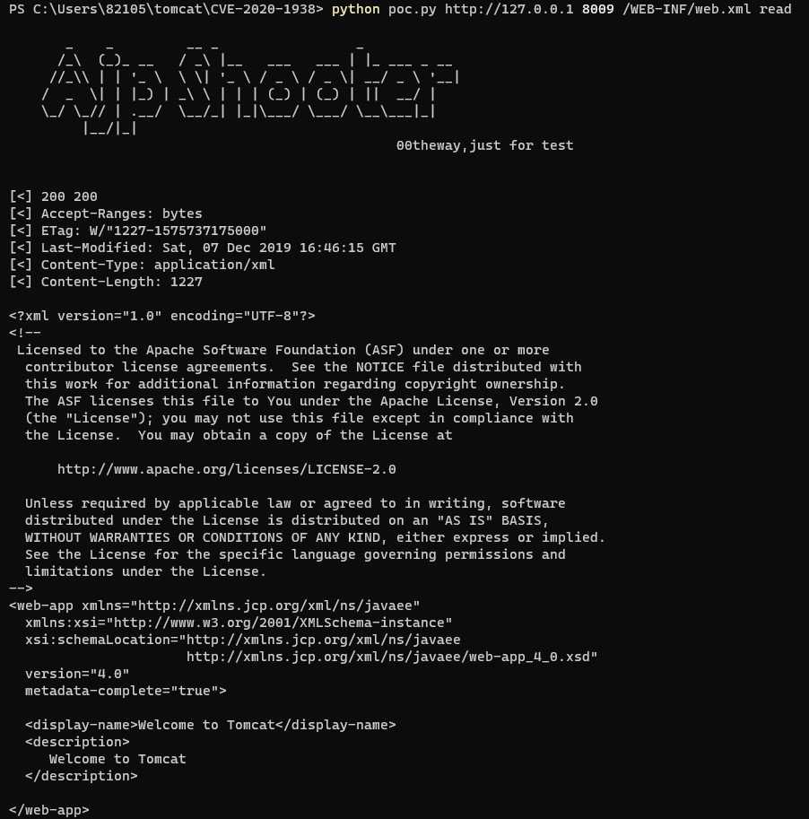

# CVE-2020-1938

**Contributors**

-   [박정은(@mythofsummer)](https://github.com/mythofsummer)

<br/>

### 요약

-   Ghostcat이라고도 불리는 CVE-2020-1938은 Apache Tomcat AJP 커넥터 취약점입니다.
-   AJP Request가 처리될 때 사용자 입력값 검증 없이 실행되면서 임의 파일 읽기 또는 코드 실행이 가능합니다.
-   https://www.igloo.co.kr/security-information/tomcat-ajp-%EC%B7%A8%EC%95%BD%EC%A0%90-%EB%B6%84%EC%84%9D-%EB%B0%8F-%EB%8C%80%EC%9D%91%EB%B0%A9%EC%95%88-ghostcatcve-2020-1938/
-   https://nvd.nist.gov/vuln/detail/CVE-2020-1938

<br/>

### Apache Tomcat이란?

-   Apache Tomcat은 Java Servlet, JavaServer Pages(JSP), WebSocket 기술을 구현한 오픈소스 웹 애플리케이션 서버입니다.
-   AJP(Apache JServ Protocol)는 웹 서버와 Tomcat 간의 통신에 사용되는 바이너리 프로토콜로, 기본적으로 8009 포트에서 수신합니다.

<br/>

### CVE-2020-1938 소개

-   Apache Tomcat 9.0.30 이하 버전에서 AJP 커넥터의 파일 포함 처리 시 임의 파일 읽기가 가능합니다.
-   Request 메시지 헤더에서 파일 확장자에 따라 `*.JSP` 파일은 `JspServlet.java`에서 처리하고, 그 외의 파일은 `DefaultServlet.java`에서 처리합니다. 임의의 파일도 `JspServlet.java`를 통해 수행하게 만드는 것이 취약점의 핵심입니다.
-   파일 업로드가 가능한 환경에서는 원격 코드 실행(RCE)으로 확장될 수 있습니다.

<br/>

### 환경 구성 및 실행

-   다음 명령을 실행하여 Apache Tomcat 9.0.30 테스트 환경을 시작합니다.
```
docker compose up -d
```

-   서버가 시작되면 `http://your-ip:8080`에서 Tomcat 기본 페이지를 확인할 수 있습니다. 이 환경은 AJP 프로토콜(8009 포트)이 활성화되어 있습니다.

<br/>

### Exploit

-   다음 명령으로 AJP를 통해 `web.xml` 파일 내용을 읽을 수 있습니다.
```
python3 poc.py http://your-ip 8009 /WEB-INF/web.xml read
```



<br/>

### 정리

-   이 취약점은 AJP 커넥터가 외부에 노출된 경우 인증 없이 임의 파일 읽기가 가능합니다. Apache Tomcat 9.0.31 이상으로 업그레이드하거나, AJP 커넥터를 비활성화하여 대응할 수 있습니다.
