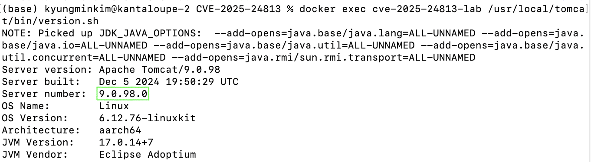
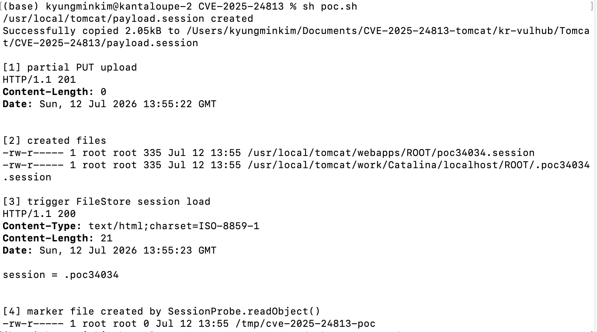

# CVE-2025-24813 Apache Tomcat Path Equivalence 취약점

## 1. 취약점 요약

- CVE: CVE-2025-24813
- 취약 버전: 9.0.0.M1 ~ 9.0.98, 10.1.0-M1 ~ 10.1.34, 11.0.0-M1 ~ 11.0.2(실습 기준 9.0.98)
- 패치 버전: Apache Tomcat 9.0.99, 10.1.35, 11.0.3 이상
- Risk Score: 9.8

CVE-2025-24813은 쓰기 권한이 할당된 Default Servlet의 partial PUT 임시 파일 처리 과정에서 발생하는 Path Equivalence 취약점이다. Path Equivalence 취약점은 경로 동등성 문제로, 서로 다른 문자열 경로가 내부적으로는 동일한 파일이나 디렉터리를 가리키도록 해석될 수 있다는 점을 악용한다.   환경 조건에 따라 민감 파일의 정보 노출 및 내용 변조로 이어질 수 있으며, 파일 기반 세션 저장과 역직렬화 공격에 악용 가능한 라이브러리가 결합되면 원격 코드 실행으로 확장될 수 있다. 이 글에서 해당 취약점의 발생 조건, 동작 원리, 실습 환경에서의 재현 방식, 대응 방안과 더불어 공급망 보안 관점에서의 해석을 다룬다.  

본 실습은 로컬 Docker 환경에서 공격자가 제어한 `.session` 파일이 FileStore를 통해 역직렬화되는 흐름을 검증한다.

### +) 관련 배경 지식 간단 요약
- **partial PUT**: partial PUT은 명칭 그대로 HTTP ‘Content-Range’ 헤더를 사용해 파일의 전체가 아닌 일부 범위만을 업로드하는 방식이다. 이 기능은 기본적으로 활성화되어 있다. 
- **FileStore 기반 세션 저장**: Tomcat은 설정에 따라 세션 정보를 파일로 저장할 수 있다. 이때, 세션은 ‘.session’ 파일 형태로 저장되며 이후 동일한 세션 ID가 요청되면 Tomcat이 해당 파일을 읽어 세션을 복원한다. 원격 코드 실행 시도가 이 FileStore 기반 세션 저장과 연결된다. 공격자가 partial PUT을 이용해서 조작된 세션 파일을 Tomcat의 기본 세션 저장 위치에 위치시킬 수 있고, 이후 JSESSIONID 값을 조작하여 Tomcat이 해당 세션 파일을 로드하도록 유도할 수 있다. 세션 복원 과정에서는 직렬화된 세션 데이터를 Java 객체로 되돌리는 역직렬화를 수행한다. 이 과정에서 공격자가 조작한 세션 파일을 Tomcat이 신뢰하고 읽게 만들 수 있고, 애플리케이션 classpath에 역직렬화 공격에 악용 가능한 라이브러리나 gadget이 존재할 경우 원격 코드 실행 공격이 가능해질 수 있다.  


## 2. 환경 구성

```bash
docker compose up --build -d
```

위 명령어 입력 시, 다음과 같은 구성이 완료된다. 

- Apache Tomcat 9.0.98 실행
- Default Servlet `readonly=false` 설정
- `PersistentManager`와 `FileStore` 설정
- `SessionProbe` 검증 클래스 컴파일
- PoC에 사용할 `/usr/local/tomcat/payload.session` 자동 생성


## 3. 취약 조건

다음은 원격 코드 실행을 가능케 할 수 있는 취약 조건들이다. 2번의 환경 구성과 유사한 면이 있으나, 실습 진행에 있어서 가장 핵심적인 부분에 해당한다. 

**취약 조건 체크리스트**

- Default Servlet의 쓰기 기능이 활성화(`readonly=false`)되어 있다.
- partial PUT 기능이 활성화되어 있다.
- Tomcat의 파일 기반 세션 저장 기능을 기본 위치로 사용한다.
- 애플리케이션 classpath에 역직렬화 시 실행 여부를 확인할 수 있는 검증 클래스가 존재한다. (또는 역직렬화 gadget이 존재할 경우도 가능, 그러나 해당 실습에서는 검증 클래스를 활용하였다.)

## 4. 재현 절차(실행 ~ 종료 전과정)

### (1) 컨테이너 실행

```bash
docker compose up --build -d
```


### (2) Tomcat 버전 확인

```bash
docker exec cve-2025-24813-lab /usr/local/tomcat/bin/version.sh
```

위 명령어를 입력해 주면, 아래와 같은 결과가 출력된다. 
<br>

버전이 9.0.98.0이므로, 해당 취약점의 위험성이 존재하는 버전이다. 

### (3) PoC 실행

```bash
sh poc.sh
```

`poc.sh`는 실행할 때마다 고유 세션 ID를 만들고, 컨테이너 내부에서 `/usr/local/tomcat/payload.session`을 새로 생성한다. 이후 해당 파일을 현재 디렉터리로 복사한 뒤, 파일 크기에 맞는 `Content-Range` 헤더를 계산 후 partial PUT 요청을 보낸다. 마지막으로 `Cookie: JSESSIONID=<세션ID>` 요청으로 FileStore 세션 로드를 유도하며, `SessionProbe.readObject()` 실행 여부를 marker 파일 생성으로 확인하는 로직을 갖고 있다. 

### (4) 컨테이너 종료

```bash
docker compose down
```

## 5. PoC 코드

핵심 검증 클래스는 `ROOT/WEB-INF/classes/demo/SessionProbe.java`다. 코드는 아래와 같다.

```java
private void readObject(ObjectInputStream in) throws IOException, ClassNotFoundException {
    in.defaultReadObject();
    Process process = Runtime.getRuntime().exec(cmd);
    try {
        process.waitFor();
    } catch (InterruptedException e) {
        Thread.currentThread().interrupt();
        throw new IOException("Interrupted while running probe command", e);
    }
}
```

`MakeSession.java`는 `.poc` 세션 ID와 `SessionProbe` 속성을 포함한 직렬화 세션 파일을 생성한다. Dockerfile은 빌드 중 이 파일을 실행해 `/usr/local/tomcat/payload.session`을 자동 생성한다.

## 6. 실행 결과

`sh poc.sh` 을 실행할 경우 아래와 같은 결과가 출력된다. 

<br>


## 7. 대응 방안

- Apache Tomcat을 패치 버전인 9.0.99, 10.1.35, 11.0.3 이상으로 업데이트한다.
- Default Servlet의 `readonly` 값을 기본값인 `true`로 유지한다.
- 불필요한 PUT 요청과 partial PUT 사용을 제한한다.
- FileStore 기반 세션 저장을 사용하지 않거나 저장 위치와 권한을 엄격히 관리한다.
- 역직렬화에 악용될 수 있는 라이브러리가 애플리케이션 classpath에 포함되어 있는지 점검한다.

#### 참고 자료

- Apache Tomcat Security: https://tomcat.apache.org/security-9.html
- NVD CVE-2025-24813: https://nvd.nist.gov/vuln/detail/CVE-2025-24813
-  Li, J., Liu, Q., An, Y., & Zhang, H. (2025, July 3). Apache under the lens: Tomcat's partial PUT and Camel's header hijack. Unit 42, Palo Alto Networks: https://unit42.paloaltonetworks.com/apache-cve-2025-24813-cve-2025-27636-cve-2025-29891/
