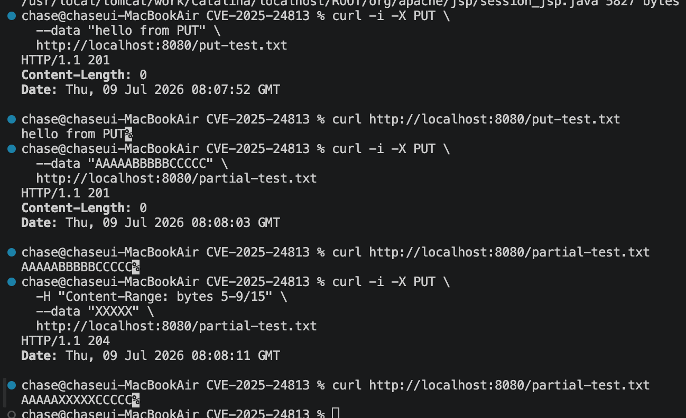
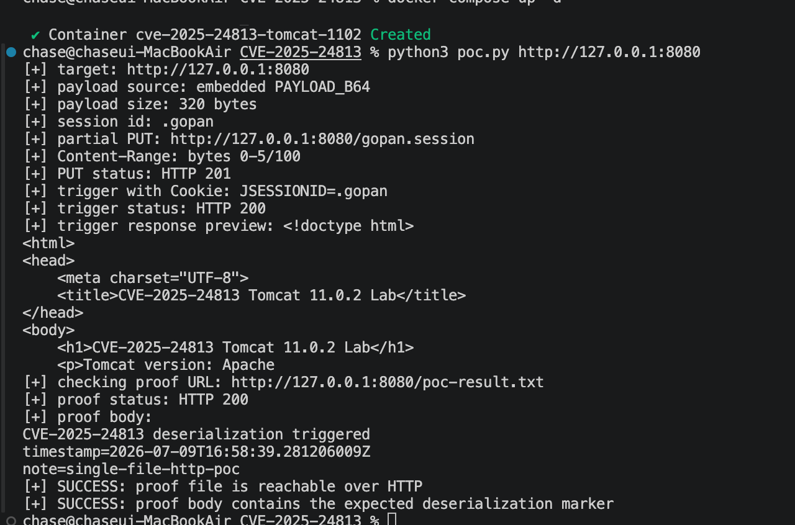

# Contributor
- 화이트햇스쿨 4기 3반 [최희수(@chlgmltn)](https://github.com/chlgmltn)
<br><br>
# 요약

- CVE-2025-24813은 Apache Tomcat에서 partial PUT과 파일 기반 세션 저장 기능이 함께 사용될 때 발생할 수 있는 취약점입니다.
- 조작된 .session 파일을 업로드한 뒤 Tomcat이 이를 역직렬화하도록 유도하면, 서버 내부에서 공격자 제어 코드가 실행될 수 있습니다.
<br><br>
# **CVE-2025-24813** 소개

Apache Tomcat에서 발생하는 **원격 코드 실행 취약점** (**CVSS : 9.8**)

- Partial PUT 기능과 기본 서블릿에 대한 쓰기 권한이 결합되어 발생한다
- 공격자는 취약점을 악용해 **원격 코드 실행, 정보 유출 및 손상** 등의 악성 행위를 수행할 수 있다
- 업로드된 세션 파일의 부적절한 처리와 직렬 해제 메커니즘을 활용한다
<br><br>

# 환경 구성

## 1) 기본 구성 정보

### Tomcat version

Apache Tomcat 11.0.2

### docker 구성

Base Image: eclipse-temurin:17-jdk-jammy
Java Version: 17 (Tomcat 11은 17이상 필요)
Tomcat Version: 11.0.2

### 환경 요구사항

- Docker 및 Docker Compose가 설치되어 있어야 합니다.
- PoC 실행을 위해 Python 3가 설치되어 있어야 합니다.

### 실행 명령

```bash
docker compose up --build -d
```
<br><br>

# 취약 조건

본 취약점은 Tomcat이 항상 취약한 것이 아니라, 다음 조건들이 함께 충족될 때 악용 가능성이 발생한다.

1. **Default Servlet의 쓰기 기능이 활성화된 경우**
    
    기본적으로 Tomcat의 Default Servlet은 파일 쓰기 기능이 비활성화되어 있다. 그러나 `readonly=false`와 같이 쓰기 기능이 활성화되면, 공격자가 PUT 요청을 통해 서버에 파일을 업로드할 수 있는 조건이 만들어진다.
    
    ```python
      <init-param>
        <param-name>readonly</param-name>
        <param-value>false</param-value>
      </init-param>
    ```
    
2. **Partial PUT 기능이 활성화된 경우**
    
    Tomcat은 기본적으로 Partial PUT 요청을 지원한다. 이 기능이 활성화되어 있으면, 공격자가 조작된 PUT 요청을 통해 서버 내부 경로에 특정 파일을 생성하거나 조작할 수 있다.
    

3. **파일 기반 세션 지속성 기능을 사용하는 경우**
    
    애플리케이션이 `PersistentManager`와 `FileStore`를 사용하여 세션을 파일로 저장하는 경우, 세션 데이터가 서버 파일 시스템에 `.session` 파일 형태로 저장된다. 이때 저장 위치가 기본 경로를 사용한다면, 공격자가 업로드한 파일이 세션 파일로 처리될 가능성이 생긴다.
    
    ```xml
    <Manager className="org.apache.catalina.session.PersistentManager"
                 saveOnRestart="true"
                 maxIdleBackup="1"
                 maxIdleSwap="2"
                 processExpiresFrequency="1">
            <Store className="org.apache.catalina.session.FileStore" />
        </Manager>
    ```
    
4. **역직렬화 공격에 활용 가능한 라이브러리가 애플리케이션에 포함된 경우**
    
    애플리케이션 내부에 역직렬화 과정에서 악용 가능한 라이브러리 또는 gadget chain이 존재하면, 조작된 세션 파일이 로드되는 과정에서 원격 코드 실행으로 이어질 수 있다.
    
    (추후 exploit 과정에서 구성)
    
<br><br>

# 재현 절차

### Exploit 과정 요약

1. PoC는 내부에 내장된 조작된 세션 payload를 읽어 온다.
2. partial PUT 요청을 통해 해당 payload를 `/gopan.session` 경로로 업로드한다.
3. Tomcat은 업로드된 payload를 세션 저장 위치에 `.gopan.session` 파일로 생성한다.
4. 이후 PoC는 `Cookie: JSESSIONID=.gopan` 요청을 보내 Tomcat이 해당 세션 파일을 읽도록 유도한다.
5. Tomcat이 세션 파일을 역직렬화하는 과정에서 `lab.Marker.readObject()`가 실행된다.
6. 그 결과 웹 루트에 `poc-result.txt` 파일이 생성되고, PoC는 이를 HTTP로 조회하여 exploit 성공 여부를 확인한다.

실행 명령

```xml
python3 poc.py http://<your-ip>:8080 
```
<br><br>

# 실행 결과


PoC 실행 결과, 내장된 세션 payload가 partial PUT 요청을 통해 `/gopan.session` 경로로 업로드되었고, 서버는 `HTTP 201` 응답을 반환하였다. 이후 `Cookie: JSESSIONID=.gopan` 값을 포함한 요청을 전송하여 Tomcat이 업로드된 세션 파일을 로드하도록 유도하였다.

그 결과 Tomcat이 `.gopan.session` 파일을 역직렬화하는 과정에서 세션 내부의 `lab.Marker.readObject()` 메서드가 실행되었으며, 웹 루트에 `poc-result.txt` 파일이 생성되었다. PoC는 해당 파일을 `http://127.0.0.1:8080/poc-result.txt`로 조회하였고, `HTTP 200` 응답과 함께 `CVE-2025-24813 deserialization triggered` 문자열이 출력되는 것을 확인하였다.

이를 통해 조작된 세션 파일 역직렬화로 인해 Tomcat JVM 내부에서 공격자 제어 코드가 실행될 수 있음을 검증하였다.

<br><br>

# 대응 방안

### 1) 보안 업데이트 적용

CVE-2025-24813은 Apache Tomcat 패치 버전에서 해결되었으므로, 영향받는 버전을 사용하는 경우 즉시 업데이트해야 한다.

| 제품명 | 영향받는 버전 | 해결 버전 |
| --- | --- | --- |
| Apache Tomcat 9 | 9.0.0.M1 ~ 9.0.98 | 9.0.99 이상 |
| Apache Tomcat 10.1 | 10.1.0-M1 ~ 10.1.34 | 10.1.35 이상 |
| Apache Tomcat 11 | 11.0.0-M1 ~ 11.0.2 | 11.0.3 이상 |

### 2) 취약 조건 제거

패치 적용이 어렵다면 취약점 악용에 필요한 조건을 제거해야 한다.

- Default Servlet 쓰기 권한 비활성화
    
    `conf/web.xml`에서 `readonly=true` 설정
    
- partial PUT 비활성화
    
    `allowPartialPut=false` 설정
    
- 파일 기반 세션 저장 사용 제한
    
    `PersistentManager`, `FileStore` 사용을 최소화하고 세션 저장 경로 권한을 제한
    
- 역직렬화 위험 라이브러리 관리
    
    불필요한 라이브러리를 제거하고 의존성 취약점을 주기적으로 점검
    
<br><br>

# 참고자료

https://www.cve.org/CVERecord?id=CVE-2025-24813

https://lists.apache.org/thread/j5fkjv2k477os90nczf2v9l61fb0kkgq

https://tomcat.apache.org/security-11.html