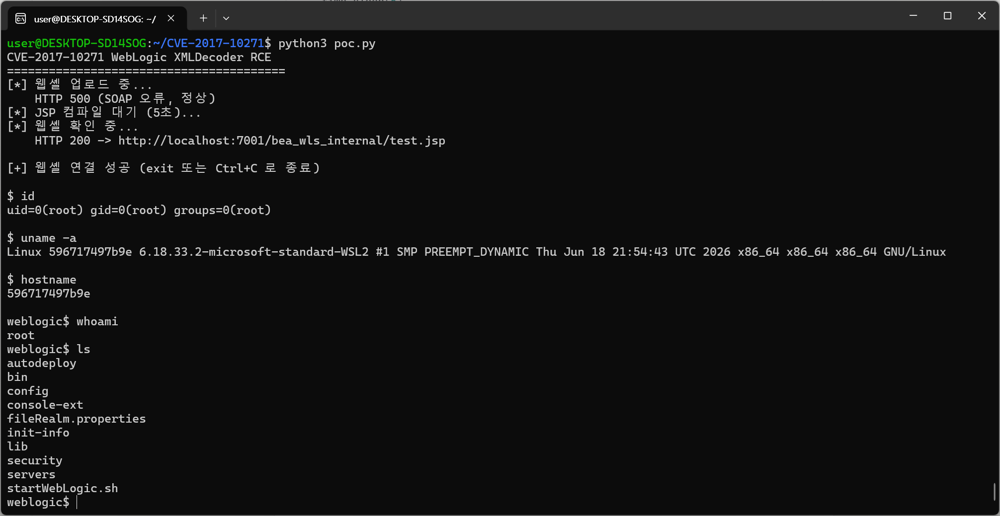

# Oracle WebLogic WLS-WSAT XMLDecoder 역직렬화 RCE (CVE-2017-10271) 

## 취약점 요약

Oracle WebLogic Server의 WLS-WSAT 컴포넌트는 SOAP 메시지 헤더의 WorkContext 영역을 파싱할 때 Java 내장 클래스인 XMLDecoder를 사용한다. XMLDecoder는 XML에 정의된 Java 객체를 검증 없이 인스턴스화하기 때문에, 공격자가 악성 XML을 전달하면 서버에서 임의 코드가 실행된다.

취약 엔드포인트는 인증 없이 외부에서 접근 가능하기 때문에 별도 자격증명 없이도 원격 코드 실행이 가능하다.

## 환경 구성
```bash
docker compose up -d
```

WebLogic 기동에 60~90초 정도 걸리며, 아래 응답을 확인해야 한다.

```bash
$ curl -I http://localhost:7001/
HTTP/1.1 404 Not Found   # 404면 정상
```

## 취약 조건

- WebLogic 10.3.6.0 ~ 12.2.1.2 버전
- `wls-wsat` 컴포넌트가 활성화된 상태 (기본값으로 활성화됨)
- 공격 대상 포트(7001)에 네트워크 접근 가능

## 재현 절차

1. /wls-wsat/CoordinatorPortType 엔드포인트에 악성 SOAP XML을 POST한다.
2. XML 내 XMLDecoder가 PrintWriter 객체를 생성해 JSP 웹셸을 서버 내부 경로에 기록한다.
3. 웹셸이 정상 생성됐는지 GET 요청으로 HTTP 200 응답을 확인한다.
4. 웹셸에 명령을 전달해 실행 결과를 받는다.

Step 1에서 HTTP 500이 응답으로 오더라도 정상이다. SOAP Body가 없어 오류가 발생하지만 헤더의 XMLDecoder는 이미 실행되어 파일 쓰기가 완료된 상태다.

## PoC 코드

```bash
python3 poc.py
```

Python 3 표준 라이브러리만 사용하므로 별도 패키지 설치가 필요 없다.

poc.py는 아래 순서로 동작한다.

1. XMLDecoder 페이로드로 JSP 웹셸(/bea_wls_internal/test.jsp)을 서버에 업로드
2. 웹셸 URL에 GET 요청을 보내 HTTP 200 응답으로 생성 여부 검증
3. 검증 실패 시 즉시 종료, 성공 시 id / uname -a / hostname 자동 출력
4. weblogic$ 프롬프트로 인터랙티브 셸 진입

## 실행 결과



웹셸 생성이 HTTP 200으로 확인된 뒤 id 결과로 uid=0(root)가 출력됐다. 이후 whoami, ls 등 임의 명령이 weblogic$ 프롬프트를 통해 정상 실행됐다.

## 대응 방안

- **패치 적용**: Oracle Critical Patch Update(2017년 10월) 패치를 적용한다.
- **컴포넌트 제거**: wls-wsat가 불필요한 환경이라면 wls-wsat.war를 삭제한다.
- **네트워크 차단**: WebLogic 관리 포트(7001)를 방화벽으로 외부 접근 차단한다.

## 참고

- [CVE-2017-10271 NVD](https://nvd.nist.gov/vuln/detail/CVE-2017-10271)
- [Oracle CPU October 2017](https://www.oracle.com/security-alerts/cpuoct2017.html)
- [vulhub/weblogic/CVE-2017-10271](https://github.com/vulhub/vulhub/tree/master/weblogic/CVE-2017-10271)