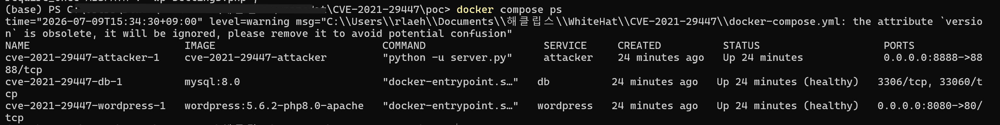
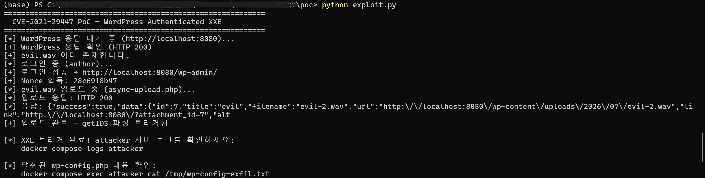
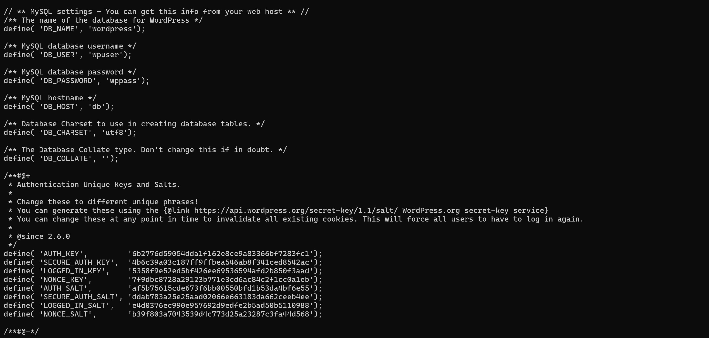

# WordPress 인증된 XXE 취약점 (CVE-2021-29447)

> 화이트햇 스쿨 4기 — 16반 [도윤 (@Doyoun510)](https://github.com/Doyoun510)

WordPress는 전 세계 웹사이트의 약 43%를 구동하는 오픈소스 CMS(콘텐츠 관리 시스템)입니다.
버전 5.6~5.7에서 미디어 라이브러리 파일 업로드 기능에 **XXE(XML External Entity) 취약점**이 존재합니다.

공격자는 Author 이상의 권한을 가진 계정으로, iXML 청크에 악성 XML을 삽입한 WAV 파일을 업로드합니다.
WordPress가 해당 파일을 getID3 라이브러리로 파싱할 때 XXE가 트리거되어, 서버 내부 파일(`wp-config.php` 등)을
공격자가 제어하는 외부 서버로 탈취할 수 있습니다.

**참고 자료 (References):**

- <https://www.sonarsource.com/blog/wordpress-xxe-security-vulnerability/>
- <https://github.com/WordPress/wordpress-develop/security/advisories/GHSA-rv47-pc52-qrhh>
- <https://nvd.nist.gov/vuln/detail/CVE-2021-29447>
- <https://wordpress.org/support/wordpress-version/version-5-7-1/>

<br/>

## 취약점 분석 (Vulnerability Analysis)

### 근본 원인

`wp-includes/ID3/module.audio-video.riff.php`는 WAV 파일의 `iXML` 청크를 발견하면 `getid3_lib::XML2array()`를 호출합니다.

```php
// wp-includes/ID3/getid3.lib.php
public static function XML2array($XMLstring) {
    if (function_exists('xml_parser_create')) {
        // ...
    }
    // PHP 8 미만에서는 libxml_disable_entity_loader(true) 호출로 보호
    // PHP 8 이상에서는 해당 함수가 deprecated → 조건부로만 호출됨
    $XMLobject = simplexml_load_string($XMLstring, 'SimpleXMLElement', LIBXML_NOENT);
    // ...
}
```

`LIBXML_NOENT` 플래그는 외부 엔티티 치환을 활성화합니다.
PHP 8에서는 `libxml_disable_entity_loader(true)` 함수가 deprecated 처리되어 더 이상 호출되지 않았고,
그 결과 XXE 보호가 해제된 채로 외부 엔티티가 처리됩니다.

### 취약 조건

| 조건 | 내용 |
|------|------|
| WordPress 버전 | 5.6 ~ 5.7 (5.7.1에서 패치) |
| PHP 버전 | **8.0 이상 필수** |
| 필요 권한 | **Author 이상** (`upload_files` 능력 보유) |
| 공격 벡터 | 네트워크 (인증 필요) |

### 공격 흐름

```
[공격자]                         [WordPress 서버]              [Attacker 서버]
   │                                   │                             │
   │─── WAV 업로드 (iXML XXE) ────────▶│                             │
   │                                   │─── GET /evil.dtd ──────────▶│
   │                                   │◀── evil.dtd 수신 ───────────│
   │                                   │                             │
   │                         php://filter로                          │
   │                         wp-config.php 읽기                      │
   │                                   │                             │
   │                                   │─── GET /out?data=<base64> ─▶│
   │                                   │                             │ 디코딩
   │◀──────────────────────── wp-config.php 내용 탈취 ───────────────│
```

### CVSS 점수

| 출처 | 점수 | 벡터 |
|------|------|------|
| GitHub Security Advisory | **7.1 (HIGH)** | AV:N/AC:L/PR:L/UI:N/S:U/C:H/I:L/A:N |
| NVD | **6.5 (MEDIUM)** | AV:N/AC:L/PR:L/UI:N/S:U/C:H/I:N/A:N |

> 두 기관의 점수 차이는 무결성(Integrity) 영향 평가 기준의 차이에서 비롯됩니다.
> Docker 환경에서 확인된 실제 동작(파일 읽기) 기준으로 **Risk Score: 7.1**을 채택합니다.

<br/>

## 환경 설정 (Environment Setup)

다음 명령어로 취약한 환경을 구성합니다:

```bash
docker compose up -d
```

4개의 서비스가 실행됩니다:

| 서비스 | 이미지 | 역할 |
|--------|--------|------|
| `db` | mysql:8.0 | WordPress 데이터베이스 |
| `wordpress` | wordpress:**5.6.2-php8.0**-apache | 취약한 WordPress (PHP8 고정) |
| `setup` | wordpress:cli | wp-cli로 자동 설치 + Author 계정 생성 |
| `attacker` | python:3.11-slim (빌드) | DTD 서빙 + 탈취 데이터 캡처 |

`setup` 컨테이너가 완료될 때까지 대기합니다:

```bash
docker compose logs -f setup
```

아래 메시지가 출력되면 환경 준비가 완료된 것입니다:

```
[+] 환경 준비 완료!
[+] WordPress: http://localhost:8080
[+] PoC 계정:  author / author1234!  (Author 권한)
```



<br/>

## 취약점 재현 (Vulnerability Reproduction)

### 사전 요구사항

```bash
pip install requests
```

### PoC 실행

```bash
cd poc
python exploit.py
```

스크립트는 다음 과정을 자동으로 수행합니다:

1. Author 계정(`author` / `author1234!`)으로 WordPress 로그인
2. 업로드 nonce 획득
3. iXML XXE 페이로드가 삽입된 `evil.wav` 생성 및 업로드
4. WordPress getID3가 WAV를 파싱하며 XXE 트리거
5. attacker 컨테이너의 `evil.dtd`를 로드 → `wp-config.php` 읽기
6. 탈취 데이터를 base64(zlib 압축)로 인코딩해 attacker 서버로 전송



### 결과 확인

```bash
docker compose logs attacker
```

또는 탈취된 파일 전체 확인:

```bash
docker compose exec attacker cat /tmp/wp-config-exfil.txt
```



attacker 서버 로그에서 `wp-config.php` 전체 내용을 확인할 수 있습니다.
DB 자격증명, 인증 키·솔트 등 민감 정보가 모두 포함됩니다:

```php
define( 'DB_NAME',     'wordpress');
define( 'DB_USER',     'wpuser');
define( 'DB_PASSWORD', 'wppass');
define( 'AUTH_KEY',    '6b2776d59054dda1f162e8ce9a83366...');
// ...
```

<br/>

## 대응 방안 (Mitigation)

### 1. WordPress 업데이트 (근본 해결)

WordPress **5.7.1** 이상으로 업데이트합니다.

패치 내용: `getid3.lib.php`에서 `libxml_disable_entity_loader(true)` 호출을 PHP 버전 조건 없이 **무조건 적용**합니다.

```php
// 패치 전 (취약)
if (PHP_VERSION_ID < 80000) {
    $loader = libxml_disable_entity_loader(true);
}
$XMLobject = simplexml_load_string($XMLstring, 'SimpleXMLElement', LIBXML_NOENT);

// 패치 후 (5.7.1)
$loader = @libxml_disable_entity_loader(true);  // PHP8 deprecation 경고 억제
$XMLobject = simplexml_load_string($XMLstring, 'SimpleXMLElement', LIBXML_NOENT);
```

### 2. 업로드 권한 최소화

불필요한 사용자에게 Author 권한(`upload_files`)을 부여하지 않습니다.
Contributor 권한(업로드 불가)으로 제한하면 이 취약점의 공격 표면을 줄일 수 있습니다.

### 3. PHP 버전 관리

PHP 8.0 이상 환경에서 WordPress 5.7.1 미만 버전을 운영하지 않습니다.
이 취약점은 PHP 7.x 환경에서는 재현되지 않습니다.
