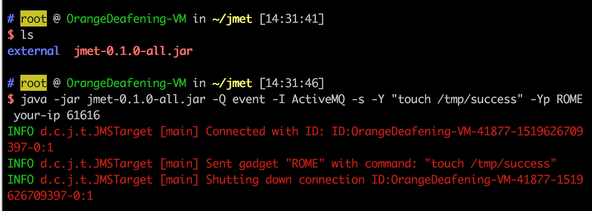

# ActiveMQ 직렬화 취약점（CVE-2015-5254）

pache ActiveMQ는 미국 아파치(Apache) 소프트웨어 재단에서 개발한 오픈 소스 메시징 미들웨어로, Java 메시징 서비스, 클러스터링, Spring Framework 등을 지원합니다.

Apache ActiveMQ 5.13.0 이전 5.x 버전에는 보안 취약점이 존재합니다. 이 취약점은 프로그램이 프록시에서 직렬화할 수 있는 클래스를 제한하지 않아 발생합니다. 원격 공격자는 특수하게 직렬화된 Java Message Service(JMS) ObjectMessage 객체를 이용하여 이 취약점을 통해 임의의 코드를 실행할 수 있습니다.

참고 링크:

- https://www.blackhat.com/docs/us-16/materials/us-16-Kaiser-Pwning-Your-Java-Messaging-With-Deserialization-Vulnerabilities.pdf

## 취약한 환경

취약한 환경을 실행합니다:

```
docker compose up -d
```

환경이 실행되면 61616 및 8161 포트를 듣게 됩니다. 61616은 작업 포트로, 메시지는 이 포트를 통해 전송됩니다. 8161은 웹 관리 페이지의 포트입니다. http://your-ip:8161로 접속하면 웹 관리 페이지를 볼 수 있지만, 이 취약점을 이론적으로는 웹이 필요하지 않습니다.

## 취약점 실행

취약점 실행은 다음과 같습니다:


1. (ysoserial을 사용하여) 실행 가능한 명령어를 직렬화한 객체를 생성합니다.
2. 이것을 메시지로 만들어 목표 61616 포트로 보냅니다.
3. 웹 관리 페이지에 접속하여 메시지를 읽고 취약점을 트리거합니다.

jmet을 사용하여 취약점을 실행합니다. 먼저 jmet의 jar 파일을 다운로드하고 동일한 디렉토리에 external이라는 폴더를 만듭니다 (그렇지 않으면 폴더가 없다는 오류가 발생할 수 있습니다).

jmet의 작동 원리는 ysoserial을 사용하여 Payload를 생성하고 전송하는 것입니다 (jar 파일 자체에 ysoserial이 포함되어 있으므로 따로 다운로드할 필요가 없습니다). 따라서 ysoserial에서 사용할 수 있는 gadget 중 하나를 선택해야 합니다. 예를 들어 ROME을 선택할 수 있습니다.

다음 명령을 실행합니다:

```
java -jar jmet-0.1.0-all.jar -Q event -I ActiveMQ -s -Y "touch /tmp/success" -Yp ROME your-ip 61616
```



이제 event라는 이름의 큐가 대상 ActiveMQ에 추가됩니다. http://your-ip:8161/admin/browse.jsp?JMSDestination=event에서 이 큐의 모든 메시지를 볼 수 있습니다:


해당 메시지를 클릭하면 명령이 실행되고, 이때 docker compose exec activemq bash를 사용하여 컨테이너 내부로 이동할 수 있습니다. 그 결과 /tmp/success가 성공적으로 생성되었음을 확인할 수 있습니다. 이는 취약점이 성공적으로 이용되었음을 나타냅니다:


명령을 쉘 명령으로 바꾸고 다시 이용할 수 있습니다:


웹 관리 페이지를 통해 메시지에 접근하고 취약점을 트리거하려면 관리자 권한이 필요합니다. 비밀번호가 없는 경우, 우리는 관리자가 우리의 링크를 방문하도록 유도하거나 다른 유효한 서비스의 메시지로 위장하여 클라이언트의 접근을 기다릴 수 있습니다. 이때 클라이언트가 접근하면 취약점이 트리거됩니다.
