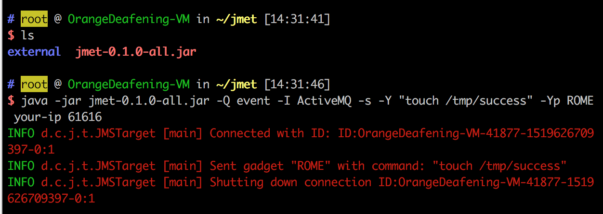
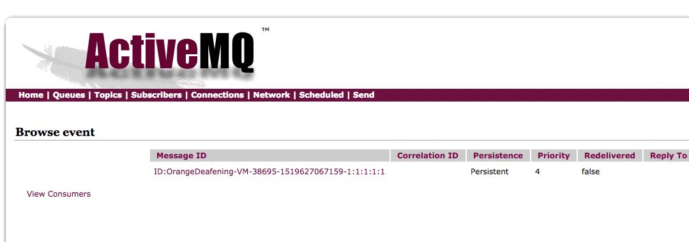
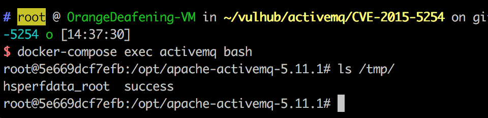
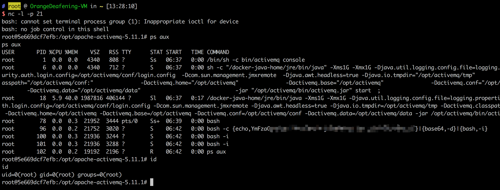

# ActiveMQ 직렬화 취약점 (CVE-2015-5254)

[한국어본(Korean version)]

Apache ActiveMQ는 미국 아파치(Apache) 소프트웨어 재단에서 개발한 오픈 소스 메시징 미들웨어로, Java 메시징 서비스, 클러스터링, Spring 프레임워크 등을 지원합니다.

Apache ActiveMQ 버전 5.x에서 5.13.0 이전에는 보안 취약점이 존재합니다. 이 취약점은 프로그램이 프록시에서 직렬화할 수 있는 클래스를 제한하지 않아 발생합니다. 원격 공격자는 특수하게 직렬화된 Java 메시징 서비스 (JMS) ObjectMessage 객체를 만들어 이 취약점을 이용하여 임의의 코드를 실행할 수 있습니다.

참고 링크:

- https://www.blackhat.com/docs/us-16/materials/us-16-Kaiser-Pwning-Your-Java-Messaging-With-Deserialization-Vulnerabilities.pdf

## 취약한 환경


취약한 환경을 시작합니다:

```
docker compose up -d
```

환경을 실행한 후 61616 포트와 8161 포트에 두 개의 포트가 설정됩니다. 61616 포트는 작업 포트이며, 메시지가 이 포트로 전달됩니다. 8161 포트는 웹 페이지 관리 페이지 포트입니다. http://your-ip:8161로 접속하면 네트워크 관리 페이지를 볼 수 있지만, 이 취약점은 이론적으로 네트워크가 필요하지 않습니다.

## Exploit

Exploit 과정은 다음과 같습니다:

1. 직렬화된 payload를 생성합니다 (ysoserial을 사용할 수 있습니다).
2. payload를 61616 포트로 전송합니다.
3. 웹 관리 페이지에 접속하여 직렬화된 메시지를 읽으면 취약점을 트리거할 수 있습니다.


이 환경을 이용하기 위해 jmet (Java Message Exploitation Tool)을 사용할 것입니다. 먼저 jmet의 jar 파일을 다운로드하고 동일한 디렉토리에 external이라는 폴더를 만듭니다 (그렇지 않으면 폴더가 없다는 오류가 발생할 수 있습니다).

jmet은 ysoserial을 사용하여 payload를 생성하고 전송하는 도구입니다 (이 jar 파일에는 ysoserial이 함께 제공되므로 다시 다운로드할 필요가 없습니다). 따라서 ysoserial에서 사용할 수 있는 gadget으로 선택할 옵션을 선택해야 합니다. 예를 들어 ROME을 선택할 수 있습니다.

실행:

```
java -jar jmet-0.1.0-all.jar -Q event -I ActiveMQ -s -Y "touch /tmp/success" -Yp ROME your-ip 61616
```



이제 event라는 이름의 큐가 대상 ActiveMQ에 추가됩니다.

http://your-ip:8161/admin/browse.jsp?JMSDestination=Event을 방문하여 이 큐의 모든 메시지를 볼 수 있습니다.

(**login / password:** admin/admin):



이 메시지를 클릭하여 명령을 실행하면 docker compose exec activemq bash를 사용하여 컨테이너 내부로 이동할 수 있습니다.

/tmp/success가 성공적으로 생성된 것을 볼 수 있습니다. 이는 성공적으로 exploit이 수행되었음을 나타냅니다.



명령을 역쉘 명령으로 바꾸고 다시 사용할 수 있습니다.


웹 관리 페이지를 통해 메시지에 액세스하고 취약점을 트리거하려면 관리자 권한이 필요합니다. 비밀번호가 없는 경우 관리자가 우리의 링크를 방문하도록 유도하거나 다른 서비스의 정당한 메시지로 위장하여 클라이언트 액세스를 기다려야 할 수 있습니다.