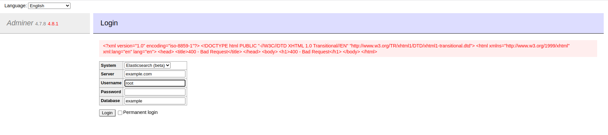

# Elasticsearch 및 ClickHouse의 오류페이지에 대한 SSRF 위조(CVE-2021-21311)

[中文版本(Chinese version)](README.zh-cn.md)

Adminer는 PHP에서 개발한 데이터베이스의 콘텐츠를 관리하는 도구입니다. 기본적으로 MySQL, MariaDB, PostgreSQL, SQLite, MS SQL, Oracle, Elasticsearch 및 MongoDB를 지원합니다.

버전 4.0.0 및 4.7.9 이전의 관리자에는 Elasticsearch 및 ClickHouse의 오류 페이지에 서버 측 요청 위조 취약점이 있습니다. 모든 드라이버를 번들로 제공하는 관리자 버전(e.g. `adminer.php`) 사용자가 영향을 받습니다. 이 문제는 버전 4.7.9에서 해결되었습니다.

참고자료:

- <https://github.com/vrana/adminer/security/advisories/GHSA-x5r2-hj5c-8jx6>
- <https://github.com/vrana/adminer/files/5957311/Adminer.SSRF.pdf>
- <https://github.com/projectdiscovery/nuclei-templates/blob/main/http/cves/2021/CVE-2021-21311.yaml>

## 취약한 환경

Adminer 4.7.8로 PHP 서버를 시작하려면 다음 명령을 실행하십시오.

```
docker compose up -d
```

서버가 시작되면 에서 Adminer 로그인 페이지를 볼 수 있습니다 . `http://your-ip:8080`

## 취약점

시스템 필드로 ElasticSearch를 선택한 후  `example.com` 서버 필드에 입력합니다. 로그인 버튼을 클릭하면 다음에서 400 응답이 표시됩니다. `example.com`:


