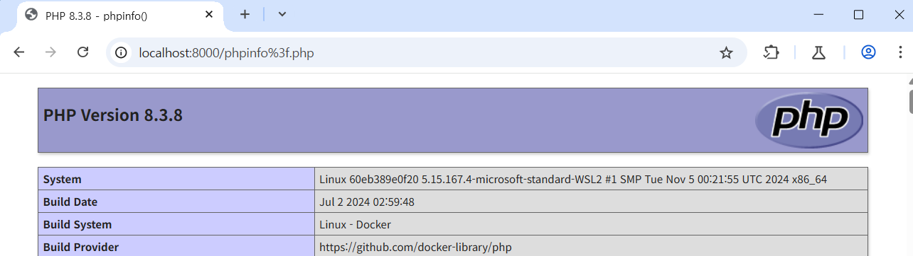

# Confusion attack: Filename Confusion(CVE-2024-38474)

> 화이트햇 스쿨 3기 (29반) - [이경준](https://github.com/nicknamemohaji)

> [원본 발표 자료](https://blog.orange.tw/posts/2024-08-confusion-attacks-en/), [정리 글](https://blog.kyungjle.kr/69)


Apache는 널리 사용되는 웹 서버로, 모듈식 디자인을 가지고 있습니다.

Apache 2.4.60 이전 버전에서는 mod_rewirte에서 `r->filename`을 URL로 처리하여 발생하는 Semantic Gap 취약점이 발생합니다. CVE-2024-384744는 mod_rewire가 `%3f`를 `?`로 decode하여 처리해 올바르지 않은 경로에도 RewriteRule을 적용하는 취약점입니다.


## 환경 설정

다음 명령을 실행하여 Apache 2.4.59 + PHP 8.3.8 버전에서 실행되는 취약한 환경을 만들 수 있습니다.

```
docker compose up -d --name kr-vulnhub-CVE-2024-38474
```


docker compose를 이용한 환경 설정이 끝나면 `http://localhost:8000`으로 사이트에 접속할 수 있습니다.


## 취약점 재연

사이트는 `/var/www/html`을 DocumentRoot로 가지고 있습니다. `/var/www/html/phpinfo`에 실행 가능한 PHP 파일이 있습니다.


사이트의 VirutalHost는 다음과 같습니다.

```
<VirtualHost *:80>
    DocumentRoot /var/www/html
    RewriteEngine On

    RewriteRule  ^(.+\.php)$  /var/www/html/$1  [H=application/x-httpd-php]
</VirtualHost>
```


`.php`로 끝나는 URL에 handler를 적용하기 때문에 `%3f.php`로 끝내면 어느 php-fpm handler가 실행됩니다. 그런데 mod_rewrite는 `?`을 기준으로 잘라 `r->filename`에 저장하고 이후 모듈로 넘기는 코드가 있습니다.


그래서 `aa%3f.php`는 핸들러가 지정되고 파일이름은 `aa`를 읽게 됩니다.

`http://localhost:8000/phpinfo%3f.php`에  접근해 취약점을 확인해볼 수 있습니다.

