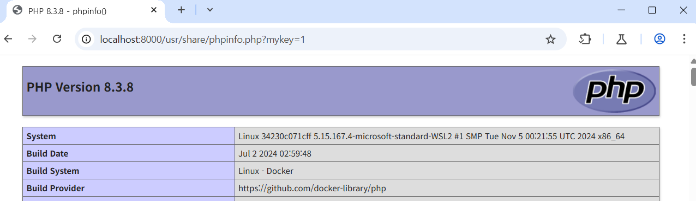

# Confusion attack: DocuementRoot Confusion(CVE-2024-38475)

> 화이트햇 스쿨 3기 (29반) - [이경준](https://github.com/nicknamemohaji)

> [원본 발표 자료](https://blog.orange.tw/posts/2024-08-confusion-attacks-en/), [정리 글](https://blog.kyungjle.kr/69)


Apache는 널리 사용되는 웹 서버로, 모듈식 디자인을 가지고 있습니다.

Apache 2.4.60 이전 버전에서는 mod_rewirte에서 `r->filename`을 URL로 처리하여 발생하는 Semantic Gap 취약점이 발생합니다. CVE-2024-38475는 RewriteRule을 이용하여 재작성된 파일 경로를 DocumentRoot 뿐 아니라 Filesystem Root에도 적용하여, VirtualServer의 DocumentRoot를 벗어난 경로를 읽을 수 있는 취약점입니다.


## 환경 설정

다음 명령을 실행하여 Apache 2.4.59 + PHP 8.3.8 버전에서 실행되는 취약한 환경을 만들 수 있습니다.

```
docker compose up -d --name kr-vulnhub-CVE-2024-38475
```


docker compose를 이용한 환경 설정이 끝나면 `http://localhost:8000`으로 사이트에 접속할 수 있습니다.


## 취약점 재연

사이트는 `/var/www/html`을 DocumentRoot로 가지고 있습니다. `/usr/share/phpinfo.php`에 실행 가능한 PHP 파일이 있습니다.


사이트의 VirutalHost는 다음과 같습니다.

```
<VirtualHost *:80>
    DocumentRoot /var/www/html
    RewriteEngine On

    RewriteCond "%{QUERY_STRING}" "(.*(?:^|&))mykey=([^&]*)&?(.*)&?$"
    RewriteRule "(.*)" "$1?%1%3"
</VirtualHost>
```


`$1`로 시작하는 RewriteRule이 Filesystem Root에서부터 파일을 읽게 만들기 때문에 DocumentRoot에 없는 `/usr/share/phpinfo.php`에 접근할 수 있습니다.


`http://localhost:8000/usr/share/phpinfo.php?mykey=1`에  접근해 취약점을 확인해볼 수 있습니다.



